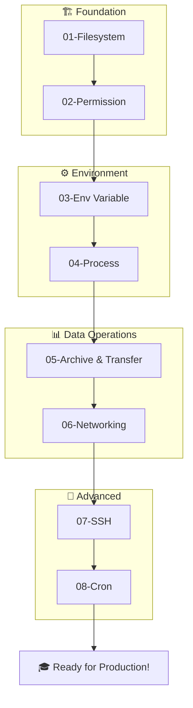

# 🐧 Linux Practical untuk Data Engineering

[](https://www.linux.org/)
[](https://www.gnu.org/software/bash/)
[](https://en.wikipedia.org/wiki/Data_engineering)

Panduan praktis Linux untuk Data Engineer. Repository ini berisi materi pembelajaran komprehensif dengan hands-on lab untuk menguasai command line Linux dalam konteks Data Engineering.

---

## 📚 Daftar Modul

| No | Modul | Topik | Skill Level |
|----|-------|-------|-------------|
| 01 | [Filesystem](docs/01-filesystem/README.md) | Navigasi, struktur direktori, operasi file | ⭐ Beginner |
| 02 | [Permission](docs/02-permission/README.md) | Hak akses, chmod, chown, ACL | ⭐ Beginner |
| 03 | [Environment Variable](docs/03-env-variable/README.md) | PATH, .env, export, source | ⭐⭐ Intermediate |
| 04 | [Process](docs/04-prosess/README.md) | ps, top, kill, background jobs | ⭐⭐ Intermediate |
| 05 | [Archive & Transfer](docs/05-archive-transfer/README.md) | tar, gzip, scp, rsync, curl | ⭐⭐ Intermediate |
| 06 | [Networking](docs/06-networking/README.md) | ping, netstat, DNS, HTTP testing | ⭐⭐ Intermediate |
| 07 | [SSH](docs/07-ssh/README.md) | Keys, config, tunneling, jump hosts | ⭐⭐⭐ Advanced |
| 08 | [Cron](docs/08-cron/README.md) | Scheduling, crontab, systemd timers | ⭐⭐⭐ Advanced |
| 09 | [Text Processing](docs/09-text-processing/README.md) | grep, awk, sed, cut, sort, uniq | ⭐⭐⭐ Advanced |
| 10 | [Shell Scripting](docs/10-shell-scripting/README.md) | Variables, loops, functions, scripts | ⭐⭐⭐ Advanced |

---

## 🎯 Learning Objectives

Setelah menyelesaikan seluruh modul, peserta mampu:

- ✅ **Navigasi Filesystem** - Mengelola file dan direktori dengan efisien
- ✅ **Mengelola Permission** - Mengamankan file dengan permission yang tepat
- ✅ **Environment Variables** - Mengkonfigurasi environment untuk development
- ✅ **Process Management** - Menjalankan dan memantau proses
- ✅ **Data Transfer** - Memindahkan data antar server dengan aman
- ✅ **Network Troubleshooting** - Mendiagnosis masalah jaringan
- ✅ **Remote Access** - Mengakses server secara aman dengan SSH
- ✅ **Task Scheduling** - Mengotomatisasi ETL jobs dengan cron
- ✅ **Text Processing** - Parsing dan transformasi data dengan grep, awk, sed
- ✅ **Shell Scripting** - Automasi dengan bash scripts

---

## 🗂️ Struktur Repository

```
linux-practical/
├── README.md           # Panduan utama (file ini)
├── changelog.md        # Riwayat perubahan
├── docs/               # Materi pembelajaran
│   ├── 01-filesystem/  # Modul filesystem
│   ├── 02-permission/  # Modul permission
│   ├── 03-env-variable/# Modul environment variable
│   ├── 04-prosess/     # Modul process management
│   ├── 05-archive-transfer/ # Modul archive & transfer
│   ├── 06-networking/  # Modul networking
│   ├── 07-ssh/         # Modul SSH
│   ├── 08-cron/        # Modul cron & scheduling
│   ├── 09-text-processing/  # Modul text processing
│   └── 10-shell-scripting/  # Modul shell scripting
└── lab/                # Hands-on lab exercises
    ├── 01-filesystem/
    ├── 02-permission/
    ├── 03-env-variable/
    ├── 04-prosess/
    ├── 05-archive-transfer/
    ├── 06-networking/
    ├── 07-ssh/
    └── 08-cron/
```

---

## 🚀 Quick Start

### Prerequisites

- Akses ke terminal Linux (Ubuntu/Debian/WSL/macOS)
- Basic understanding of command line
- Text editor (VSCode, vim, atau nano)

### Setup Lab Environment

```bash
# Clone repository
git clone <repository-url>
cd linux-practical

# Buat direktori lab
mkdir -p lab/{01-filesystem,02-permission,03-env-variable,04-prosess,05-archive-transfer,06-networking,07-ssh,08-cron}

# Mulai dari Modul 01
cd docs/01-filesystem/
```

---

## 📖 Cara Menggunakan

### 1. Sequential Learning
Ikuti modul secara berurutan dari 01 hingga 08:

```
01-filesystem → 02-permission → 03-env-variable → 04-prosess
       ↓               ↓               ↓               ↓
       └───────────────┴───────────────┴───────────────┘
                               ↓
05-archive-transfer → 06-networking → 07-ssh → 08-cron
```

### 2. Setiap Modul Memiliki:
- 📋 **Learning Outcome** - Tujuan pembelajaran
- 📚 **Teori** - Konsep dan penjelasan
- 💻 **Hands-on Flow** - Latihan praktis step-by-step
- 🏆 **Mini Challenge** - Tantangan untuk menguji pemahaman
- 📎 **Referensi** - Sumber belajar tambahan

### 3. Lab Practice
Setiap modul memiliki direktori lab untuk practice:

```bash
# Contoh: Lab untuk modul filesystem
cd lab/01-filesystem/
# Ikuti instruksi di docs/01-filesystem/README.md
```

---

## 🔗 Learning Path untuk Data Engineering



---

## 💼 Use Cases untuk Data Engineering

| Modul | Use Case Data Engineering |
|-------|--------------------------|
| **Filesystem** | Organize data files, navigate data directories |
| **Permission** | Secure sensitive data, manage team access |
| **Env Variable** | Configure database connections, API keys |
| **Process** | Monitor ETL jobs, manage long-running processes |
| **Archive** | Backup data, transfer between servers |
| **Networking** | Test API endpoints, troubleshoot connectivity |
| **SSH** | Access production servers, secure tunnels to databases |
| **Cron** | Schedule ETL jobs, automate data pipelines |

---

## 📊 Skill Matrix

| Skill | Modul | Commands |
|-------|-------|----------|
| File Management | 01, 02 | `ls`, `cd`, `cp`, `mv`, `chmod`, `chown` |
| Text Processing | 01 | `cat`, `grep`, `awk`, `sed`, `head`, `tail` |
| Environment Config | 03 | `export`, `source`, `env`, `printenv` |
| Process Control | 04 | `ps`, `top`, `kill`, `nohup`, `bg`, `fg` |
| Data Transfer | 05, 06 | `scp`, `rsync`, `curl`, `wget`, `tar` |
| Network Debug | 06 | `ping`, `netstat`, `ss`, `dig`, `traceroute` |
| Remote Access | 07 | `ssh`, `ssh-keygen`, `ssh-copy-id`, `sftp` |
| Scheduling | 08 | `crontab`, `at`, `systemctl` |

---

## 🎓 Recommended Schedule

| Week | Modul | Durasi | Fokus |
|------|-------|--------|-------|
| 1 | 01-02 | 4-6 jam | Filesystem & Permission |
| 2 | 03-04 | 4-6 jam | Environment & Process |
| 3 | 05-06 | 4-6 jam | Archive, Transfer & Networking |
| 4 | 07-08 | 4-6 jam | SSH & Cron |

---

## 🔧 Environment Support

| Platform | Status | Notes |
|----------|--------|-------|
| Ubuntu/Debian | ✅ Supported | Primary development platform |
| RHEL/CentOS | ✅ Supported | Minor command differences noted |
| macOS | ✅ Supported | Use Homebrew for missing tools |
| WSL 2 | ✅ Supported | Windows Subsystem for Linux |
| Git Bash | ⚠️ Limited | Some commands may not work |

---

## 📝 Contributing

1. Fork repository
2. Buat branch baru (`git checkout -b feature/modul-baru`)
3. Commit perubahan (`git commit -m 'Add: modul baru'`)
4. Push ke branch (`git push origin feature/modul-baru`)
5. Buat Pull Request

---

## 📚 Additional Resources

### Online Resources
- [Linux Journey](https://linuxjourney.com/) - Interactive learning
- [OverTheWire Bandit](https://overthewire.org/wargames/bandit/) - Gamified learning
- [Explainshell](https://explainshell.com/) - Command explanation
- [TLDR Pages](https://tldr.sh/) - Simplified man pages

### Books
- "The Linux Command Line" by William Shotts
- "Linux Pocket Guide" by Daniel J. Barrett
- "UNIX and Linux System Administration Handbook"

### Cheat Sheets
- [Linux Commands Cheat Sheet](https://www.linuxtrainingacademy.com/linux-commands-cheat-sheet/)
- [Bash Scripting Cheat Sheet](https://devhints.io/bash)

---

## 📄 License

This project is licensed under the MIT License - see the [LICENSE](LICENSE) file for details.

---

## 👨‍💻 Author

**Linux Practical for Data Engineering**

> 💡 *"The command line is your friend. Master it, and you'll become a more effective Data Engineer."*

---

## 🔄 Changelog

Lihat [learning.log.md](learning.log.md) untuk riwayat belajar.

---

<div align="center">

**Happy Learning! 🐧**

Made with ❤️ for Data Engineers

</div>
