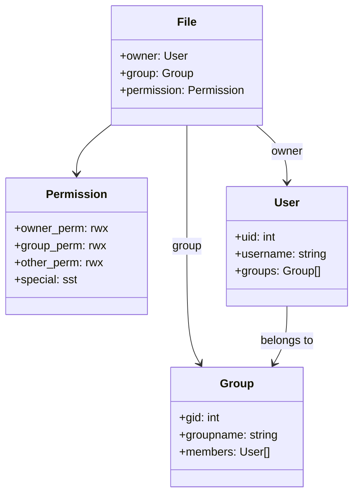
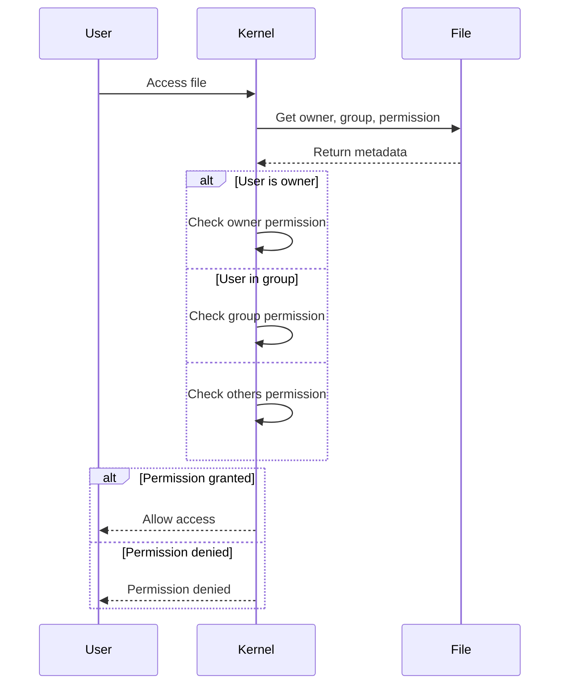

# Modul 02: Permission & Ownership Linux untuk Data Engineering

## 📚 Daftar Isi
- [Learning Outcome](#learning-outcome)
- [Prasyarat](#prasyarat)
- [Bab 0: Analisis Kebutuhan](#bab-0-analisis-kebutuhan)
- [Bab 1: Konsep Dasar Permission](#bab-1-konsep-dasar-permission)
- [Bab 2: Command Dasar](#bab-2-command-dasar)
- [Bab 3: Flow Latihan Permission](#bab-3-flow-latihan-permission)
- [Bab 4: Advanced Topics](#bab-4-advanced-topics)
- [Bab 5: Mini Challenge](#bab-5-mini-challenge)
- [Referensi](#referensi)

---

## Learning Outcome
Setelah menyelesaikan modul ini, peserta mampu:

1. ✅ Memahami konsep permission Linux (read, write, execute)
2. ✅ Membaca dan menginterpretasi permission file/folder
3. ✅ Mengubah permission menggunakan `chmod` (symbolic & numeric)
4. ✅ Mengubah ownership menggunakan `chown` dan `chgrp`
5. ✅ Memahami special permission (SUID, SGID, Sticky Bit)
6. ✅ Mengamankan file data dalam workflow ETL

---

## Prasyarat
- Menyelesaikan Modul 01: Filesystem
- Akses ke terminal Linux
- Pemahaman dasar user dan group Linux

---

## Bab 0: Analisis Kebutuhan

### Mengapa Permission Penting untuk Data Engineering?

| Aspek | Kebutuhan | Solusi |
|-------|-----------|--------|
| **Data Security** | Lindungi data sensitif dari akses tidak sah | Permission yang ketat |
| **Collaboration** | Tim bisa akses file yang diperlukan | Group permission |
| **Automation** | Script harus executable | Execute permission |
| **Audit Trail** | Log file tidak boleh diubah sembarangan | Read-only permission |
| **Shared Storage** | Multiple user akses folder yang sama | SGID, Sticky Bit |

### Skenario Umum Data Engineering
```
/data/
├── raw/              # 755: Team bisa baca, hanya admin tulis
├── processed/        # 775: Team bisa baca/tulis
├── sensitive/        # 700: Hanya owner yang bisa akses
├── scripts/          # 755: Semua bisa execute
└── logs/             # 644: Semua baca, owner tulis
```

---

## Bab 1: Konsep Dasar Permission

### Tiga Jenis Permission

| Symbol | Nama | File | Directory |
|--------|------|------|-----------|
| `r` | Read | Baca isi file | List isi folder (`ls`) |
| `w` | Write | Ubah isi file | Buat/hapus file di folder |
| `x` | Execute | Jalankan sebagai program | Masuk folder (`cd`) |

### Tiga Kategori User

| Kategori | Symbol | Penjelasan |
|----------|--------|------------|
| Owner | `u` | Pemilik file |
| Group | `g` | Grup pemilik file |
| Others | `o` | Semua user lain |
| All | `a` | Semua kategori |

### Membaca Permission
```
-rwxr-xr-- 1 user group 1024 Dec 27 10:00 script.sh
│└┬┘└┬┘└┬┘
│ │  │  └── Others: r-- (read only)
│ │  └───── Group:  r-x (read, execute)
│ └──────── Owner:  rwx (read, write, execute)
└────────── File type: - (regular file), d (directory), l (link)
```

### Numeric (Octal) Permission

| Permission | Binary | Decimal |
|------------|--------|---------|
| `---` | 000 | 0 |
| `--x` | 001 | 1 |
| `-w-` | 010 | 2 |
| `-wx` | 011 | 3 |
| `r--` | 100 | 4 |
| `r-x` | 101 | 5 |
| `rw-` | 110 | 6 |
| `rwx` | 111 | 7 |

### Contoh Permission Umum

| Octal | Symbolic | Penggunaan |
|-------|----------|------------|
| `755` | `rwxr-xr-x` | Script executable, folder publik |
| `644` | `rw-r--r--` | File biasa (config, data) |
| `700` | `rwx------` | Private folder/script |
| `600` | `rw-------` | Private file (credentials) |
| `775` | `rwxrwxr-x` | Folder shared dengan group |
| `664` | `rw-rw-r--` | File shared dengan group |

---

## Bab 2: Command Dasar

### Melihat Permission

| Command | Fungsi | Contoh |
|---------|--------|--------|
| `ls -l` | List dengan permission | `ls -l file.txt` |
| `ls -la` | Include hidden files | `ls -la` |
| `ls -ld` | Permission folder only | `ls -ld /data/` |
| `stat` | Info detail termasuk permission | `stat file.txt` |

### Mengubah Permission dengan chmod

#### Symbolic Mode
| Command | Fungsi | Contoh |
|---------|--------|--------|
| `chmod u+x` | Tambah execute untuk owner | `chmod u+x script.sh` |
| `chmod g-w` | Hapus write dari group | `chmod g-w file.txt` |
| `chmod o=r` | Set others hanya read | `chmod o=r data.csv` |
| `chmod a+r` | Tambah read untuk semua | `chmod a+r readme.txt` |
| `chmod u+x,g+r` | Multiple changes | `chmod u+x,g+r script.sh` |

#### Numeric Mode
| Command | Fungsi | Contoh |
|---------|--------|--------|
| `chmod 755` | rwxr-xr-x | `chmod 755 script.sh` |
| `chmod 644` | rw-r--r-- | `chmod 644 config.txt` |
| `chmod 700` | rwx------ | `chmod 700 private/` |
| `chmod -R 755` | Recursive | `chmod -R 755 folder/` |

### Mengubah Ownership

| Command | Fungsi | Contoh |
|---------|--------|--------|
| `chown user file` | Ubah owner | `chown john data.csv` |
| `chown user:group file` | Ubah owner dan group | `chown john:data data.csv` |
| `chown :group file` | Ubah group saja | `chown :analytics data.csv` |
| `chgrp group file` | Ubah group | `chgrp analytics data.csv` |
| `chown -R user folder/` | Recursive ownership | `chown -R john data/` |

### Melihat User & Group

| Command | Fungsi | Contoh |
|---------|--------|--------|
| `whoami` | User saat ini | `whoami` |
| `id` | UID, GID, groups | `id` |
| `groups` | Groups user | `groups john` |
| `cat /etc/passwd` | List semua user | `cat /etc/passwd` |
| `cat /etc/group` | List semua group | `cat /etc/group` |

---

## Bab 3: Flow Latihan Permission

### 🔧 Flow 0: Persiapan Lab
```bash
# Pindah ke direktori lab
cd ~/linux-practical/lab/02-permission/

# Buat struktur folder
mkdir -p data/{raw,processed,sensitive} scripts logs

# Buat file dummy
touch data/raw/sales.csv
touch data/processed/report.csv
touch data/sensitive/credentials.txt
touch scripts/etl.sh
touch logs/app.log

# Verifikasi
tree -L 2
ls -la
```

---

### 👀 Flow 1: Melihat Permission
```bash
# Lihat permission semua file
ls -la

# Lihat permission folder
ls -ld data/

# Lihat permission recursive
ls -laR data/

# Info detail dengan stat
stat data/raw/sales.csv

# Cek permission dalam octal
stat -c "%a %n" data/*
```
**✅ Tujuan:** Mahir membaca dan menginterpretasi permission

---

### 🔐 Flow 2: Mengubah Permission (chmod)
```bash
# Symbolic mode - tambah execute untuk script
chmod u+x scripts/etl.sh
ls -l scripts/etl.sh

# Symbolic mode - multiple changes
chmod u+rwx,g+rx,o+r scripts/etl.sh
ls -l scripts/etl.sh

# Numeric mode - set permission
chmod 755 scripts/etl.sh
ls -l scripts/etl.sh

# Private folder
chmod 700 data/sensitive/
ls -ld data/sensitive/

# Read-only untuk log
chmod 644 logs/app.log
ls -l logs/app.log

# Recursive permission
chmod -R 755 data/processed/
ls -la data/processed/
```
**✅ Tujuan:** Mahir menggunakan chmod symbolic dan numeric mode

---

### 👤 Flow 3: Ownership (chown/chgrp)
```bash
# Lihat current user dan groups
whoami
id
groups

# Ubah ownership (perlu sudo untuk user lain)
sudo chown $USER:$USER data/raw/sales.csv
ls -l data/raw/sales.csv

# Ubah group saja
sudo chgrp $USER data/processed/report.csv
ls -l data/processed/report.csv

# Recursive ownership
sudo chown -R $USER:$USER data/
ls -laR data/
```
**✅ Tujuan:** Mahir mengatur ownership file dan folder

---

### 🔒 Flow 4: Permission untuk Data Security
```bash
# Credentials file - hanya owner bisa akses
chmod 600 data/sensitive/credentials.txt
ls -l data/sensitive/credentials.txt

# Folder sensitive - hanya owner
chmod 700 data/sensitive/
ls -ld data/sensitive/

# Script - executable tapi tidak bisa diubah sembarangan
chmod 555 scripts/etl.sh
ls -l scripts/etl.sh

# Test permission
cat data/sensitive/credentials.txt  # Berhasil (owner)
# sudo -u nobody cat data/sensitive/credentials.txt  # Gagal (others)
```
**✅ Tujuan:** Mengamankan file sensitif dengan permission yang tepat

---

### 📁 Flow 5: Shared Folder Setup
```bash
# Buat folder shared untuk team
mkdir -p shared_data

# Set permission untuk group collaboration
chmod 775 shared_data/
ls -ld shared_data/

# Buat file di shared folder
touch shared_data/team_report.csv
chmod 664 shared_data/team_report.csv
ls -l shared_data/team_report.csv

# Verify group bisa akses
stat shared_data/
```
**✅ Tujuan:** Setup folder untuk kolaborasi team

---

## Bab 4: Advanced Topics

### Special Permissions

#### SUID (Set User ID)
```bash
# Execute dengan permission owner, bukan user yang menjalankan
chmod u+s script.sh
# atau
chmod 4755 script.sh
ls -l script.sh
# Output: -rwsr-xr-x
```

#### SGID (Set Group ID)
```bash
# File baru dalam folder mewarisi group folder
chmod g+s shared_folder/
# atau
chmod 2775 shared_folder/
ls -ld shared_folder/
# Output: drwxrwsr-x

# Semua file baru akan memiliki group yang sama
touch shared_folder/newfile.txt
ls -l shared_folder/newfile.txt
```

#### Sticky Bit
```bash
# Hanya owner file yang bisa hapus file dalam folder
chmod +t shared_folder/
# atau
chmod 1777 shared_folder/
ls -ld shared_folder/
# Output: drwxrwxrwt

# User lain tidak bisa hapus file user lain
```

### umask - Default Permission
```bash
# Lihat umask current
umask

# umask 022 = default file 644, folder 755
# umask 027 = default file 640, folder 750

# Set umask temporary
umask 027
touch newfile.txt
ls -l newfile.txt

# Set umask permanent (tambah ke ~/.bashrc)
echo "umask 027" >> ~/.bashrc
```

### ACL (Access Control List)
```bash
# Install ACL tools
# sudo apt install acl

# Set ACL untuk user tertentu
setfacl -m u:john:rw data.csv

# Set ACL untuk group
setfacl -m g:analytics:r data.csv

# Lihat ACL
getfacl data.csv

# Hapus ACL
setfacl -x u:john data.csv

# Hapus semua ACL
setfacl -b data.csv
```

---

## Bab 5: Mini Challenge

### Challenge 1: Setup Project Permission
```bash
# 1. Buat struktur project
mkdir -p ~/project/{public,private,scripts,logs}

# 2. Set permission yang tepat
chmod 755 ~/project/public/      # Semua bisa baca
chmod 700 ~/project/private/     # Hanya owner
chmod 755 ~/project/scripts/     # Executable
chmod 755 ~/project/logs/        # Log readable

# 3. Buat file dengan permission berbeda
touch ~/project/public/readme.txt && chmod 644 ~/project/public/readme.txt
touch ~/project/private/secret.key && chmod 600 ~/project/private/secret.key
touch ~/project/scripts/run.sh && chmod 755 ~/project/scripts/run.sh

# 4. Verifikasi
ls -laR ~/project/
```

### Challenge 2: Team Collaboration Folder
```bash
# 1. Buat folder team
sudo mkdir -p /data/team_analytics

# 2. Buat group dan tambah user
# sudo groupadd analytics
# sudo usermod -aG analytics $USER

# 3. Set ownership dan permission
sudo chown :analytics /data/team_analytics
sudo chmod 2775 /data/team_analytics

# 4. Set sticky bit agar user tidak bisa hapus file user lain
sudo chmod +t /data/team_analytics

# 5. Verifikasi
ls -ld /data/team_analytics
```

### Challenge 3: Secure Data Pipeline
```bash
# Setup secure data pipeline
mkdir -p ~/pipeline/{input,processing,output,credentials}

# Input: readable by all
chmod 755 ~/pipeline/input/

# Processing: only owner
chmod 700 ~/pipeline/processing/

# Output: readable by group
chmod 750 ~/pipeline/output/

# Credentials: super restricted
chmod 700 ~/pipeline/credentials/
touch ~/pipeline/credentials/db_password.txt
chmod 600 ~/pipeline/credentials/db_password.txt

# Verifikasi
ls -laR ~/pipeline/
```

---

## UML Diagram

### Permission Model


### Permission Check Flow


---

## Referensi

- [Linux File Permissions](https://www.linux.com/training-tutorials/understanding-linux-file-permissions/)
- [chmod Manual](https://man7.org/linux/man-pages/man1/chmod.1.html)
- [chown Manual](https://man7.org/linux/man-pages/man1/chown.1.html)
- `man chmod`, `man chown`, `man chgrp`

---

## Tips & Best Practices

| ✅ Do | ❌ Don't |
|------|---------|
| Gunakan `600` untuk credentials | Permission `777` untuk apapun |
| Gunakan group untuk collaboration | `chmod -R 777` recursive |
| Audit permission secara berkala | Ignore permission warning |
| Gunakan SGID untuk shared folders | Run script sebagai root tanpa alasan |
| Document permission requirements | Hardcode credentials di script |

---

> 💡 **Pro Tip:** "Principle of Least Privilege - berikan permission seminimal mungkin yang diperlukan untuk menjalankan tugas!"
