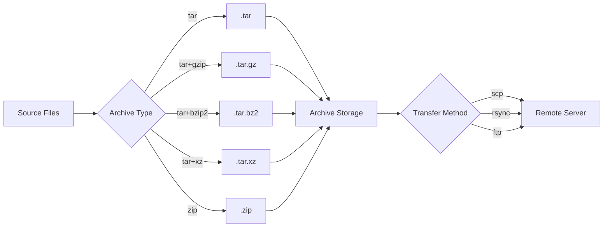
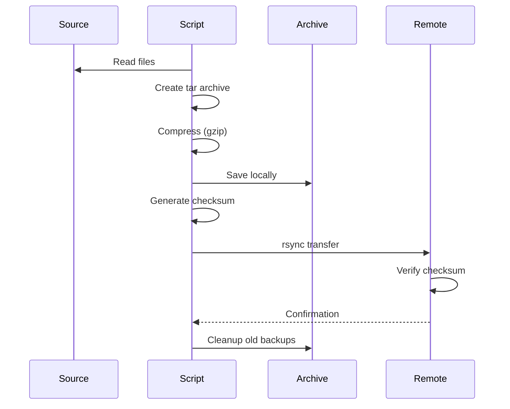

# Modul 05: Archive & Transfer Linux untuk Data Engineering

## 📚 Daftar Isi
- [Learning Outcome](#learning-outcome)
- [Prasyarat](#prasyarat)
- [Bab 0: Analisis Kebutuhan](#bab-0-analisis-kebutuhan)
- [Bab 1: Konsep Dasar Archive & Compression](#bab-1-konsep-dasar-archive--compression)
- [Bab 2: Command Dasar](#bab-2-command-dasar)
- [Bab 3: Flow Latihan Archive & Transfer](#bab-3-flow-latihan-archive--transfer)
- [Bab 4: Advanced Topics](#bab-4-advanced-topics)
- [Bab 5: Mini Challenge](#bab-5-mini-challenge)
- [Referensi](#referensi)

---

## Learning Outcome
Setelah menyelesaikan modul ini, peserta mampu:

1. ✅ Memahami perbedaan archive dan compression
2. ✅ Menggunakan `tar`, `gzip`, `zip` untuk archiving
3. ✅ Transfer file dengan `scp`, `rsync`, `curl`, `wget`
4. ✅ Membuat backup data secara efisien
5. ✅ Mengelola archive untuk data warehouse
6. ✅ Automation backup dan transfer dalam pipeline

---

## Prasyarat
- Menyelesaikan Modul 01-04
- Pemahaman dasar filesystem dan permissions
- Akses ke terminal Linux

---

## Bab 0: Analisis Kebutuhan

### Mengapa Archive & Transfer Penting untuk Data Engineering?

| Aspek | Kebutuhan | Solusi |
|-------|-----------|--------|
| **Backup Data** | Simpan data historis | tar, gzip, archive |
| **Space Efficiency** | Kurangi storage usage | Compression (gzip, bzip2, xz) |
| **Data Transfer** | Kirim data antar server | scp, rsync, sftp |
| **API Integration** | Download dari API/web | curl, wget |
| **Incremental Backup** | Backup perubahan saja | rsync --archive |
| **Log Rotation** | Compress old logs | logrotate, gzip |

### Skenario Data Engineering
```bash
# Daily backup
tar -czvf backup_$(date +%Y%m%d).tar.gz /data/warehouse/

# Sync ke remote server
rsync -avz /data/processed/ user@backup-server:/backup/

# Download dataset dari API
curl -o dataset.json https://api.example.com/data

# Incremental backup
rsync -avz --delete /data/ /backup/
```

---

## Bab 1: Konsep Dasar Archive & Compression

### Archive vs Compression

| Konsep | Fungsi | Tools |
|--------|--------|-------|
| **Archive** | Gabungkan banyak file jadi satu | `tar` |
| **Compression** | Kurangi ukuran file | `gzip`, `bzip2`, `xz`, `zip` |
| **Combined** | Archive + compress | `tar.gz`, `tar.bz2`, `tar.xz` |

### Format Compression Comparison

| Format | Extension | Speed | Ratio | Tool |
|--------|-----------|-------|-------|------|
| **gzip** | `.gz` | Fast | Medium | `gzip` |
| **bzip2** | `.bz2` | Medium | Good | `bzip2` |
| **xz** | `.xz` | Slow | Best | `xz` |
| **zip** | `.zip` | Fast | Medium | `zip` |
| **zstd** | `.zst` | Very Fast | Good | `zstd` |

### Tar Archive Extensions

| Extension | Meaning |
|-----------|---------|
| `.tar` | Archive only (no compression) |
| `.tar.gz` / `.tgz` | Archive + gzip |
| `.tar.bz2` / `.tbz2` | Archive + bzip2 |
| `.tar.xz` / `.txz` | Archive + xz |

---

## Bab 2: Command Dasar

### tar - Tape Archive

| Command | Fungsi | Contoh |
|---------|--------|--------|
| `tar -cvf` | Create archive | `tar -cvf archive.tar folder/` |
| `tar -xvf` | Extract archive | `tar -xvf archive.tar` |
| `tar -tvf` | List contents | `tar -tvf archive.tar` |
| `tar -czvf` | Create + gzip | `tar -czvf archive.tar.gz folder/` |
| `tar -xzvf` | Extract gzip | `tar -xzvf archive.tar.gz` |
| `tar -cjvf` | Create + bzip2 | `tar -cjvf archive.tar.bz2 folder/` |
| `tar -xjvf` | Extract bzip2 | `tar -xjvf archive.tar.bz2` |
| `tar -cJvf` | Create + xz | `tar -cJvf archive.tar.xz folder/` |

**tar flags:**
- `c` - create
- `x` - extract
- `t` - list
- `v` - verbose
- `f` - file
- `z` - gzip
- `j` - bzip2
- `J` - xz

### gzip / gunzip

| Command | Fungsi | Contoh |
|---------|--------|--------|
| `gzip file` | Compress (replace original) | `gzip data.csv` |
| `gzip -k file` | Compress (keep original) | `gzip -k data.csv` |
| `gunzip file.gz` | Decompress | `gunzip data.csv.gz` |
| `gzip -l file.gz` | List info | `gzip -l data.csv.gz` |
| `zcat file.gz` | View without decompress | `zcat data.csv.gz` |

### zip / unzip

| Command | Fungsi | Contoh |
|---------|--------|--------|
| `zip archive.zip files` | Create zip | `zip backup.zip *.csv` |
| `zip -r archive.zip folder/` | Recursive | `zip -r backup.zip data/` |
| `unzip archive.zip` | Extract | `unzip backup.zip` |
| `unzip -l archive.zip` | List contents | `unzip -l backup.zip` |
| `unzip -d dir archive.zip` | Extract to dir | `unzip -d /tmp backup.zip` |

### File Transfer - scp

| Command | Fungsi | Contoh |
|---------|--------|--------|
| `scp file user@host:path` | Upload file | `scp data.csv user@server:/data/` |
| `scp user@host:path local` | Download file | `scp user@server:/data/file.csv .` |
| `scp -r folder user@host:path` | Upload folder | `scp -r data/ user@server:/backup/` |
| `scp -P port ...` | Custom port | `scp -P 2222 file user@host:/path` |

### File Transfer - rsync

| Command | Fungsi | Contoh |
|---------|--------|--------|
| `rsync -av src dst` | Sync (archive mode) | `rsync -av data/ backup/` |
| `rsync -avz src user@host:dst` | Remote sync | `rsync -avz data/ user@host:/backup/` |
| `rsync --delete` | Delete extra files | `rsync -av --delete src/ dst/` |
| `rsync --dry-run` | Preview only | `rsync -avn src/ dst/` |
| `rsync --progress` | Show progress | `rsync -av --progress large_file dst/` |

**rsync flags:**
- `-a` - archive (recursive, preserve permissions, etc.)
- `-v` - verbose
- `-z` - compress during transfer
- `-n` - dry run
- `--delete` - delete extra files at destination
- `--progress` - show progress
- `--exclude` - exclude pattern

### Download - curl & wget

| Command | Fungsi | Contoh |
|---------|--------|--------|
| `curl URL` | Fetch content | `curl https://api.example.com/data` |
| `curl -o file URL` | Save to file | `curl -o data.json https://api.com/data` |
| `curl -O URL` | Save with original name | `curl -O https://example.com/file.csv` |
| `wget URL` | Download file | `wget https://example.com/file.csv` |
| `wget -O file URL` | Save with name | `wget -O data.csv https://example.com/` |
| `wget -r URL` | Recursive download | `wget -r https://example.com/data/` |

---

## Bab 3: Flow Latihan Archive & Transfer

### 🔧 Flow 0: Persiapan Lab
```bash
# Pindah ke direktori lab
cd ~/linux-practical/lab/05-archive-transfer/
mkdir -p data/{raw,processed,backup} scripts logs

# Buat sample files
for i in {1..5}; do
    echo "id,name,value" > data/raw/sales_$i.csv
    for j in {1..100}; do
        echo "$j,product_$j,$RANDOM" >> data/raw/sales_$i.csv
    done
done

# Buat sample JSON
echo '{"status":"ok","timestamp":"'$(date -Iseconds)'"}' > data/raw/status.json

# Buat sample log
for i in {1..1000}; do
    echo "[$(date -Iseconds)] Log entry $i" >> data/raw/app.log
done

# Verifikasi
ls -lh data/raw/
du -sh data/raw/
```

---

### 📦 Flow 1: Archive dengan tar
```bash
# Create archive tanpa compression
tar -cvf data/backup/raw_data.tar data/raw/
ls -lh data/backup/

# Create archive dengan gzip
tar -czvf data/backup/raw_data.tar.gz data/raw/
ls -lh data/backup/

# Create archive dengan bzip2 (better compression)
tar -cjvf data/backup/raw_data.tar.bz2 data/raw/
ls -lh data/backup/

# Create archive dengan xz (best compression)
tar -cJvf data/backup/raw_data.tar.xz data/raw/
ls -lh data/backup/

# Compare sizes
echo "=== Compression Comparison ==="
ls -lh data/backup/

# List archive contents
tar -tvf data/backup/raw_data.tar.gz

# Extract archive
mkdir -p /tmp/extract_test
tar -xzvf data/backup/raw_data.tar.gz -C /tmp/extract_test
ls -la /tmp/extract_test/
```
**✅ Tujuan:** Mahir menggunakan tar dengan berbagai kompresi

---

### 🗜️ Flow 2: Compression Tools
```bash
# gzip single file
cp data/raw/sales_1.csv /tmp/
gzip -k /tmp/sales_1.csv  # -k keeps original
ls -lh /tmp/sales_1.*

# View compressed file
zcat /tmp/sales_1.csv.gz | head

# gunzip
gunzip /tmp/sales_1.csv.gz
ls -lh /tmp/sales_1.*

# zip folder
zip -r data/backup/raw_data.zip data/raw/
ls -lh data/backup/raw_data.zip

# List zip contents
unzip -l data/backup/raw_data.zip

# Unzip
unzip data/backup/raw_data.zip -d /tmp/unzip_test
ls -la /tmp/unzip_test/

# Compare compression ratios
echo "=== Original vs Compressed ==="
du -sh data/raw/
echo "tar.gz: $(ls -lh data/backup/raw_data.tar.gz | awk '{print $5}')"
echo "tar.bz2: $(ls -lh data/backup/raw_data.tar.bz2 | awk '{print $5}')"
echo "tar.xz: $(ls -lh data/backup/raw_data.tar.xz | awk '{print $5}')"
echo "zip: $(ls -lh data/backup/raw_data.zip | awk '{print $5}')"
```
**✅ Tujuan:** Memahami berbagai metode kompresi

---

### 📡 Flow 3: Transfer Lokal dengan rsync
```bash
# Simple sync
rsync -av data/raw/ data/processed/
ls -la data/processed/

# Sync dengan progress
rsync -av --progress data/raw/ data/processed/

# Dry run (preview)
touch data/raw/new_file.csv
rsync -avn data/raw/ data/processed/

# Sync dengan delete (mirror)
rsync -av --delete data/raw/ data/processed/

# Exclude patterns
rsync -av --exclude='*.log' data/raw/ data/processed/

# Include only certain files
rsync -av --include='*.csv' --exclude='*' data/raw/ data/processed/

# Backup with timestamp
BACKUP_DIR="data/backup/$(date +%Y%m%d_%H%M%S)"
mkdir -p "$BACKUP_DIR"
rsync -av data/raw/ "$BACKUP_DIR/"
ls data/backup/
```
**✅ Tujuan:** Mahir menggunakan rsync untuk sync dan backup

---

### 🌐 Flow 4: Download dengan curl & wget
```bash
# curl - GET request
curl -s https://httpbin.org/get | head

# curl - save to file
curl -o /tmp/response.json https://httpbin.org/json

# curl - POST request
curl -X POST -H "Content-Type: application/json" \
    -d '{"name":"test"}' https://httpbin.org/post

# curl - download with progress
curl -# -o /tmp/large_file.txt https://httpbin.org/bytes/1000000

# wget - simple download
wget -O /tmp/wget_test.json https://httpbin.org/json

# wget - continue partial download
wget -c https://example.com/large_file.zip

# wget - download multiple files
cat > /tmp/urls.txt << 'EOF'
https://httpbin.org/json
https://httpbin.org/uuid
https://httpbin.org/headers
EOF
wget -i /tmp/urls.txt -P /tmp/downloads/

# curl - loop download
for i in {1..3}; do
    curl -s "https://httpbin.org/uuid" >> /tmp/uuids.json
    echo "" >> /tmp/uuids.json
done
cat /tmp/uuids.json
```
**✅ Tujuan:** Download data dari web/API

---

### 💾 Flow 5: Backup Strategy
```bash
# Create backup script
cat > scripts/backup.sh << 'EOF'
#!/bin/bash

# Configuration
SOURCE_DIR="${SOURCE_DIR:-data/raw}"
BACKUP_DIR="${BACKUP_DIR:-data/backup}"
RETENTION_DAYS=${RETENTION_DAYS:-7}
TIMESTAMP=$(date +%Y%m%d_%H%M%S)
BACKUP_NAME="backup_${TIMESTAMP}.tar.gz"

# Create backup
echo "[$(date)] Starting backup..."
mkdir -p "$BACKUP_DIR"
tar -czvf "$BACKUP_DIR/$BACKUP_NAME" "$SOURCE_DIR"

# Verify backup
if tar -tzf "$BACKUP_DIR/$BACKUP_NAME" > /dev/null 2>&1; then
    echo "[$(date)] Backup verified: $BACKUP_NAME"
    echo "Size: $(ls -lh "$BACKUP_DIR/$BACKUP_NAME" | awk '{print $5}')"
else
    echo "[$(date)] ERROR: Backup verification failed!"
    exit 1
fi

# Cleanup old backups
echo "[$(date)] Cleaning up backups older than $RETENTION_DAYS days..."
find "$BACKUP_DIR" -name "backup_*.tar.gz" -mtime +$RETENTION_DAYS -delete

echo "[$(date)] Backup completed!"
ls -lh "$BACKUP_DIR/"
EOF

chmod +x scripts/backup.sh

# Run backup
./scripts/backup.sh

# Verify
ls -lh data/backup/
```
**✅ Tujuan:** Implementasi backup otomatis

---

## Bab 4: Advanced Topics

### Incremental Backup dengan rsync
```bash
cat > scripts/incremental_backup.sh << 'EOF'
#!/bin/bash

SOURCE="/data/source/"
DEST="/backup"
LATEST_LINK="$DEST/latest"
TIMESTAMP=$(date +%Y%m%d_%H%M%S)
BACKUP_PATH="$DEST/$TIMESTAMP"

mkdir -p "$DEST"

# Incremental backup using hard links
rsync -av --delete \
    --link-dest="$LATEST_LINK" \
    "$SOURCE" "$BACKUP_PATH"

# Update latest symlink
rm -f "$LATEST_LINK"
ln -s "$BACKUP_PATH" "$LATEST_LINK"

echo "Backup completed: $BACKUP_PATH"
EOF
```

### Parallel Compression dengan pigz
```bash
# Install pigz (parallel gzip)
# sudo apt install pigz

# Use pigz instead of gzip
tar -cvf - data/ | pigz -p 4 > data.tar.gz

# Extract
pigz -dc data.tar.gz | tar -xvf -
```

### Split Large Archives
```bash
# Create and split archive
tar -czvf - large_folder/ | split -b 100M - archive_part_

# Combine and extract
cat archive_part_* | tar -xzvf -
```

### Remote Backup via SSH
```bash
# Backup to remote server
tar -czvf - data/ | ssh user@backup-server "cat > /backup/data.tar.gz"

# Restore from remote
ssh user@backup-server "cat /backup/data.tar.gz" | tar -xzvf -

# rsync to remote
rsync -avz --progress data/ user@backup-server:/backup/data/
```

### Secure Transfer dengan checksum
```bash
# Create checksum
sha256sum data/backup/*.tar.gz > data/backup/checksums.sha256

# Verify after transfer
sha256sum -c data/backup/checksums.sha256

# Transfer with verification
rsync -avz --checksum data/backup/ user@remote:/backup/
```

---

## Bab 5: Mini Challenge

### Challenge 1: Data Lake Backup System
```bash
cat > scripts/data_lake_backup.sh << 'EOF'
#!/bin/bash

# Data Lake Backup System
# Supports: daily, weekly, monthly retention

LAKE_PATH="${LAKE_PATH:-/data/lake}"
BACKUP_PATH="${BACKUP_PATH:-/backup}"
TYPE="${1:-daily}"

TIMESTAMP=$(date +%Y%m%d)

case "$TYPE" in
    daily)
        DEST="$BACKUP_PATH/daily/backup_$TIMESTAMP.tar.gz"
        RETENTION=7
        ;;
    weekly)
        DEST="$BACKUP_PATH/weekly/backup_$TIMESTAMP.tar.gz"
        RETENTION=4
        ;;
    monthly)
        DEST="$BACKUP_PATH/monthly/backup_$TIMESTAMP.tar.gz"
        RETENTION=12
        ;;
    *)
        echo "Usage: $0 [daily|weekly|monthly]"
        exit 1
        ;;
esac

mkdir -p "$(dirname "$DEST")"

echo "Starting $TYPE backup..."
tar -czvf "$DEST" "$LAKE_PATH"

# Cleanup old backups
find "$(dirname "$DEST")" -name "backup_*.tar.gz" -mtime +$((RETENTION * 7)) -delete

echo "Backup completed: $DEST"
EOF
chmod +x scripts/data_lake_backup.sh
```

### Challenge 2: API Data Collector
```bash
cat > scripts/api_collector.sh << 'EOF'
#!/bin/bash

# API Data Collector
# Downloads data from multiple API endpoints

OUTPUT_DIR="${OUTPUT_DIR:-data/api_data}"
TIMESTAMP=$(date +%Y%m%d_%H%M%S)

mkdir -p "$OUTPUT_DIR/$TIMESTAMP"

# Define endpoints
ENDPOINTS=(
    "https://httpbin.org/json:response.json"
    "https://httpbin.org/uuid:uuid.json"
    "https://httpbin.org/headers:headers.json"
)

for endpoint in "${ENDPOINTS[@]}"; do
    URL="${endpoint%:*}"
    FILENAME="${endpoint#*:}"
    
    echo "Downloading from $URL..."
    
    if curl -sf -o "$OUTPUT_DIR/$TIMESTAMP/$FILENAME" "$URL"; then
        echo "  ✓ Saved: $FILENAME"
    else
        echo "  ✗ Failed: $URL"
    fi
done

# Create manifest
echo "Download completed at $(date)" > "$OUTPUT_DIR/$TIMESTAMP/manifest.txt"
ls -la "$OUTPUT_DIR/$TIMESTAMP/" >> "$OUTPUT_DIR/$TIMESTAMP/manifest.txt"

# Archive collection
tar -czvf "$OUTPUT_DIR/collection_$TIMESTAMP.tar.gz" -C "$OUTPUT_DIR" "$TIMESTAMP"
rm -rf "$OUTPUT_DIR/$TIMESTAMP"

echo "Collection archived: collection_$TIMESTAMP.tar.gz"
EOF
chmod +x scripts/api_collector.sh
```

### Challenge 3: Sync & Mirror Tool
```bash
cat > scripts/sync_mirror.sh << 'EOF'
#!/bin/bash

# Sync & Mirror Tool
# Supports: push, pull, mirror modes

MODE="${1:-push}"
LOCAL="${2:-.}"
REMOTE="${3:-user@remote:/backup}"

case "$MODE" in
    push)
        echo "Pushing local to remote..."
        rsync -avz --progress "$LOCAL/" "$REMOTE/"
        ;;
    pull)
        echo "Pulling remote to local..."
        rsync -avz --progress "$REMOTE/" "$LOCAL/"
        ;;
    mirror)
        echo "Mirroring (with delete)..."
        rsync -avz --delete --progress "$LOCAL/" "$REMOTE/"
        ;;
    status)
        echo "Comparing local and remote..."
        rsync -avzn "$LOCAL/" "$REMOTE/" | head -20
        ;;
    *)
        echo "Usage: $0 [push|pull|mirror|status] [local_path] [remote_path]"
        echo "Example: $0 push ./data user@server:/backup/data"
        exit 1
        ;;
esac

echo "Operation completed!"
EOF
chmod +x scripts/sync_mirror.sh
```

---

## UML Diagram

### Archive Pipeline


### Backup Strategy


---

## Referensi

- [GNU tar Manual](https://www.gnu.org/software/tar/manual/)
- [rsync Manual](https://rsync.samba.org/documentation.html)
- [curl Documentation](https://curl.se/docs/)
- `man tar`, `man rsync`, `man curl`, `man wget`

---

## Tips & Best Practices

| ✅ Do | ❌ Don't |
|------|---------|
| Verifikasi archive dengan checksum | Skip verification |
| Gunakan compression yang sesuai | Compress already compressed files |
| Test restore secara berkala | Assume backup works |
| Gunakan rsync untuk sync | Copy manual berulang kali |
| Encrypt sensitive backups | Store plain text credentials |

### Compression Decision Guide
```
Fast speed needed?          → gzip
Better compression needed?  → bzip2 or xz
Cross-platform needed?      → zip
Large files, multi-core?    → pigz (parallel gzip)
```

### Quick Reference
```bash
# Backup folder dengan timestamp
tar -czvf backup_$(date +%Y%m%d).tar.gz /path/to/folder/

# Sync dengan progress
rsync -avz --progress source/ destination/

# Download and save
curl -o output.json https://api.example.com/data

# Verify archive
tar -tzf archive.tar.gz > /dev/null && echo "OK"
```

---

> 💡 **Pro Tip:** "Selalu verifikasi backup dengan melakukan test restore. Backup yang tidak bisa di-restore adalah backup yang tidak berguna!"
