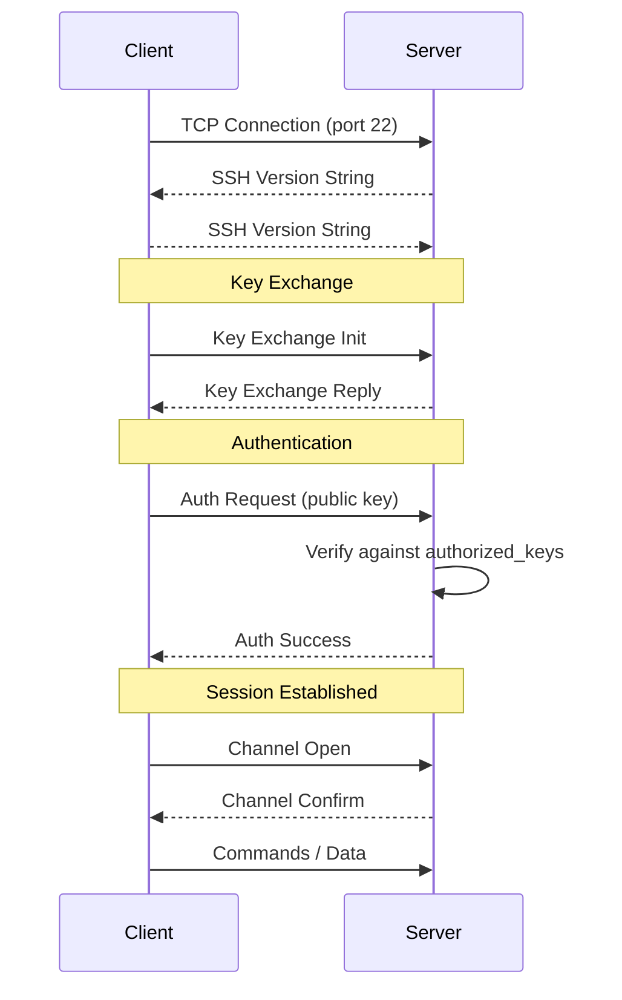
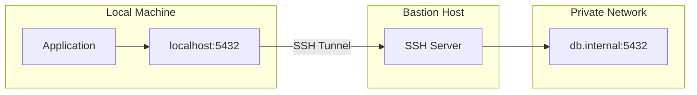

# Modul 07: SSH (Secure Shell) untuk Data Engineering

## 📚 Daftar Isi
- [Learning Outcome](#learning-outcome)
- [Prasyarat](#prasyarat)
- [Bab 0: Analisis Kebutuhan](#bab-0-analisis-kebutuhan)
- [Bab 1: Konsep Dasar SSH](#bab-1-konsep-dasar-ssh)
- [Bab 2: Command Dasar](#bab-2-command-dasar)
- [Bab 3: Flow Latihan SSH](#bab-3-flow-latihan-ssh)
- [Bab 4: Advanced Topics](#bab-4-advanced-topics)
- [Bab 5: Mini Challenge](#bab-5-mini-challenge)
- [Referensi](#referensi)

---

## Learning Outcome
Setelah menyelesaikan modul ini, peserta mampu:

1. ✅ Memahami konsep SSH dan enkripsi
2. ✅ Membuat dan mengelola SSH keys
3. ✅ Koneksi ke remote server dengan SSH
4. ✅ Transfer file dengan SCP dan SFTP
5. ✅ Setup passwordless authentication
6. ✅ Menggunakan SSH tunneling dan port forwarding

---

## Prasyarat
- Menyelesaikan Modul 01-06
- Pemahaman dasar networking
- Akses ke terminal Linux

---

## Bab 0: Analisis Kebutuhan

### Mengapa SSH Penting untuk Data Engineering?

| Aspek | Kebutuhan | Solusi SSH |
|-------|-----------|------------|
| **Remote Access** | Akses server production | SSH login |
| **Secure Transfer** | Transfer data sensitif | SCP, SFTP |
| **Automation** | Script deployment tanpa password | SSH keys |
| **Database Access** | Connect ke DB di private network | SSH tunneling |
| **CI/CD** | Automated deployment | SSH keys + scripts |
| **Multi-server** | Manage cluster | SSH config |

### Skenario Data Engineering
```bash
# Connect ke data warehouse server
ssh dataengineer@warehouse.company.com

# Transfer ETL results
scp output/*.csv user@remote:/data/processed/

# Tunnel ke database
ssh -L 5432:db.internal:5432 user@bastion

# Run remote script
ssh user@server './run_etl.sh'
```

---

## Bab 1: Konsep Dasar SSH

### Apa itu SSH?

SSH (Secure Shell) adalah protokol jaringan terenkripsi untuk:
- Remote login ke server
- Eksekusi command jarak jauh
- Transfer file yang aman
- Tunneling dan port forwarding

### SSH Authentication Methods

| Method | Security | Use Case |
|--------|----------|----------|
| **Password** | Low | Quick testing |
| **SSH Key** | High | Production, automation |
| **Key + Passphrase** | Very High | Critical systems |
| **2FA** | Highest | Sensitive environments |

### SSH Key Pair

```
┌─────────────────┐          ┌─────────────────┐
│   Private Key   │          │   Public Key    │
│   (id_rsa)      │    →     │ (id_rsa.pub)    │
│   KEEP SECRET!  │          │ Share with      │
│   ~/.ssh/       │          │ remote servers  │
└─────────────────┘          └─────────────────┘
```

### Key Types

| Type | Command | Recommendation |
|------|---------|----------------|
| RSA | `ssh-keygen -t rsa -b 4096` | Good compatibility |
| Ed25519 | `ssh-keygen -t ed25519` | Modern, preferred |
| ECDSA | `ssh-keygen -t ecdsa` | Alternative |

### SSH Directory Structure

```
~/.ssh/
├── id_rsa           # Private key (RSA)
├── id_rsa.pub       # Public key (RSA)
├── id_ed25519       # Private key (Ed25519)
├── id_ed25519.pub   # Public key (Ed25519)
├── known_hosts      # Server fingerprints
├── authorized_keys  # Keys allowed to login (server)
└── config           # SSH client configuration
```

---

## Bab 2: Command Dasar

### SSH Key Management

| Command | Fungsi | Contoh |
|---------|--------|--------|
| `ssh-keygen` | Generate key pair | `ssh-keygen -t ed25519` |
| `ssh-keygen -t rsa -b 4096` | Generate RSA key | With 4096 bits |
| `ssh-copy-id user@host` | Copy public key to server | Passwordless setup |
| `ssh-add` | Add key to agent | `ssh-add ~/.ssh/id_rsa` |
| `ssh-agent` | Start SSH agent | `eval $(ssh-agent)` |

### SSH Connection

| Command | Fungsi | Contoh |
|---------|--------|--------|
| `ssh user@host` | Connect to remote | `ssh admin@server.com` |
| `ssh -p port user@host` | Custom port | `ssh -p 2222 user@host` |
| `ssh -i key user@host` | Specific key | `ssh -i ~/.ssh/prod_key user@host` |
| `ssh user@host command` | Run remote command | `ssh user@host ls -la` |
| `ssh -v user@host` | Verbose (debug) | `ssh -v user@server` |

### File Transfer - SCP

| Command | Fungsi | Contoh |
|---------|--------|--------|
| `scp file user@host:path` | Upload file | `scp data.csv user@host:/data/` |
| `scp user@host:path local` | Download file | `scp user@host:/data/file.csv .` |
| `scp -r dir user@host:path` | Upload directory | `scp -r data/ user@host:/backup/` |
| `scp -P port ...` | Custom port | `scp -P 2222 file user@host:` |

### File Transfer - SFTP

| Command | Fungsi | Contoh |
|---------|--------|--------|
| `sftp user@host` | Start SFTP session | `sftp admin@server` |
| `put file` | Upload file (in SFTP) | `put local.csv` |
| `get file` | Download file (in SFTP) | `get remote.csv` |
| `ls` / `lls` | Remote/local listing | `ls /data` / `lls` |
| `cd` / `lcd` | Remote/local cd | `cd /data` / `lcd ~/` |

### SSH Tunneling

| Command | Fungsi | Contoh |
|---------|--------|--------|
| `ssh -L local:remote:port user@host` | Local forwarding | `ssh -L 5432:db:5432 user@bastion` |
| `ssh -R remote:local:port user@host` | Remote forwarding | `ssh -R 8080:localhost:80 user@server` |
| `ssh -D port user@host` | Dynamic (SOCKS) | `ssh -D 1080 user@server` |
| `ssh -N -L ...` | Forward only (no shell) | `ssh -N -L 5432:db:5432 user@host` |

---

## Bab 3: Flow Latihan SSH

### 🔧 Flow 0: Persiapan Lab
```bash
# Pindah ke direktori lab
cd ~/linux-practical/lab/07-ssh/
mkdir -p scripts configs keys

# Pastikan SSH client terinstall
which ssh
ssh -V

# Cek direktori SSH
ls -la ~/.ssh/ 2>/dev/null || echo "No .ssh directory yet"
```

---

### 🔑 Flow 1: Generate SSH Keys
```bash
# Create .ssh directory dengan permission benar
mkdir -p ~/.ssh
chmod 700 ~/.ssh

# Generate Ed25519 key (recommended)
ssh-keygen -t ed25519 -C "your_email@example.com"
# Press Enter untuk default location
# Optional: set passphrase

# Atau generate RSA key
ssh-keygen -t rsa -b 4096 -C "your_email@example.com"

# Lihat keys yang dibuat
ls -la ~/.ssh/

# Lihat public key
cat ~/.ssh/id_ed25519.pub
# atau
cat ~/.ssh/id_rsa.pub

# Permission yang benar
chmod 700 ~/.ssh
chmod 600 ~/.ssh/id_*
chmod 644 ~/.ssh/id_*.pub
```
**✅ Tujuan:** Generate SSH key pair untuk authentication

---

### 🔐 Flow 2: SSH Agent
```bash
# Start SSH agent
eval "$(ssh-agent -s)"

# Add private key ke agent
ssh-add ~/.ssh/id_ed25519
# atau
ssh-add ~/.ssh/id_rsa

# List keys di agent
ssh-add -l

# Remove all keys dari agent
ssh-add -D

# Add key dengan timeout (1 hour)
ssh-add -t 3600 ~/.ssh/id_ed25519
```
**✅ Tujuan:** Mengelola SSH keys dengan agent

---

### 🌐 Flow 3: SSH Connection (Simulasi)
```bash
# Test koneksi ke localhost (jika SSH server aktif)
# ssh localhost

# Verbose mode untuk debugging
# ssh -v localhost

# Run command di remote
# ssh user@host 'hostname; date; uptime'

# Interactive session simulation
cat > scripts/ssh_test.sh << 'EOF'
#!/bin/bash
# SSH Connection Test Script

TARGET=${1:-localhost}
PORT=${2:-22}

echo "Testing SSH connection to $TARGET:$PORT..."

# Check if port is open
if nc -zv -w 3 $TARGET $PORT 2>&1 | grep -q succeeded; then
    echo "✅ Port $PORT is open"
else
    echo "❌ Port $PORT is closed or unreachable"
    exit 1
fi

# Get SSH version
echo "SSH Server Version:"
echo "" | nc -w 3 $TARGET $PORT 2>/dev/null | head -1
EOF
chmod +x scripts/ssh_test.sh
```
**✅ Tujuan:** Understand SSH connection flow

---

### 📁 Flow 4: SSH Config File
```bash
# Buat SSH config
cat > ~/.ssh/config << 'EOF'
# Default settings
Host *
    ServerAliveInterval 60
    ServerAliveCountMax 3
    AddKeysToAgent yes

# Production Server
Host prod
    HostName production.server.com
    User dataengineer
    Port 22
    IdentityFile ~/.ssh/id_prod

# Staging Server
Host staging
    HostName staging.server.com
    User dataengineer
    Port 22
    IdentityFile ~/.ssh/id_staging

# Database Bastion
Host bastion
    HostName bastion.company.com
    User admin
    Port 22
    LocalForward 5432 db.internal:5432
    LocalForward 6379 redis.internal:6379

# Jump Host Configuration
Host internal
    HostName 10.0.0.100
    User admin
    ProxyJump bastion
EOF

chmod 600 ~/.ssh/config

# Sekarang bisa connect dengan:
# ssh prod
# ssh staging
# ssh bastion
```
**✅ Tujuan:** Simplify SSH connections dengan config

---

### 📦 Flow 5: File Transfer (SCP/SFTP)
```bash
# Buat sample files
mkdir -p /tmp/ssh_transfer
echo "Sample data file" > /tmp/ssh_transfer/data.csv
echo '{"status":"ok"}' > /tmp/ssh_transfer/status.json

# SCP upload (contoh syntax)
# scp /tmp/ssh_transfer/data.csv user@remote:/path/

# SCP download
# scp user@remote:/path/file.csv /tmp/

# SCP recursive
# scp -r /tmp/ssh_transfer/ user@remote:/backup/

# SFTP session (contoh)
# sftp user@remote
# > put data.csv
# > get remote_file.csv
# > ls
# > exit

# Create SCP transfer script
cat > scripts/transfer.sh << 'EOF'
#!/bin/bash

# File Transfer Script
ACTION=${1:-help}
LOCAL=${2:-}
REMOTE=${3:-}
HOST=${4:-remote}

case "$ACTION" in
    upload)
        echo "Uploading $LOCAL to $HOST:$REMOTE"
        scp -r "$LOCAL" "$HOST:$REMOTE"
        ;;
    download)
        echo "Downloading $HOST:$REMOTE to $LOCAL"
        scp -r "$HOST:$REMOTE" "$LOCAL"
        ;;
    sync)
        echo "Syncing $LOCAL with $HOST:$REMOTE"
        rsync -avz "$LOCAL" "$HOST:$REMOTE"
        ;;
    *)
        echo "Usage: $0 [upload|download|sync] local remote host"
        echo "Example: $0 upload ./data /backup prod"
        ;;
esac
EOF
chmod +x scripts/transfer.sh
```
**✅ Tujuan:** Mahir transfer file via SSH

---

## Bab 4: Advanced Topics

### SSH Tunneling Explained

#### Local Port Forwarding
```bash
# Scenario: Access database yang hanya bisa diakses dari server
# db.internal:5432 hanya accessible dari bastion

# Local forwarding: akses db.internal:5432 via localhost:5432
ssh -L 5432:db.internal:5432 user@bastion

# Sekarang connect ke database:
# psql -h localhost -p 5432 -U dbuser

# Run di background
ssh -fN -L 5432:db.internal:5432 user@bastion

# Multiple forwards
ssh -L 5432:db:5432 -L 6379:redis:6379 user@bastion
```

#### Remote Port Forwarding
```bash
# Scenario: Expose local service ke remote
# Share local:8080 ke remote:9090

ssh -R 9090:localhost:8080 user@remote

# Now remote can access your local service via localhost:9090
```

#### Dynamic Port Forwarding (SOCKS Proxy)
```bash
# Create SOCKS proxy
ssh -D 1080 user@remote

# Configure browser/app to use SOCKS5 proxy at localhost:1080
# All traffic will go through SSH tunnel
```

### SSH Jump Host / ProxyJump
```bash
# Connect via jump host
ssh -J jumphost user@target

# Multiple jumps
ssh -J jump1,jump2 user@target

# In SSH config
Host internal-server
    HostName 10.0.0.100
    User admin
    ProxyJump bastion
```

### SSH Multiplexing
```bash
# Enable multiplexing in ~/.ssh/config
Host *
    ControlMaster auto
    ControlPath ~/.ssh/sockets/%r@%h-%p
    ControlPersist 600

# Create sockets directory
mkdir -p ~/.ssh/sockets

# First connection creates master
ssh user@remote

# Subsequent connections reuse the socket (faster)
ssh user@remote 'ls'  # Instant connection
```

### Secure Key Management
```bash
# Key with passphrase
ssh-keygen -t ed25519 -f ~/.ssh/id_secure -C "secure@example.com"
# Enter passphrase when prompted

# Change passphrase
ssh-keygen -p -f ~/.ssh/id_rsa

# Key for specific purpose
ssh-keygen -t ed25519 -f ~/.ssh/id_github -C "github"
ssh-keygen -t ed25519 -f ~/.ssh/id_server -C "server-access"

# Restrict key usage (in authorized_keys on server)
# command="/path/to/script",no-port-forwarding,no-X11-forwarding ssh-ed25519 AAAA... key@host
```

---

## Bab 5: Mini Challenge

### Challenge 1: SSH Connection Manager
```bash
cat > scripts/ssh_manager.sh << 'EOF'
#!/bin/bash

# SSH Connection Manager

CONFIG_FILE=~/.ssh_hosts

# Initialize if not exists
if [ ! -f "$CONFIG_FILE" ]; then
    echo "# SSH Hosts Database" > "$CONFIG_FILE"
    echo "# Format: alias|hostname|user|port|key" >> "$CONFIG_FILE"
fi

add_host() {
    echo "Adding new host..."
    read -p "Alias: " alias
    read -p "Hostname: " hostname
    read -p "User: " user
    read -p "Port [22]: " port
    port=${port:-22}
    read -p "Key file [~/.ssh/id_ed25519]: " key
    key=${key:-~/.ssh/id_ed25519}
    
    echo "$alias|$hostname|$user|$port|$key" >> "$CONFIG_FILE"
    echo "✅ Host added: $alias"
}

list_hosts() {
    echo "╔══════════════════════════════════════════════╗"
    echo "║           Available SSH Hosts                ║"
    echo "╠══════════════════════════════════════════════╣"
    grep -v "^#" "$CONFIG_FILE" | while IFS='|' read alias hostname user port key; do
        [ -z "$alias" ] && continue
        printf "║ %-10s → %s@%s:%s\n" "$alias" "$user" "$hostname" "$port"
    done
    echo "╚══════════════════════════════════════════════╝"
}

connect() {
    alias=$1
    host_line=$(grep "^$alias|" "$CONFIG_FILE")
    
    if [ -z "$host_line" ]; then
        echo "❌ Host not found: $alias"
        exit 1
    fi
    
    IFS='|' read alias hostname user port key <<< "$host_line"
    echo "Connecting to $user@$hostname:$port..."
    ssh -p "$port" -i "$key" "$user@$hostname"
}

case "${1:-help}" in
    add) add_host ;;
    list) list_hosts ;;
    connect) connect "$2" ;;
    *)
        echo "SSH Connection Manager"
        echo "Usage: $0 [add|list|connect alias]"
        ;;
esac
EOF
chmod +x scripts/ssh_manager.sh
```

### Challenge 2: SSH Tunnel Manager
```bash
cat > scripts/tunnel_manager.sh << 'EOF'
#!/bin/bash

# SSH Tunnel Manager

TUNNEL_DIR=~/.ssh/tunnels
mkdir -p "$TUNNEL_DIR"

start_tunnel() {
    name="$1"
    local_port="$2"
    remote_host="$3"
    remote_port="$4"
    ssh_host="$5"
    
    pid_file="$TUNNEL_DIR/${name}.pid"
    
    if [ -f "$pid_file" ]; then
        pid=$(cat "$pid_file")
        if kill -0 "$pid" 2>/dev/null; then
            echo "Tunnel '$name' already running (PID: $pid)"
            return 1
        fi
    fi
    
    echo "Starting tunnel: localhost:$local_port → $remote_host:$remote_port via $ssh_host"
    ssh -fN -L "$local_port:$remote_host:$remote_port" "$ssh_host"
    
    # Find the PID
    pid=$(pgrep -f "ssh -fN -L $local_port:$remote_host:$remote_port")
    echo "$pid" > "$pid_file"
    
    echo "✅ Tunnel started (PID: $pid)"
}

stop_tunnel() {
    name="$1"
    pid_file="$TUNNEL_DIR/${name}.pid"
    
    if [ -f "$pid_file" ]; then
        pid=$(cat "$pid_file")
        if kill "$pid" 2>/dev/null; then
            rm "$pid_file"
            echo "✅ Tunnel '$name' stopped"
        else
            echo "Tunnel not running, cleaning up..."
            rm "$pid_file"
        fi
    else
        echo "No tunnel named '$name' found"
    fi
}

list_tunnels() {
    echo "Active Tunnels:"
    for pid_file in "$TUNNEL_DIR"/*.pid; do
        [ -f "$pid_file" ] || continue
        name=$(basename "$pid_file" .pid)
        pid=$(cat "$pid_file")
        
        if kill -0 "$pid" 2>/dev/null; then
            port=$(ps -p "$pid" -o args= | grep -oP '(?<=-L )\d+')
            echo "  ✅ $name (PID: $pid, Port: $port)"
        else
            echo "  ❌ $name (stale)"
            rm "$pid_file"
        fi
    done
}

case "$1" in
    start)
        # Usage: start name local_port remote_host remote_port ssh_host
        start_tunnel "$2" "$3" "$4" "$5" "$6"
        ;;
    stop)
        stop_tunnel "$2"
        ;;
    list)
        list_tunnels
        ;;
    *)
        echo "SSH Tunnel Manager"
        echo "Usage:"
        echo "  $0 start <name> <local_port> <remote_host> <remote_port> <ssh_host>"
        echo "  $0 stop <name>"
        echo "  $0 list"
        echo ""
        echo "Example:"
        echo "  $0 start postgres 5432 db.internal 5432 bastion"
        echo "  $0 stop postgres"
        ;;
esac
EOF
chmod +x scripts/tunnel_manager.sh
```

### Challenge 3: Automated Deployment Script
```bash
cat > scripts/deploy.sh << 'EOF'
#!/bin/bash

# Automated Deployment Script via SSH

# Configuration
DEPLOY_HOST=${DEPLOY_HOST:-"user@server"}
DEPLOY_PATH=${DEPLOY_PATH:-"/var/www/app"}
LOCAL_PATH=${LOCAL_PATH:-"./dist"}
BACKUP_COUNT=${BACKUP_COUNT:-5}

# Colors
RED='\033[0;31m'
GREEN='\033[0;32m'
YELLOW='\033[1;33m'
NC='\033[0m'

log() { echo -e "${GREEN}[$(date +%H:%M:%S)]${NC} $1"; }
warn() { echo -e "${YELLOW}[$(date +%H:%M:%S)]${NC} $1"; }
error() { echo -e "${RED}[$(date +%H:%M:%S)]${NC} $1"; }

deploy() {
    log "Starting deployment to $DEPLOY_HOST:$DEPLOY_PATH"
    
    # Test connection
    log "Testing SSH connection..."
    if ! ssh -q "$DEPLOY_HOST" exit; then
        error "Cannot connect to $DEPLOY_HOST"
        exit 1
    fi
    
    # Create backup
    log "Creating backup..."
    TIMESTAMP=$(date +%Y%m%d_%H%M%S)
    ssh "$DEPLOY_HOST" "
        if [ -d $DEPLOY_PATH ]; then
            cp -r $DEPLOY_PATH ${DEPLOY_PATH}_backup_$TIMESTAMP
        fi
    "
    
    # Deploy files
    log "Uploading files..."
    rsync -avz --delete "$LOCAL_PATH/" "$DEPLOY_HOST:$DEPLOY_PATH/"
    
    # Cleanup old backups
    log "Cleaning old backups..."
    ssh "$DEPLOY_HOST" "
        cd $(dirname $DEPLOY_PATH)
        ls -dt ${DEPLOY_PATH}_backup_* 2>/dev/null | tail -n +$((BACKUP_COUNT + 1)) | xargs rm -rf
    "
    
    # Restart service (optional)
    # log "Restarting service..."
    # ssh "$DEPLOY_HOST" "sudo systemctl restart app"
    
    log "Deployment completed!"
}

rollback() {
    log "Rolling back..."
    
    # Get latest backup
    LATEST_BACKUP=$(ssh "$DEPLOY_HOST" "ls -dt ${DEPLOY_PATH}_backup_* 2>/dev/null | head -1")
    
    if [ -z "$LATEST_BACKUP" ]; then
        error "No backup found!"
        exit 1
    fi
    
    log "Restoring from: $LATEST_BACKUP"
    ssh "$DEPLOY_HOST" "
        rm -rf $DEPLOY_PATH
        mv $LATEST_BACKUP $DEPLOY_PATH
    "
    
    log "Rollback completed!"
}

case "${1:-deploy}" in
    deploy) deploy ;;
    rollback) rollback ;;
    *)
        echo "Usage: $0 [deploy|rollback]"
        echo "Environment variables:"
        echo "  DEPLOY_HOST - SSH host (user@server)"
        echo "  DEPLOY_PATH - Remote deploy path"
        echo "  LOCAL_PATH  - Local source path"
        ;;
esac
EOF
chmod +x scripts/deploy.sh
```

---

## UML Diagram

### SSH Authentication Flow


### SSH Tunneling


---

## Referensi

- [OpenSSH Manual](https://www.openssh.com/manual.html)
- [SSH Academy](https://www.ssh.com/academy/ssh)
- [GitHub SSH Guide](https://docs.github.com/en/authentication/connecting-to-github-with-ssh)
- `man ssh`, `man ssh-keygen`, `man scp`, `man ssh_config`

---

## Tips & Best Practices

| ✅ Do | ❌ Don't |
|------|---------|
| Use SSH keys instead of password | Share private keys |
| Use passphrase on keys | Store keys without protection |
| Use Ed25519 keys | Use old DSA keys |
| Configure SSH config file | Remember complex ssh commands |
| Rotate keys periodically | Use same key forever |

### Security Checklist
```bash
# Correct permissions
chmod 700 ~/.ssh
chmod 600 ~/.ssh/id_*
chmod 644 ~/.ssh/id_*.pub
chmod 600 ~/.ssh/config
chmod 600 ~/.ssh/authorized_keys

# Disable password auth (on server /etc/ssh/sshd_config)
# PasswordAuthentication no
# PubkeyAuthentication yes

# Restrict root login
# PermitRootLogin no
```

### Quick Reference
```bash
# Generate key
ssh-keygen -t ed25519 -C "email@example.com"

# Copy key to server
ssh-copy-id user@server

# Connect with config alias
ssh myserver

# Port forward
ssh -L 5432:db:5432 -N bastion

# Run remote command
ssh server 'cd /app && ./script.sh'
```

---

> 💡 **Pro Tip:** "Setup SSH config dan gunakan alias. Ini membuat automation dan daily work jauh lebih efisien. Kombinasikan dengan SSH agent untuk pengalaman tanpa password yang aman!"
