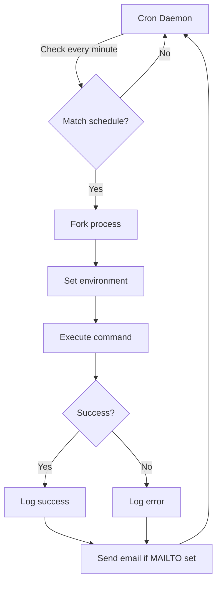
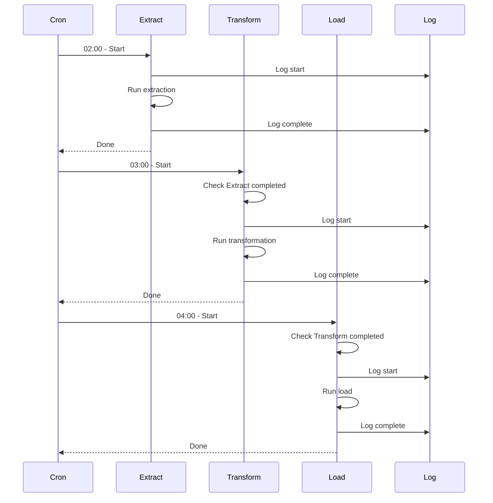

# Modul 08: Cron & Task Scheduling untuk Data Engineering

## 📚 Daftar Isi
- [Learning Outcome](#learning-outcome)
- [Prasyarat](#prasyarat)
- [Bab 0: Analisis Kebutuhan](#bab-0-analisis-kebutuhan)
- [Bab 1: Konsep Dasar Cron](#bab-1-konsep-dasar-cron)
- [Bab 2: Command Dasar](#bab-2-command-dasar)
- [Bab 3: Flow Latihan Cron](#bab-3-flow-latihan-cron)
- [Bab 4: Advanced Topics](#bab-4-advanced-topics)
- [Bab 5: Mini Challenge](#bab-5-mini-challenge)
- [Referensi](#referensi)

---

## Learning Outcome
Setelah menyelesaikan modul ini, peserta mampu:

1. ✅ Memahami syntax cron expression
2. ✅ Membuat, mengelola, dan menghapus cron jobs
3. ✅ Scheduling ETL jobs secara otomatis
4. ✅ Logging dan monitoring cron jobs
5. ✅ Menggunakan systemd timers sebagai alternatif
6. ✅ Best practices untuk production scheduling

---

## Prasyarat
- Menyelesaikan Modul 01-07
- Pemahaman dasar shell scripting
- Akses ke terminal Linux

---

## Bab 0: Analisis Kebutuhan

### Mengapa Scheduling Penting untuk Data Engineering?

| Aspek | Kebutuhan | Solusi |
|-------|-----------|--------|
| **ETL Jobs** | Run daily data extraction | Cron jobs |
| **Backup** | Automated daily/weekly backup | Scheduled scripts |
| **Data Sync** | Sync data setiap jam | Hourly cron |
| **Cleanup** | Hapus old files/logs | Weekly maintenance |
| **Reports** | Generate daily reports | Morning cron |
| **Monitoring** | Health check setiap 5 menit | Short interval cron |

### Skenario Data Engineering
```bash
# ETL job setiap hari jam 2 pagi
0 2 * * * /scripts/etl_daily.sh

# Backup setiap minggu Minggu jam 3 pagi
0 3 * * 0 /scripts/backup_weekly.sh

# Cleanup logs lebih dari 30 hari
0 4 * * * find /logs -mtime +30 -delete

# API data fetch setiap jam
0 * * * * /scripts/fetch_api_data.sh
```

---

## Bab 1: Konsep Dasar Cron

### Apa itu Cron?

Cron adalah daemon Linux untuk menjalankan scheduled tasks (cron jobs). Setiap user bisa memiliki crontab (cron table) sendiri.

### Cron Expression Format

```
┌───────────── minute (0 - 59)
│ ┌───────────── hour (0 - 23)
│ │ ┌───────────── day of month (1 - 31)
│ │ │ ┌───────────── month (1 - 12)
│ │ │ │ ┌───────────── day of week (0 - 7, 0 & 7 = Sunday)
│ │ │ │ │
│ │ │ │ │
* * * * * command_to_execute
```

### Special Characters

| Character | Meaning | Example |
|-----------|---------|---------|
| `*` | Any value | `* * * * *` = setiap menit |
| `,` | List of values | `1,15,30` = menit 1, 15, 30 |
| `-` | Range | `1-5` = hari 1-5 (Mon-Fri) |
| `/` | Step/interval | `*/15` = setiap 15 |
| `@reboot` | On system boot | `@reboot /script.sh` |

### Common Schedules

| Expression | Meaning |
|------------|---------|
| `0 * * * *` | Setiap jam (awal jam) |
| `*/15 * * * *` | Setiap 15 menit |
| `0 0 * * *` | Setiap hari tengah malam |
| `0 2 * * *` | Setiap hari jam 2 pagi |
| `0 0 * * 0` | Setiap minggu (Minggu) |
| `0 0 1 * *` | Setiap bulan (tanggal 1) |
| `0 0 1 1 *` | Setiap tahun (1 Jan) |
| `0 9-17 * * 1-5` | Jam kerja (9-17 Mon-Fri) |

### Special Strings

| String | Equivalent |
|--------|------------|
| `@yearly` | `0 0 1 1 *` |
| `@monthly` | `0 0 1 * *` |
| `@weekly` | `0 0 * * 0` |
| `@daily` | `0 0 * * *` |
| `@hourly` | `0 * * * *` |
| `@reboot` | Run at startup |

---

## Bab 2: Command Dasar

### Crontab Management

| Command | Fungsi | Contoh |
|---------|--------|--------|
| `crontab -e` | Edit crontab | Edit user's crontab |
| `crontab -l` | List crontab | View current crontab |
| `crontab -r` | Remove crontab | Delete all cron jobs |
| `crontab -u user -e` | Edit user's crontab | Requires root |

### Cron Directories

| Directory | Meaning |
|-----------|---------|
| `/etc/crontab` | System crontab |
| `/etc/cron.d/` | Additional cron files |
| `/etc/cron.daily/` | Daily scripts |
| `/etc/cron.hourly/` | Hourly scripts |
| `/etc/cron.weekly/` | Weekly scripts |
| `/etc/cron.monthly/` | Monthly scripts |
| `/var/spool/cron/` | User crontabs |

### Cron Logging

| Command | Fungsi |
|---------|--------|
| `grep CRON /var/log/syslog` | View cron logs (Ubuntu/Debian) |
| `journalctl -u cron` | View cron logs (systemd) |
| `tail -f /var/log/cron` | View cron logs (RHEL/CentOS) |

---

## Bab 3: Flow Latihan Cron

### 🔧 Flow 0: Persiapan Lab
```bash
# Pindah ke direktori lab
cd ~/linux-practical/lab/08-cron/
mkdir -p scripts logs

# Cek cron service
systemctl status cron || service cron status

# Lihat crontab saat ini
crontab -l 2>/dev/null || echo "No crontab for user"

echo "Lab ready!"
```

---

### 📋 Flow 1: Crontab Basics
```bash
# Lihat crontab saat ini
crontab -l

# Buat script untuk test
cat > scripts/hello_cron.sh << 'EOF'
#!/bin/bash
echo "[$(date '+%Y-%m-%d %H:%M:%S')] Hello from cron!" >> ~/linux-practical/lab/08-cron/logs/cron.log
EOF
chmod +x scripts/hello_cron.sh

# Test script manual
./scripts/hello_cron.sh
cat logs/cron.log

# Edit crontab
crontab -e
# Tambahkan baris (jalankan setiap menit):
# * * * * * /home/$USER/linux-practical/lab/08-cron/scripts/hello_cron.sh

# Atau gunakan pipe
(crontab -l 2>/dev/null; echo "* * * * * $HOME/linux-practical/lab/08-cron/scripts/hello_cron.sh") | crontab -

# Verifikasi
crontab -l

# Tunggu 1-2 menit, cek log
sleep 120
cat logs/cron.log
```
**✅ Tujuan:** Memahami dasar crontab

---

### ⏰ Flow 2: Various Schedules
```bash
# Buat script scheduler demo
cat > scripts/scheduler_demo.sh << 'EOF'
#!/bin/bash
SCRIPT_NAME=$(basename "$0")
LOG_FILE="${LOG_DIR:-$HOME/linux-practical/lab/08-cron/logs}/scheduler.log"

mkdir -p "$(dirname "$LOG_FILE")"
echo "[$(date '+%Y-%m-%d %H:%M:%S')] $SCRIPT_NAME executed" >> "$LOG_FILE"
EOF
chmod +x scripts/scheduler_demo.sh

# Contoh berbagai schedule (untuk referensi)
# Jangan tambahkan semua sekaligus!

cat << 'EOF'
# Setiap menit (untuk testing)
* * * * * /path/to/script.sh

# Setiap 5 menit
*/5 * * * * /path/to/script.sh

# Setiap jam tepat
0 * * * * /path/to/script.sh

# Setiap hari jam 2 pagi
0 2 * * * /path/to/script.sh

# Setiap hari jam 8 pagi dan 8 malam
0 8,20 * * * /path/to/script.sh

# Setiap hari kerja jam 9 pagi
0 9 * * 1-5 /path/to/script.sh

# Setiap Minggu jam 3 pagi
0 3 * * 0 /path/to/script.sh

# Tanggal 1 setiap bulan jam 1 pagi
0 1 1 * * /path/to/script.sh
EOF
```
**✅ Tujuan:** Memahami berbagai format schedule

---

### 📝 Flow 3: Environment dan Logging
```bash
# Buat script dengan proper logging
cat > scripts/etl_job.sh << 'EOF'
#!/bin/bash

# ETL Job Script
# Designed to be run by cron

# Configuration
SCRIPT_DIR="$(cd "$(dirname "$0")" && pwd)"
LOG_DIR="${SCRIPT_DIR}/../logs"
LOG_FILE="${LOG_DIR}/etl_$(date +%Y%m%d).log"
LOCK_FILE="/tmp/etl_job.lock"

# Ensure log directory exists
mkdir -p "$LOG_DIR"

# Logging function
log() {
    echo "[$(date '+%Y-%m-%d %H:%M:%S')] $1" >> "$LOG_FILE"
    echo "[$(date '+%Y-%m-%d %H:%M:%S')] $1"
}

# Prevent concurrent execution
if [ -f "$LOCK_FILE" ]; then
    log "ERROR: Job already running (lock file exists)"
    exit 1
fi
trap "rm -f $LOCK_FILE" EXIT
echo $$ > "$LOCK_FILE"

# Start job
log "ETL job started"
log "Working directory: $(pwd)"
log "User: $(whoami)"

# Simulate ETL process
log "Step 1: Extract data..."
sleep 2

log "Step 2: Transform data..."
sleep 2

log "Step 3: Load data..."
sleep 2

# End job
log "ETL job completed successfully"
exit 0
EOF
chmod +x scripts/etl_job.sh

# Test manual
./scripts/etl_job.sh

# Cek log
ls -la logs/
cat logs/etl_$(date +%Y%m%d).log
```
**✅ Tujuan:** Script yang production-ready untuk cron

---

### 🔒 Flow 4: Lock Files dan Error Handling
```bash
# Script dengan lock dan error handling
cat > scripts/safe_job.sh << 'EOF'
#!/bin/bash

# Safe Cron Job with Lock and Error Handling

SCRIPT_NAME="safe_job"
LOCK_FILE="/tmp/${SCRIPT_NAME}.lock"
LOG_FILE="$HOME/linux-practical/lab/08-cron/logs/${SCRIPT_NAME}.log"
ALERT_EMAIL="${ALERT_EMAIL:-}"  # Set untuk notifikasi

# Logging
log() { echo "[$(date '+%Y-%m-%d %H:%M:%S')] [$1] $2" >> "$LOG_FILE"; }
log_info() { log "INFO" "$1"; }
log_error() { log "ERROR" "$1"; }

# Error handler
handle_error() {
    log_error "Job failed at line $1"
    rm -f "$LOCK_FILE"
    
    if [ -n "$ALERT_EMAIL" ]; then
        echo "Job $SCRIPT_NAME failed at $(date)" | mail -s "Cron Alert" "$ALERT_EMAIL"
    fi
    
    exit 1
}
trap 'handle_error $LINENO' ERR

# Lock handling
acquire_lock() {
    if [ -f "$LOCK_FILE" ]; then
        OLD_PID=$(cat "$LOCK_FILE")
        if kill -0 "$OLD_PID" 2>/dev/null; then
            log_error "Job already running (PID: $OLD_PID)"
            exit 1
        else
            log_info "Removing stale lock file"
            rm -f "$LOCK_FILE"
        fi
    fi
    echo $$ > "$LOCK_FILE"
}

release_lock() {
    rm -f "$LOCK_FILE"
}
trap release_lock EXIT

# Main execution
main() {
    log_info "Job started"
    acquire_lock
    
    # Your job logic here
    log_info "Processing..."
    sleep 3
    
    log_info "Job completed successfully"
}

# Run
mkdir -p "$(dirname "$LOG_FILE")"
main "$@"
EOF
chmod +x scripts/safe_job.sh

# Test
./scripts/safe_job.sh

# Test concurrent execution
./scripts/safe_job.sh & ./scripts/safe_job.sh
wait
```
**✅ Tujuan:** Proper error handling untuk cron jobs

---

### 📊 Flow 5: Monitoring Cron Jobs
```bash
# Buat script untuk monitor cron jobs
cat > scripts/cron_monitor.sh << 'EOF'
#!/bin/bash

# Cron Job Monitor

echo "╔════════════════════════════════════════════════════════╗"
echo "║                Cron Job Monitor                        ║"
echo "║            $(date '+%Y-%m-%d %H:%M:%S')                      ║"
echo "╠════════════════════════════════════════════════════════╣"

# Show current crontab
echo "║ Current Crontab:"
crontab -l 2>/dev/null | while read line; do
    echo "║   $line"
done
echo "║"

# Recent cron activity
echo "║ Recent Cron Activity (last 10):"
grep CRON /var/log/syslog 2>/dev/null | tail -10 | while read line; do
    echo "║   $(echo $line | cut -c1-60)..."
done
echo "║"

# Check lock files
echo "║ Lock Files:"
for lock in /tmp/*.lock; do
    if [ -f "$lock" ]; then
        pid=$(cat "$lock" 2>/dev/null)
        name=$(basename "$lock" .lock)
        if [ -n "$pid" ] && kill -0 "$pid" 2>/dev/null; then
            echo "║   🔒 $name - Running (PID: $pid)"
        else
            echo "║   ⚠️  $name - Stale lock"
        fi
    fi
done

# Recent log files
echo "║"
echo "║ Recent Log Files:"
ls -lt ~/linux-practical/lab/08-cron/logs/*.log 2>/dev/null | head -5 | while read line; do
    echo "║   $line"
done

echo "╚════════════════════════════════════════════════════════╝"
EOF
chmod +x scripts/cron_monitor.sh

# Run monitor
./scripts/cron_monitor.sh
```
**✅ Tujuan:** Monitor status cron jobs

---

## Bab 4: Advanced Topics

### Systemd Timers (Modern Alternative)

```bash
# Buat service file
cat > /tmp/etl-job.service << 'EOF'
[Unit]
Description=ETL Job Service
After=network.target

[Service]
Type=oneshot
ExecStart=/path/to/etl_job.sh
User=dataengineer
StandardOutput=journal
StandardError=journal

[Install]
WantedBy=multi-user.target
EOF

# Buat timer file
cat > /tmp/etl-job.timer << 'EOF'
[Unit]
Description=Run ETL Job Daily

[Timer]
OnCalendar=*-*-* 02:00:00
Persistent=true

[Install]
WantedBy=timers.target
EOF

# Install (requires sudo)
# sudo cp /tmp/etl-job.service /etc/systemd/system/
# sudo cp /tmp/etl-job.timer /etc/systemd/system/
# sudo systemctl daemon-reload
# sudo systemctl enable etl-job.timer
# sudo systemctl start etl-job.timer

# Check status
# systemctl list-timers
# systemctl status etl-job.timer
```

### Cron dengan Email Notification

```bash
# Setup email (requires mail command)
# MAILTO=your@email.com dalam crontab

cat << 'EOF'
# Di awal crontab
MAILTO=dataengineer@company.com
SHELL=/bin/bash
PATH=/usr/local/sbin:/usr/local/bin:/sbin:/bin:/usr/sbin:/usr/bin

# Jobs
0 2 * * * /path/to/script.sh
EOF

# Atau dalam script
# echo "Job completed" | mail -s "Cron Notification" email@example.com
```

### Cron dengan Slack/Webhook Notification

```bash
cat > scripts/notify_slack.sh << 'EOF'
#!/bin/bash

WEBHOOK_URL="${SLACK_WEBHOOK_URL:-}"
MESSAGE="$1"

if [ -z "$WEBHOOK_URL" ]; then
    echo "No webhook URL configured"
    exit 1
fi

curl -s -X POST -H 'Content-type: application/json' \
    --data "{\"text\":\"$MESSAGE\"}" \
    "$WEBHOOK_URL"
EOF
chmod +x scripts/notify_slack.sh

# Gunakan dalam script
# notify_slack.sh "ETL Job completed at $(date)"
```

### Anacron for Non-24/7 Systems

```bash
# /etc/anacrontab
# period  delay  job-identifier  command

# Run daily jobs (dengan delay 5 menit)
1       5       daily-backup    /path/to/backup.sh

# Run weekly jobs (delay 10 menit)
7       10      weekly-cleanup  /path/to/cleanup.sh

# Run monthly jobs (delay 15 menit)
30      15      monthly-report  /path/to/report.sh
```

---

## Bab 5: Mini Challenge

### Challenge 1: Complete ETL Scheduler
```bash
cat > scripts/etl_scheduler.sh << 'EOF'
#!/bin/bash

# ETL Scheduler - Complete Solution
# Manages multiple ETL jobs with dependency handling

SCRIPT_DIR="$(cd "$(dirname "$0")" && pwd)"
CONFIG_DIR="${SCRIPT_DIR}/../configs"
LOG_DIR="${SCRIPT_DIR}/../logs"
JOB_NAME="${1:-default}"

# Initialize directories
mkdir -p "$CONFIG_DIR" "$LOG_DIR"

# Logging
LOG_FILE="$LOG_DIR/scheduler_$(date +%Y%m%d).log"
log() {
    local level=$1
    shift
    echo "[$(date '+%Y-%m-%d %H:%M:%S')] [$level] [$JOB_NAME] $*" | tee -a "$LOG_FILE"
}

# Job tracking
JOB_STATUS_FILE="$LOG_DIR/.job_status"
set_status() { echo "$JOB_NAME:$1:$(date +%s)" >> "$JOB_STATUS_FILE"; }
get_last_status() { grep "^$JOB_NAME:" "$JOB_STATUS_FILE" 2>/dev/null | tail -1 | cut -d: -f2; }

# Lock handling
LOCK_FILE="/tmp/etl_${JOB_NAME}.lock"
acquire_lock() {
    if [ -f "$LOCK_FILE" ]; then
        OLD_PID=$(cat "$LOCK_FILE")
        if kill -0 "$OLD_PID" 2>/dev/null; then
            log "WARN" "Job already running (PID: $OLD_PID)"
            return 1
        fi
        rm -f "$LOCK_FILE"
    fi
    echo $$ > "$LOCK_FILE"
    return 0
}
release_lock() { rm -f "$LOCK_FILE"; }
trap release_lock EXIT

# Wait for dependency
wait_for_dependency() {
    local dep=$1
    local timeout=${2:-300}
    local waited=0
    
    log "INFO" "Waiting for dependency: $dep"
    
    while [ $waited -lt $timeout ]; do
        local dep_status=$(grep "^$dep:" "$JOB_STATUS_FILE" 2>/dev/null | tail -1)
        if echo "$dep_status" | grep -q "completed"; then
            log "INFO" "Dependency $dep is ready"
            return 0
        fi
        sleep 10
        waited=$((waited + 10))
    done
    
    log "ERROR" "Timeout waiting for dependency: $dep"
    return 1
}

# Main job execution
run_job() {
    log "INFO" "Starting job"
    set_status "running"
    
    # Example job steps
    log "INFO" "Step 1: Extract"
    sleep 2
    
    log "INFO" "Step 2: Transform"
    sleep 2
    
    log "INFO" "Step 3: Load"
    sleep 2
    
    set_status "completed"
    log "INFO" "Job completed successfully"
}

# Main
main() {
    if ! acquire_lock; then
        exit 1
    fi
    
    # Check dependencies (if defined)
    if [ -n "$DEPENDS_ON" ]; then
        for dep in $DEPENDS_ON; do
            wait_for_dependency "$dep" || exit 1
        done
    fi
    
    run_job
}

main
EOF
chmod +x scripts/etl_scheduler.sh

# Contoh crontab entry
echo "# ETL Scheduler Jobs
0 2 * * * $HOME/linux-practical/lab/08-cron/scripts/etl_scheduler.sh extract
0 3 * * * DEPENDS_ON=extract $HOME/linux-practical/lab/08-cron/scripts/etl_scheduler.sh transform
0 4 * * * DEPENDS_ON=transform $HOME/linux-practical/lab/08-cron/scripts/etl_scheduler.sh load"
```

### Challenge 2: Backup Rotation System
```bash
cat > scripts/backup_rotation.sh << 'EOF'
#!/bin/bash

# Backup Rotation System
# Implements grandfather-father-son backup scheme

SOURCE_DIR="${SOURCE_DIR:-/data}"
BACKUP_BASE="${BACKUP_BASE:-/backup}"
RETENTION_DAILY=7
RETENTION_WEEKLY=4
RETENTION_MONTHLY=12

# Determine backup type based on day
DAY_OF_WEEK=$(date +%u)  # 1=Monday, 7=Sunday
DAY_OF_MONTH=$(date +%d)

if [ "$DAY_OF_MONTH" = "01" ]; then
    BACKUP_TYPE="monthly"
    RETENTION=$RETENTION_MONTHLY
elif [ "$DAY_OF_WEEK" = "7" ]; then
    BACKUP_TYPE="weekly"
    RETENTION=$RETENTION_WEEKLY
else
    BACKUP_TYPE="daily"
    RETENTION=$RETENTION_DAILY
fi

# Directories
BACKUP_DIR="$BACKUP_BASE/$BACKUP_TYPE"
TIMESTAMP=$(date +%Y%m%d_%H%M%S)
BACKUP_NAME="backup_${TIMESTAMP}.tar.gz"

mkdir -p "$BACKUP_DIR"

echo "=== Backup Rotation System ==="
echo "Type: $BACKUP_TYPE"
echo "Source: $SOURCE_DIR"
echo "Destination: $BACKUP_DIR/$BACKUP_NAME"

# Create backup
if tar -czvf "$BACKUP_DIR/$BACKUP_NAME" "$SOURCE_DIR" 2>/dev/null; then
    echo "✅ Backup created successfully"
    
    # Verify
    if tar -tzf "$BACKUP_DIR/$BACKUP_NAME" > /dev/null 2>&1; then
        echo "✅ Backup verified"
    else
        echo "❌ Backup verification failed!"
        exit 1
    fi
else
    echo "❌ Backup creation failed!"
    exit 1
fi

# Cleanup old backups
echo "Cleaning up backups older than $RETENTION..."
find "$BACKUP_DIR" -name "backup_*.tar.gz" -mtime +$RETENTION -delete

# Summary
echo ""
echo "=== Backup Summary ==="
echo "$BACKUP_TYPE backups:"
ls -lh "$BACKUP_DIR"/*.tar.gz 2>/dev/null | tail -5
echo ""
echo "Total size: $(du -sh "$BACKUP_DIR" | cut -f1)"
EOF
chmod +x scripts/backup_rotation.sh
```

### Challenge 3: Cron Job Dashboard
```bash
cat > scripts/cron_dashboard.sh << 'EOF'
#!/bin/bash

# Cron Job Dashboard
# Displays overview of all scheduled and running jobs

LOG_DIR="$HOME/linux-practical/lab/08-cron/logs"

# Color codes
RED='\033[0;31m'
GREEN='\033[0;32m'
YELLOW='\033[1;33m'
BLUE='\033[0;34m'
NC='\033[0m'

clear
echo "╔════════════════════════════════════════════════════════════════╗"
echo "║                    CRON JOB DASHBOARD                          ║"
echo "║                  $(date '+%Y-%m-%d %H:%M:%S')                          ║"
echo "╠════════════════════════════════════════════════════════════════╣"

# Scheduled Jobs
echo "║ ${BLUE}📅 SCHEDULED JOBS:${NC}"
crontab -l 2>/dev/null | grep -v "^#" | grep -v "^$" | while read line; do
    schedule=$(echo "$line" | awk '{print $1,$2,$3,$4,$5}')
    command=$(echo "$line" | awk '{$1=$2=$3=$4=$5=""; print $0}' | xargs)
    printf "║   %-15s → %s\n" "$schedule" "$(echo $command | cut -c1-45)"
done
echo "║"

# Running Jobs
echo "║ ${GREEN}🔄 RUNNING JOBS:${NC}"
for lock in /tmp/*.lock; do
    [ -f "$lock" ] || continue
    name=$(basename "$lock" .lock)
    pid=$(cat "$lock" 2>/dev/null)
    if [ -n "$pid" ] && kill -0 "$pid" 2>/dev/null; then
        runtime=$(ps -p "$pid" -o etime= 2>/dev/null | xargs)
        printf "║   ✅ %-20s PID: %-8s Runtime: %s\n" "$name" "$pid" "$runtime"
    fi
done
echo "║"

# Recent Logs
echo "║ ${YELLOW}📋 RECENT LOG ENTRIES:${NC}"
if [ -d "$LOG_DIR" ]; then
    cat "$LOG_DIR"/*.log 2>/dev/null | sort | tail -5 | while read line; do
        printf "║   %s\n" "$(echo $line | cut -c1-60)"
    done
fi
echo "║"

# Job Statistics
echo "║ ${BLUE}📊 STATISTICS (Last 24h):${NC}"
TOTAL_RUNS=$(grep -c "completed" "$LOG_DIR"/*.log 2>/dev/null || echo 0)
TOTAL_ERRORS=$(grep -c "ERROR\|FAIL" "$LOG_DIR"/*.log 2>/dev/null || echo 0)
printf "║   Total Runs: %s\n" "$TOTAL_RUNS"
printf "║   Errors: %s\n" "$TOTAL_ERRORS"

echo "╚════════════════════════════════════════════════════════════════╝"
echo ""
echo "Press Ctrl+C to exit. Refresh in 10s..."
sleep 10
exec "$0"
EOF
chmod +x scripts/cron_dashboard.sh
```

---

## UML Diagram

### Cron Job Flow


### ETL Scheduling


---

## Referensi

- [Crontab Guru](https://crontab.guru/) - Cron expression editor
- [Linux Cron Manual](https://man7.org/linux/man-pages/man5/crontab.5.html)
- [Systemd Timers](https://wiki.archlinux.org/title/Systemd/Timers)
- `man crontab`, `man cron`

---

## Tips & Best Practices

| ✅ Do | ❌ Don't |
|------|---------|
| Use absolute paths | Rely on PATH |
| Log all output | Ignore cron output |
| Use lock files | Allow concurrent runs |
| Test scripts manually first | Deploy untested scripts |
| Set MAILTO for errors | Ignore error notifications |
| Use descriptive job names | Name jobs generically |

### Crontab Template
```bash
# Crontab Template for Data Engineering
# Edit with: crontab -e

# Environment
SHELL=/bin/bash
PATH=/usr/local/sbin:/usr/local/bin:/sbin:/bin:/usr/sbin:/usr/bin
MAILTO=dataengineer@company.com
HOME=/home/dataengineer

# Jobs
# Min Hour Day Month DayOfWeek Command

# Daily ETL - 2 AM
0 2 * * * /home/dataengineer/scripts/etl.sh >> /var/log/etl.log 2>&1

# Hourly API sync
0 * * * * /home/dataengineer/scripts/api_sync.sh >> /var/log/api.log 2>&1

# Weekly backup - Sunday 3 AM
0 3 * * 0 /home/dataengineer/scripts/backup.sh >> /var/log/backup.log 2>&1

# Monthly cleanup - 1st of month, 4 AM
0 4 1 * * /home/dataengineer/scripts/cleanup.sh >> /var/log/cleanup.log 2>&1
```

### Quick Reference
```bash
# Edit crontab
crontab -e

# List jobs
crontab -l

# View recent cron activity
grep CRON /var/log/syslog | tail -20

# Test cron-like execution
env -i bash --noprofile --norc /path/to/script.sh
```

---

## Cleanup Lab
```bash
# Remove test cron jobs
crontab -l | grep -v "linux-practical" | crontab -

# Verify
crontab -l
```

---

> 💡 **Pro Tip:** "Selalu test script secara manual sebelum schedule dengan cron. Gunakan absolute path untuk semua commands dan files. Dan jangan lupa redirect output ke log file!"
