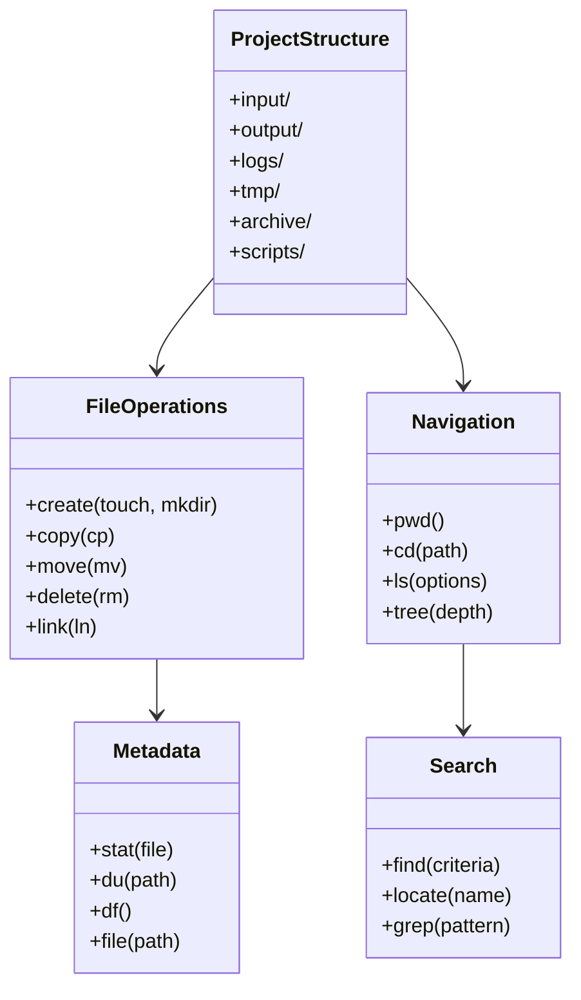
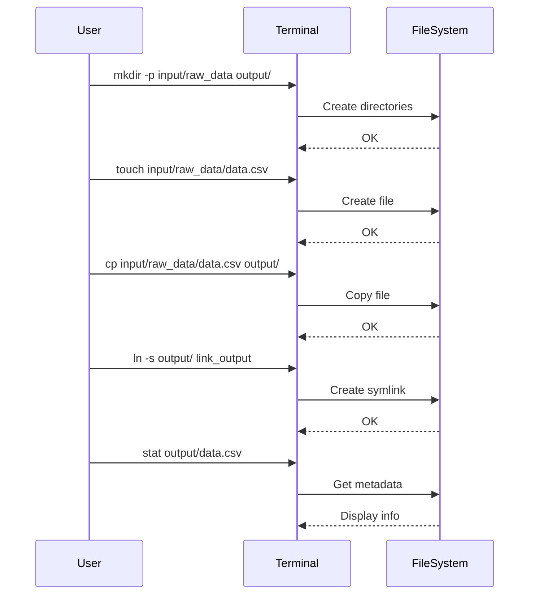

# Modul 01: Filesystem & Path Linux untuk Data Engineering

## 📚 Daftar Isi
- [Learning Outcome](#learning-outcome)
- [Prasyarat](#prasyarat)
- [Bab 0: Analisis Kebutuhan](#bab-0-analisis-kebutuhan)
- [Bab 1: Konsep Dasar Filesystem Linux](#bab-1-konsep-dasar-filesystem-linux)
- [Bab 2: Command Dasar](#bab-2-command-dasar)
- [Bab 3: Flow Latihan Filesystem](#bab-3-flow-latihan-filesystem)
- [Bab 4: Advanced Topics](#bab-4-advanced-topics)
- [Bab 5: Mini Challenge](#bab-5-mini-challenge)
- [Referensi](#referensi)

---

## Learning Outcome
Setelah menyelesaikan modul ini, peserta mampu:

1. ✅ Memahami struktur filesystem Linux (FHS - Filesystem Hierarchy Standard)
2. ✅ Navigasi filesystem Linux menggunakan relative & absolute path  
3. ✅ Membuat, copy, move, rename file dan folder
4. ✅ Menggunakan symbolic link untuk workflow ETL  
5. ✅ Memahami metadata file & kapasitas folder/disk
6. ✅ Mencari file menggunakan \`find\` dan \`locate\`

---

## Prasyarat
- Akses ke terminal Linux (Ubuntu/Debian/WSL)
- Pemahaman dasar command line
- Text editor (nano/vim)

---

## Bab 0: Analisis Kebutuhan

### Mengapa Filesystem Penting untuk Data Engineering?

| Aspek | Kebutuhan | Tools |
|-------|-----------|-------|
| **File & Folder Data** | Organisasi file CSV, JSON, Parquet, log | \`mkdir\`, \`touch\`, \`tree\` |
| **Workflow ETL** | \`input/raw_data → output/processed_data → logs → archive\` | \`cp\`, \`mv\`, \`ln\` |
| **Project Organization** | Struktur folder standar | \`mkdir -p\` |
| **Monitoring & Metadata** | Cek ukuran, waktu modifikasi | \`stat\`, \`ls -lh\`, \`du\`, \`df\` |
| **Automation** | Script untuk batch processing | \`find\`, \`xargs\` |

### Struktur Folder Project Data Engineering
```
project/
├── input/
│   └── raw_data/          # Data mentah
├── output/
│   └── processed_data/    # Data hasil proses
├── logs/                  # Log file
├── tmp/                   # File temporary
├── archive/               # Backup/arsip
└── scripts/               # Script automation
```

---

## Bab 1: Konsep Dasar Filesystem Linux

### Filesystem Hierarchy Standard (FHS)

```
/                     # Root directory
├── bin/              # Binary/executable penting
├── boot/             # File booting
├── dev/              # Device files
├── etc/              # Konfigurasi sistem
├── home/             # Home directory user
│   └── username/     # User home
├── lib/              # Library sistem
├── opt/              # Software optional
├── proc/             # Process information
├── root/             # Home directory root
├── tmp/              # Temporary files
├── usr/              # User programs
│   ├── bin/          # User binaries
│   └── local/        # Local installations
└── var/              # Variable data
    └── log/          # System logs
```

### Path: Absolute vs Relative

| Jenis | Penjelasan | Contoh |
|-------|------------|--------|
| **Absolute Path** | Dimulai dari root \`/\` | \`/home/user/project/data.csv\` |
| **Relative Path** | Relatif terhadap posisi saat ini | \`../input/data.csv\` |
| **Home Shortcut** | \`~\` = home directory | \`~/project\` = \`/home/user/project\` |

### Karakter Khusus Path
| Karakter | Arti |
|----------|------|
| \`.\` | Direktori saat ini |
| \`..\` | Direktori parent |
| \`~\` | Home directory |
| \`-\` | Direktori sebelumnya (untuk \`cd\`) |
| \`*\` | Wildcard (semua karakter) |
| \`?\` | Wildcard (satu karakter) |

---

## Bab 2: Command Dasar

### Navigasi & Eksplorasi

| Command | Fungsi | Contoh | Catatan |
|---------|--------|--------|---------|
| \`pwd\` | Print working directory | \`pwd\` | Menampilkan path absolut |
| \`cd <path>\` | Change directory | \`cd /home/user\` | Gunakan \`cd -\` untuk kembali |
| \`cd ..\` | Naik satu level | \`cd ../..\` | Naik dua level |
| \`cd ~\` | Ke home directory | \`cd ~\` | Shortcut ke home |
| \`ls\` | List directory | \`ls -la\` | \`-l\` detail, \`-a\` hidden, \`-h\` human readable |
| \`tree\` | Struktur visual | \`tree -L 2\` | \`-L\` batas kedalaman |

### Membuat & Menghapus

| Command | Fungsi | Contoh | Catatan |
|---------|--------|--------|---------|
| \`mkdir\` | Buat folder | \`mkdir -p a/b/c\` | \`-p\` recursive |
| \`touch\` | Buat file kosong | \`touch file.txt\` | Update timestamp jika exist |
| \`rm\` | Hapus file | \`rm file.txt\` | \`-r\` recursive, \`-f\` force |
| \`rmdir\` | Hapus folder kosong | \`rmdir folder/\` | Hanya folder kosong |

### Copy, Move, Rename

| Command | Fungsi | Contoh | Catatan |
|---------|--------|--------|---------|
| \`cp\` | Copy file | \`cp src dst\` | \`-r\` recursive, \`-v\` verbose |
| \`cp -r\` | Copy folder | \`cp -r dir1/ dir2/\` | Termasuk isi folder |
| \`mv\` | Move/rename | \`mv old.txt new.txt\` | Rename jika di folder sama |
| \`mv\` | Move file | \`mv file.txt dir/\` | Pindah ke folder lain |

### Link (Symbolic & Hard)

| Command | Fungsi | Contoh | Catatan |
|---------|--------|--------|---------|
| \`ln -s\` | Symbolic link | \`ln -s target link\` | Shortcut, bisa cross filesystem |
| \`ln\` | Hard link | \`ln target link\` | Pointer ke inode sama |
| \`readlink\` | Baca target link | \`readlink link\` | Lihat path asli |
| \`realpath\` | Path absolut | \`realpath file\` | Resolve symlink |

### Pencarian File

| Command | Fungsi | Contoh | Catatan |
|---------|--------|--------|---------|
| \`find\` | Cari file | \`find . -name "*.csv"\` | Pencarian real-time |
| \`find -type\` | Cari by type | \`find . -type d\` | \`f\`=file, \`d\`=dir |
| \`find -mtime\` | Cari by waktu | \`find . -mtime -7\` | Modified 7 hari terakhir |
| \`locate\` | Cari cepat | \`locate data.csv\` | Pakai database, \`updatedb\` |
| \`which\` | Cari executable | \`which python\` | Path program |

### Melihat Isi File

| Command | Fungsi | Contoh | Catatan |
|---------|--------|--------|---------|
| \`cat\` | Tampilkan semua | \`cat file.txt\` | File kecil |
| \`head\` | Tampilkan awal | \`head -n 10 file\` | 10 baris pertama |
| \`tail\` | Tampilkan akhir | \`tail -f log.txt\` | \`-f\` follow (live) |
| \`less\` | Paging view | \`less file.txt\` | \`q\` untuk keluar |
| \`wc\` | Word count | \`wc -l file.txt\` | \`-l\` lines, \`-w\` words |

### Metadata & Disk

| Command | Fungsi | Contoh | Catatan |
|---------|--------|--------|---------|
| \`stat\` | Info detail file | \`stat file.txt\` | Inode, permission, time |
| \`file\` | Tipe file | \`file data.csv\` | Deteksi tipe konten |
| \`du\` | Disk usage folder | \`du -sh folder/\` | \`-s\` summary, \`-h\` human |
| \`df\` | Disk free | \`df -h\` | Space per partition |

---

## Bab 3: Flow Latihan Filesystem

### 🔧 Flow 0: Persiapan Lab
```bash
# Pindah ke direktori lab
cd ~/linux-practical/lab/01-filesystem/

# Cek posisi
pwd

# Buat struktur folder project
mkdir -p input/raw_data output/processed_data logs tmp archive scripts

# Buat file dummy untuk latihan
touch input/raw_data/sales_2024.csv
touch input/raw_data/customers.json
touch input/raw_data/products.parquet
touch logs/etl_log.txt
echo "id,name,value" > input/raw_data/sample.csv
echo '{"status": "ok"}' > input/raw_data/status.json

# Verifikasi struktur
tree -L 2
```
**✅ Hasil:** Struktur folder project siap untuk latihan

---

### 🧭 Flow 1: Navigasi & Eksplorasi
```bash
# List dengan detail
ls -la

# Lihat struktur folder
tree -L 3

# Navigasi relative path
cd input/raw_data
pwd
ls -lh

# Navigasi ke parent
cd ../..
pwd

# Navigasi absolute path
cd ~/linux-practical/lab/01-filesystem/output
pwd

# Kembali ke direktori sebelumnya
cd -
```
**✅ Tujuan:** Mahir navigasi dengan relative & absolute path

---

### 📁 Flow 2: Manipulasi File & Folder
```bash
# Kembali ke root lab
cd ~/linux-practical/lab/01-filesystem/

# Copy file
cp input/raw_data/sample.csv output/processed_data/
cp input/raw_data/sample.csv output/processed_data/sample_backup.csv

# Copy dengan preserve attribute
cp -p input/raw_data/sales_2024.csv tmp/

# Move file
mv input/raw_data/status.json logs/

# Rename file
mv logs/status.json logs/etl_status.json

# Copy folder recursive
cp -r input/raw_data/ archive/raw_backup_\$(date +%Y%m%d)/

# Buat multiple files sekaligus
touch tmp/temp{1,2,3,4,5}.txt

# Hapus file
rm tmp/temp5.txt

# Verifikasi
tree -L 2
```
**✅ Tujuan:** Mahir copy, move, rename file dan folder

---

### 🔗 Flow 3: Symbolic Link
```bash
# Buat symbolic link ke folder
ln -s ~/linux-practical/lab/01-filesystem/input/raw_data link_input
ln -s ~/linux-practical/lab/01-filesystem/output link_output

# Verifikasi link
ls -la | grep "^l"

# Lihat target link
readlink link_input
realpath link_input

# Gunakan link seperti folder biasa
ls link_input/
cat link_input/sample.csv

# Buat symlink untuk file
ln -s logs/etl_log.txt current_log.txt

# Hapus symlink (file target tetap ada)
rm link_output
```
**✅ Tujuan:** Gunakan symlink untuk shortcut workflow ETL

---

### 📊 Flow 4: Metadata & Monitoring
```bash
# Info detail file
stat input/raw_data/sample.csv

# Deteksi tipe file
file input/raw_data/*

# Ukuran folder
du -sh input/
du -sh output/
du -h --max-depth=1 .

# Disk space
df -h

# Count files
find . -type f | wc -l

# Lihat file terbesar
du -ah . | sort -rh | head -10
```
**✅ Tujuan:** Monitoring file dan disk usage

---

### 🔍 Flow 5: Pencarian File
```bash
# Cari file by nama
find . -name "*.csv"
find . -name "*.json"

# Cari file by tipe
find . -type f -name "*.txt"
find . -type d -name "raw*"

# Cari file kosong
find . -type f -empty

# Cari file by size
find . -type f -size +1k
find . -type f -size -100k

# Cari file modified hari ini
find . -type f -mtime 0

# Cari dan eksekusi command
find . -name "*.csv" -exec ls -lh {} \;
find . -name "*.txt" -exec wc -l {} \;

# Cari dengan exclude folder
find . -path "./archive" -prune -o -name "*.csv" -print
```
**✅ Tujuan:** Mahir mencari file dengan berbagai kriteria

---

## Bab 4: Advanced Topics

### Globbing & Wildcards
```bash
# * = semua karakter
ls *.csv
ls input/raw_data/*

# ? = satu karakter
ls tmp/temp?.txt

# [] = range karakter
ls tmp/temp[1-3].txt

# {} = multiple patterns (brace expansion)
ls {input,output}/
cp file.{txt,bak}
touch report_{jan,feb,mar}.csv
```

### File Descriptor & Redirection
```bash
# Redirect stdout ke file
ls -la > file_list.txt

# Append ke file
echo "new line" >> file_list.txt

# Redirect stderr
find / -name "*.conf" 2> errors.txt

# Redirect stdout dan stderr
command &> all_output.txt

# Pipe output ke command lain
ls -la | grep ".csv" | wc -l
```

### xargs untuk Batch Processing
```bash
# Find dan process
find . -name "*.csv" | xargs wc -l

# Find dan copy
find . -name "*.log" | xargs -I {} cp {} archive/

# Parallel processing
find . -name "*.csv" | xargs -P 4 -I {} gzip {}
```

---

## Bab 5: Mini Challenge

### Challenge 1: Organisasi Data
```bash
# 1. Buat struktur folder project baru
mkdir -p ~/data_project/{raw,staging,production,archive,logs}

# 2. Buat dummy files
for i in {1..5}; do
  echo "data,\$i,\$RANDOM" > ~/data_project/raw/data_\$i.csv
done

# 3. Copy semua CSV ke staging
find ~/data_project/raw -name "*.csv" -exec cp {} ~/data_project/staging/ \;
```

### Challenge 2: ETL Simulation
```bash
# 1. Pindahkan file processed ke archive dengan timestamp
mkdir -p archive/backup_\$(date +%Y%m%d_%H%M%S)
mv output/processed_data/*.csv archive/backup_\$(date +%Y%m%d_%H%M%S)/

# 2. Buat symbolic link untuk latest archive
ln -sf archive/backup_\$(date +%Y%m%d)* archive/latest

# 3. Log aktivitas
echo "\$(date): Files archived" >> logs/etl_log.txt
```

### Challenge 3: Cleanup Script
```bash
# 1. Hapus file temporary lebih dari 7 hari
find tmp/ -type f -mtime +7 -delete

# 2. Hapus folder kosong
find . -type d -empty -delete

# 3. Compress log files lama
find logs/ -name "*.txt" -mtime +30 -exec gzip {} \;
```

---

## UML Diagram

### Class Diagram


### Sequence Diagram: ETL Workflow


---

## Referensi

- [Linux Filesystem Hierarchy Standard](https://refspecs.linuxfoundation.org/FHS_3.0/fhs/index.html)
- [GNU Coreutils Manual](https://www.gnu.org/software/coreutils/manual/)
- \`man <command>\` - Manual page untuk setiap command
- \`<command> --help\` - Quick help

---

## Tips & Best Practices

| ✅ Do | ❌ Don't |
|------|---------|
| Gunakan \`mkdir -p\` untuk nested folders | Buat folder satu per satu |
| Gunakan \`-i\` untuk confirm delete | \`rm -rf\` tanpa cek |
| Backup sebelum operasi besar | Langsung overwrite |
| Gunakan absolute path di script | Relative path di cron |
| Cek dengan \`ls\` sebelum \`rm\` | Hapus langsung |


> 💡 **Pro Tip:** "Selalu gunakan \`ls\` atau \`tree\` untuk memverifikasi hasil operasi filesystem sebelum melanjutkan ke langkah berikutnya!"

---

**Selanjutnya:** [Modul 02: Permission](../02-permission/README.md)

---