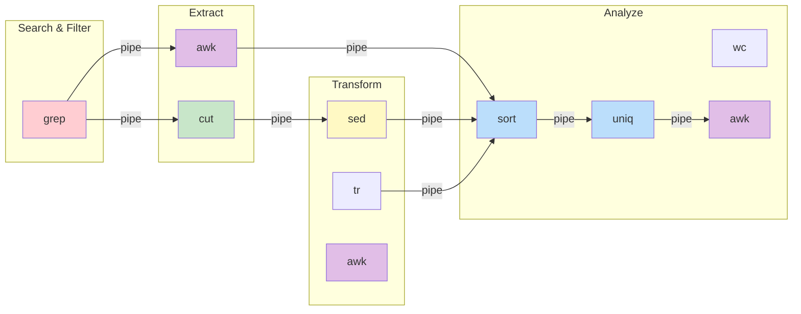
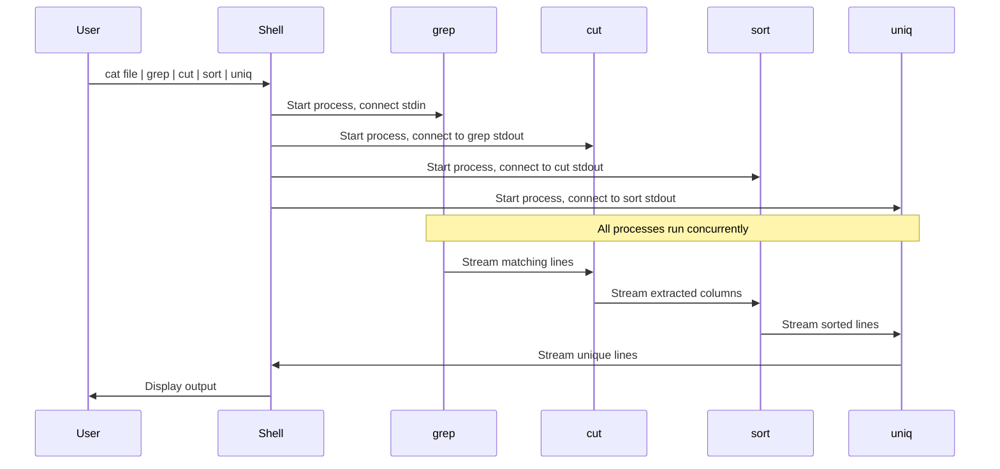

# Modul 09: Text Processing untuk Data Engineering

## 📚 Daftar Isi
- [Learning Outcome](#learning-outcome)
- [Prasyarat](#prasyarat)
- [Bab 0: Analisis Kebutuhan](#bab-0-analisis-kebutuhan)
- [Bab 1: Konsep Dasar](#bab-1-konsep-dasar)
- [Bab 2: Command Dasar](#bab-2-command-dasar)
- [Bab 3: Flow Latihan](#bab-3-flow-latihan)
- [Bab 4: Advanced Topics](#bab-4-advanced-topics)
- [Bab 5: Mini Challenge](#bab-5-mini-challenge)
- [UML Diagram](#uml-diagram)
- [Referensi](#referensi)

---

## Learning Outcome
Setelah menyelesaikan modul ini, peserta mampu:

1. ✅ Menggunakan `grep` untuk mencari pattern dalam file
2. ✅ Menggunakan `sed` untuk find & replace teks
3. ✅ Menggunakan `awk` untuk data extraction dan processing
4. ✅ Menggunakan `cut`, `sort`, `uniq` untuk manipulasi data
5. ✅ Menggabungkan tools dengan pipe untuk data pipeline
6. ✅ Parsing log files dan CSV menggunakan CLI tools

---

## Prasyarat
- Menyelesaikan Modul 01-08
- Familiar dengan terminal dan bash
- Memahami konsep file I/O

---

## Bab 0: Analisis Kebutuhan

### Mengapa Text Processing Penting untuk Data Engineering?

| Use Case | Tools | Contoh |
|----------|-------|--------|
| **Log Analysis** | grep, awk | Filter error dari log files |
| **Data Cleaning** | sed, tr | Remove special characters |
| **CSV Processing** | cut, awk | Extract kolom tertentu |
| **Data Validation** | grep, wc | Hitung records, cari duplicates |
| **Quick Reporting** | sort, uniq | Top 10 values, frequency count |

### Real-World Scenarios

```bash
# 1. Cari semua error di log
grep "ERROR" /var/log/app.log

# 2. Extract kolom email dari CSV
cut -d',' -f3 users.csv

# 3. Hitung unique IP addresses
awk '{print $1}' access.log | sort | uniq -c | sort -rn

# 4. Replace delimiter
sed 's/;/,/g' data.csv > clean_data.csv

# 5. Filter dan transform dalam satu pipeline
cat data.csv | grep "2024" | cut -d',' -f1,3 | sort | uniq
```

### Tool Overview

```
┌─────────────────────────────────────────────────────────────────────┐
│                     TEXT PROCESSING TOOLKIT                         │
├─────────────────────────────────────────────────────────────────────┤
│                                                                     │
│  SEARCH & FILTER          TRANSFORM              ANALYZE           │
│  ┌─────────────┐         ┌─────────────┐       ┌─────────────┐     │
│  │    grep     │         │    sed      │       │    wc       │     │
│  │  (pattern)  │         │  (replace)  │       │  (count)    │     │
│  └─────────────┘         └─────────────┘       └─────────────┘     │
│                                                                     │
│  EXTRACT & CUT            PROCESS               SORT & UNIQUE      │
│  ┌─────────────┐         ┌─────────────┐       ┌─────────────┐     │
│  │    cut      │         │    awk      │       │    sort     │     │
│  │  (columns)  │         │ (advanced)  │       │    uniq     │     │
│  └─────────────┘         └─────────────┘       └─────────────┘     │
│                                                                     │
│  ─────────────────────────────────────────────────────────────────  │
│                              PIPE ( | )                             │
│            Menghubungkan semua tools menjadi pipeline               │
│                                                                     │
└─────────────────────────────────────────────────────────────────────┘
```

---

## Bab 1: Konsep Dasar

### Standard Streams

```
┌──────────┐     ┌──────────┐     ┌──────────┐
│  stdin   │────▶│  COMMAND │────▶│  stdout  │
│   (0)    │     │          │     │   (1)    │
└──────────┘     │          │     └──────────┘
                 │          │────▶ stderr (2)
                 └──────────┘
```

| Stream | Deskripsi | Redirect |
|--------|-----------|----------|
| stdin (0) | Input dari keyboard atau pipe | `<`, `<<` |
| stdout (1) | Output normal | `>`, `>>` |
| stderr (2) | Error messages | `2>`, `2>>` |

### Pipe dan Redirection

```bash
# Pipe - output command1 jadi input command2
command1 | command2 | command3

# Redirect stdout ke file
command > output.txt      # Overwrite
command >> output.txt     # Append

# Redirect stderr
command 2> error.txt

# Redirect both
command > output.txt 2>&1
command &> output.txt     # shorthand
```

### Regular Expression Basics

| Pattern | Arti | Contoh |
|---------|------|--------|
| `.` | Satu karakter apapun | `a.c` → abc, aXc |
| `*` | Nol atau lebih dari sebelumnya | `ab*c` → ac, abc, abbc |
| `+` | Satu atau lebih dari sebelumnya | `ab+c` → abc, abbc |
| `?` | Nol atau satu dari sebelumnya | `ab?c` → ac, abc |
| `^` | Awal baris | `^Error` → Error di awal |
| `$` | Akhir baris | `\.csv$` → diakhiri .csv |
| `[]` | Character class | `[0-9]` → digit |
| `\d` | Digit (extended) | `\d+` → angka |
| `\s` | Whitespace | `\s+` → spasi/tab |
| `\|` | OR | `cat\|dog` → cat atau dog |

---

## Bab 2: Command Dasar

### grep - Search Pattern

```bash
# Basic syntax
grep [OPTIONS] PATTERN [FILE...]

# Common options
grep "error"    file.log      # Case sensitive
grep -i "error" file.log      # Case insensitive
grep -v "debug" file.log      # Invert (exclude)
grep -n "error" file.log      # Show line numbers
grep -c "error" file.log      # Count matches
grep -l "error" *.log         # List matching files only
grep -r "error" /var/log/     # Recursive search
grep -E "error|warning" file  # Extended regex (OR)
grep -o "error" file.log      # Only matching part
grep -A 2 "error" file.log    # 2 lines After match
grep -B 2 "error" file.log    # 2 lines Before match
grep -C 2 "error" file.log    # 2 lines Context (before+after)
```

### sed - Stream Editor

```bash
# Basic syntax
sed [OPTIONS] 'COMMAND' [FILE...]

# Substitution (s command)
sed 's/old/new/'    file      # Replace first occurrence
sed 's/old/new/g'   file      # Replace all (global)
sed 's/old/new/gi'  file      # Global, case insensitive
sed -i 's/old/new/g' file     # In-place edit (modify file)
sed -i.bak 's/old/new/g' file # Backup before edit

# Delete lines (d command)
sed '5d' file                 # Delete line 5
sed '1,10d' file              # Delete lines 1-10
sed '/pattern/d' file         # Delete lines matching pattern
sed '/^$/d' file              # Delete empty lines

# Print specific lines (p command)
sed -n '5p' file              # Print only line 5
sed -n '1,10p' file           # Print lines 1-10
sed -n '/pattern/p' file      # Print lines matching pattern

# Multiple commands
sed -e 's/a/A/g' -e 's/b/B/g' file
sed 's/a/A/g; s/b/B/g' file   # Shorthand
```

### awk - Pattern Processing

```bash
# Basic syntax
awk 'PATTERN { ACTION }' [FILE...]

# Built-in variables
# $0  = entire line
# $1  = first field, $2 = second, etc.
# NF  = number of fields
# NR  = current line number
# FS  = field separator (default: space/tab)
# OFS = output field separator

# Basic usage
awk '{print $1}' file             # Print first column
awk '{print $1, $3}' file         # Print column 1 and 3
awk '{print $NF}' file            # Print last column
awk '{print NR, $0}' file         # Add line numbers

# Set field separator
awk -F',' '{print $1}' file.csv   # Comma separated
awk -F':' '{print $1}' /etc/passwd

# Conditions
awk '$3 > 100 {print $1}' file    # If column 3 > 100
awk '/error/ {print}' file        # Lines containing "error"
awk 'NR==1 {print}' file          # First line only
awk 'NR>1 {print}' file           # Skip header

# BEGIN and END blocks
awk 'BEGIN {print "Header"} {print} END {print "Footer"}' file
awk 'BEGIN {FS=","} {print $1}' file  # Set FS in BEGIN

# Calculations
awk '{sum += $3} END {print sum}' file           # Sum column 3
awk '{sum += $3} END {print sum/NR}' file        # Average
awk '{if ($3 > max) max = $3} END {print max}'   # Max value
```

### cut - Extract Columns

```bash
# Basic syntax
cut [OPTIONS] [FILE...]

# Options
cut -d',' -f1 file.csv        # Field 1, comma delimiter
cut -d',' -f1,3 file.csv      # Fields 1 and 3
cut -d',' -f1-3 file.csv      # Fields 1 to 3
cut -d',' -f2- file.csv       # Field 2 onwards
cut -c1-10 file               # Characters 1-10
```

### sort - Sort Lines

```bash
# Basic syntax
sort [OPTIONS] [FILE...]

# Options
sort file                     # Alphabetical sort
sort -n file                  # Numeric sort
sort -r file                  # Reverse order
sort -k2 file                 # Sort by column 2
sort -k2,2n file              # Sort by column 2 numerically
sort -t',' -k2 file.csv       # Comma delimiter, sort col 2
sort -u file                  # Unique (remove duplicates)
sort -o output.txt file       # Output to file
```

### uniq - Unique Lines

```bash
# Basic syntax (requires sorted input!)
uniq [OPTIONS] [FILE...]

# Options
sort file | uniq              # Remove duplicates
sort file | uniq -c           # Count occurrences
sort file | uniq -d           # Show only duplicates
sort file | uniq -u           # Show only unique (appear once)
```

### Other Useful Commands

```bash
# wc - Word Count
wc file                       # Lines, words, bytes
wc -l file                    # Lines only
wc -w file                    # Words only

# tr - Translate/Delete characters
tr 'a-z' 'A-Z' < file         # Lowercase to uppercase
tr -d '\r' < file             # Delete carriage returns
tr -s ' ' < file              # Squeeze repeated spaces

# head & tail
head -n 10 file               # First 10 lines
tail -n 10 file               # Last 10 lines
tail -f file                  # Follow file (live)

# tee - Write to file AND stdout
command | tee output.txt      # Display and save
command | tee -a output.txt   # Append mode
```

---

## Bab 3: Flow Latihan

### 🔧 Flow 0: Persiapan Lab

```bash
# Buat folder lab
mkdir -p ~/linux-practical/lab/09-text-processing
cd ~/linux-practical/lab/09-text-processing

# Buat sample data
cat > sample.csv << 'EOF'
id,name,age,city,salary
1,Alice,30,Jakarta,5000000
2,Bob,25,Bandung,4500000
3,Charlie,35,Surabaya,6000000
4,Diana,28,Jakarta,5500000
5,Eve,32,Bandung,5200000
6,Frank,29,Jakarta,4800000
7,Grace,31,Surabaya,5100000
8,Henry,27,Bandung,4700000
9,Ivy,33,Jakarta,5800000
10,Jack,26,Surabaya,4600000
EOF

# Buat sample log
cat > app.log << 'EOF'
2024-12-29 10:00:01 INFO  Application started
2024-12-29 10:00:02 DEBUG Loading configuration
2024-12-29 10:00:03 INFO  Connected to database
2024-12-29 10:00:05 ERROR Failed to connect to API
2024-12-29 10:00:06 WARNING Retrying connection...
2024-12-29 10:00:07 INFO  Connection established
2024-12-29 10:00:10 ERROR Database timeout
2024-12-29 10:00:11 DEBUG Query: SELECT * FROM users
2024-12-29 10:00:12 INFO  Retrieved 100 records
2024-12-29 10:00:15 ERROR Disk space low
2024-12-29 10:00:16 WARNING Memory usage high
2024-12-29 10:00:20 INFO  Application shutdown
EOF

# Buat sample access log
cat > access.log << 'EOF'
192.168.1.1 - - [29/Dec/2024:10:00:01] "GET /api/users HTTP/1.1" 200 1234
192.168.1.2 - - [29/Dec/2024:10:00:02] "POST /api/login HTTP/1.1" 200 567
192.168.1.1 - - [29/Dec/2024:10:00:03] "GET /api/products HTTP/1.1" 200 2345
10.0.0.1 - - [29/Dec/2024:10:00:04] "GET /api/users HTTP/1.1" 404 123
192.168.1.3 - - [29/Dec/2024:10:00:05] "GET /api/users HTTP/1.1" 200 1234
192.168.1.1 - - [29/Dec/2024:10:00:06] "POST /api/orders HTTP/1.1" 201 890
192.168.1.2 - - [29/Dec/2024:10:00:07] "GET /api/products HTTP/1.1" 500 456
10.0.0.1 - - [29/Dec/2024:10:00:08] "GET /api/login HTTP/1.1" 200 567
192.168.1.1 - - [29/Dec/2024:10:00:09] "GET /api/users HTTP/1.1" 200 1234
192.168.1.4 - - [29/Dec/2024:10:00:10] "DELETE /api/users/5 HTTP/1.1" 403 234
EOF

# Verifikasi
ls -la
head sample.csv
```

**✅ Hasil:** Lab environment siap dengan sample data

---

### 🔍 Flow 1: grep - Mencari Pattern

```bash
cd ~/linux-practical/lab/09-text-processing

# 1. Cari semua baris yang mengandung "ERROR"
grep "ERROR" app.log

# 2. Cari case-insensitive
grep -i "error" app.log

# 3. Cari dengan line number
grep -n "ERROR" app.log

# 4. Hitung jumlah ERROR
grep -c "ERROR" app.log

# 5. Cari ERROR atau WARNING
grep -E "ERROR|WARNING" app.log

# 6. Cari yang TIDAK mengandung DEBUG
grep -v "DEBUG" app.log

# 7. Tampilkan 1 baris sebelum dan sesudah ERROR
grep -C 1 "ERROR" app.log

# 8. Cari di CSV - orang dari Jakarta
grep "Jakarta" sample.csv

# 9. Cari IP tertentu di access log
grep "192.168.1.1" access.log

# 10. Cari status 200 OK
grep '" 200 ' access.log
```

**✅ Latihan:** 
- Hitung berapa kali IP `192.168.1.1` muncul di access.log
- Cari semua request yang gagal (status 4xx atau 5xx)

---

### ✂️ Flow 2: cut - Extract Kolom

```bash
cd ~/linux-practical/lab/09-text-processing

# 1. Extract nama (kolom 2) dari CSV
cut -d',' -f2 sample.csv

# 2. Extract nama dan kota (kolom 2 dan 4)
cut -d',' -f2,4 sample.csv

# 3. Extract kolom 2 sampai akhir
cut -d',' -f2- sample.csv

# 4. Skip header lalu extract nama
tail -n +2 sample.csv | cut -d',' -f2

# 5. Extract jam dari log (karakter 12-19)
cut -c12-19 app.log

# 6. Extract IP dari access log
cut -d' ' -f1 access.log

# 7. Extract HTTP method
cut -d'"' -f2 access.log | cut -d' ' -f1

# 8. Extract URL path
cut -d'"' -f2 access.log | cut -d' ' -f2
```

**✅ Latihan:**
- Extract hanya kolom salary dari sample.csv
- Extract HTTP status code dari access.log

---

### 📊 Flow 3: sort dan uniq - Sorting & Counting

```bash
cd ~/linux-practical/lab/09-text-processing

# 1. Sort nama alphabetically
tail -n +2 sample.csv | cut -d',' -f2 | sort

# 2. Sort by salary (numeric, column 5)
tail -n +2 sample.csv | sort -t',' -k5 -n

# 3. Sort descending (highest salary first)
tail -n +2 sample.csv | sort -t',' -k5 -rn

# 4. Unique cities
tail -n +2 sample.csv | cut -d',' -f4 | sort | uniq

# 5. Count per city
tail -n +2 sample.csv | cut -d',' -f4 | sort | uniq -c

# 6. Sort by count (most frequent city)
tail -n +2 sample.csv | cut -d',' -f4 | sort | uniq -c | sort -rn

# 7. Unique IP addresses from access log
cut -d' ' -f1 access.log | sort | uniq

# 8. Top IPs by request count
cut -d' ' -f1 access.log | sort | uniq -c | sort -rn

# 9. Unique log levels
cut -d' ' -f4 app.log | sort | uniq -c

# 10. Unique HTTP methods
cut -d'"' -f2 access.log | cut -d' ' -f1 | sort | uniq -c
```

**✅ Latihan:**
- Temukan 3 endpoint paling sering diakses
- Hitung berapa request per HTTP method

---

### 🔄 Flow 4: sed - Find & Replace

```bash
cd ~/linux-practical/lab/09-text-processing

# 1. Replace Jakarta dengan JKT
sed 's/Jakarta/JKT/' sample.csv

# 2. Replace ALL occurrences (global)
sed 's/Jakarta/JKT/g' sample.csv

# 3. Replace dengan backup file
sed -i.bak 's/Jakarta/JKT/g' sample.csv
cat sample.csv
# Restore dari backup
cp sample.csv.bak sample.csv

# 4. Delete header line
sed '1d' sample.csv

# 5. Delete empty lines
sed '/^$/d' sample.csv

# 6. Delete lines containing DEBUG
sed '/DEBUG/d' app.log

# 7. Print hanya baris 2-5
sed -n '2,5p' sample.csv

# 8. Replace delimiter comma ke tab
sed 's/,/\t/g' sample.csv

# 9. Add prefix ke setiap baris
sed 's/^/ROW: /' sample.csv

# 10. Multiple replacements
sed -e 's/Jakarta/JKT/g' -e 's/Bandung/BDG/g' -e 's/Surabaya/SBY/g' sample.csv
```

**✅ Latihan:**
- Ubah semua ERROR menjadi [ERROR] di app.log
- Hapus semua baris dengan status 200 dari access.log

---

### 🧮 Flow 5: awk - Advanced Processing

```bash
cd ~/linux-practical/lab/09-text-processing

# 1. Print nama dan salary
awk -F',' '{print $2, $5}' sample.csv

# 2. Skip header
awk -F',' 'NR>1 {print $2, $5}' sample.csv

# 3. Filter salary > 5000000
awk -F',' 'NR>1 && $5 > 5000000 {print $2, $5}' sample.csv

# 4. Filter by city Jakarta
awk -F',' '$4 == "Jakarta" {print $2, $5}' sample.csv

# 5. Calculate total salary
awk -F',' 'NR>1 {sum += $5} END {print "Total:", sum}' sample.csv

# 6. Calculate average salary
awk -F',' 'NR>1 {sum += $5; count++} END {print "Average:", sum/count}' sample.csv

# 7. Find max salary
awk -F',' 'NR>1 {if($5>max) {max=$5; name=$2}} END {print name, max}' sample.csv

# 8. Group by city and sum salary
awk -F',' 'NR>1 {salary[$4] += $5} END {for (city in salary) print city, salary[city]}' sample.csv

# 9. Format output dengan header
awk -F',' 'BEGIN {print "Name\t\tSalary"} NR>1 {printf "%-15s %d\n", $2, $5}' sample.csv

# 10. Count records per city
awk -F',' 'NR>1 {count[$4]++} END {for (city in count) print city, count[city]}' sample.csv
```

**✅ Latihan:**
- Hitung average salary per city
- Temukan orang dengan age tertinggi

---

### 🔗 Flow 6: Pipeline - Combining Tools

```bash
cd ~/linux-practical/lab/09-text-processing

# 1. Top 3 highest salaries
tail -n +2 sample.csv | sort -t',' -k5 -rn | head -3

# 2. People from Jakarta with salary > 5M
grep "Jakarta" sample.csv | awk -F',' '$5 > 5000000 {print $2, $5}'

# 3. Count errors per hour from log
grep "ERROR" app.log | cut -c12-13 | sort | uniq -c

# 4. Top 3 IPs with most requests
cut -d' ' -f1 access.log | sort | uniq -c | sort -rn | head -3

# 5. All 4xx and 5xx errors
awk '{print $9}' access.log | grep -E "^[45]" | sort | uniq -c

# 6. Extract unique endpoints dan sort
cut -d'"' -f2 access.log | cut -d' ' -f2 | sort | uniq

# 7. Find failed requests (4xx/5xx) with IP
awk '$9 ~ /^[45]/ {print $1, $9, $7}' access.log

# 8. Summary report
echo "=== LOG SUMMARY ===" && \
echo "Total lines: $(wc -l < app.log)" && \
echo "Errors: $(grep -c ERROR app.log)" && \
echo "Warnings: $(grep -c WARNING app.log)"

# 9. CSV to formatted report
awk -F',' 'NR==1 {next} {printf "%-10s %-10s %s\n", $2, $4, $5}' sample.csv | \
    (echo "Name       City       Salary" && cat)

# 10. Complex pipeline: Average salary by city, sorted
awk -F',' 'NR>1 {sum[$4]+=$5; count[$4]++} 
    END {for(c in sum) printf "%s,%.0f\n", c, sum[c]/count[c]}' sample.csv | \
    sort -t',' -k2 -rn
```

**✅ Latihan:**
- Buat report: Top 5 endpoints dengan jumlah request dan status
- Extract semua nama dari Jakarta dan format sebagai list

---

### 📝 Flow 7: Real-World Scenarios

```bash
cd ~/linux-practical/lab/09-text-processing

# === Scenario 1: Log Analysis ===

# Buat larger log file untuk testing
for i in {1..100}; do
    level=$(shuf -e INFO DEBUG ERROR WARNING -n1)
    echo "2024-12-29 10:$(printf %02d $((i%60))):$(printf %02d $((RANDOM%60))) $level Message $i"
done > large_app.log

# Error rate calculation
total=$(wc -l < large_app.log)
errors=$(grep -c ERROR large_app.log)
echo "Error rate: $(echo "scale=2; $errors * 100 / $total" | bc)%"

# Errors per minute
grep ERROR large_app.log | cut -c12-16 | sort | uniq -c

# === Scenario 2: CSV Data Cleaning ===

# Buat dirty data
cat > dirty.csv << 'EOF'
id,name,email
1,  Alice  ,alice@example.com
2,Bob,BOB@EXAMPLE.COM
3,  Charlie,charlie@test.com  

4,Diana,diana@example.com
5,Eve,EVE@test.com
EOF

# Clean: remove extra spaces, normalize email to lowercase
sed '/^$/d' dirty.csv | \
    sed 's/  */ /g' | \
    sed 's/^ //; s/ $//' | \
    awk -F',' '{gsub(/ /, "", $2); print $1","$2","tolower($3)}'

# === Scenario 3: Access Log Analysis ===

# Response time analysis (simulate with size as time)
awk '{print $9, $10}' access.log | sort -k2 -n

# Error report
echo "=== ACCESS LOG ERROR REPORT ==="
echo ""
echo "4xx Errors:"
awk '$9 ~ /^4/ {print "  " $9 ": " $7 " from " $1}' access.log
echo ""
echo "5xx Errors:"
awk '$9 ~ /^5/ {print "  " $9 ": " $7 " from " $1}' access.log

# === Scenario 4: Quick Data Validation ===

# Check for duplicates
echo "Duplicate names:"
tail -n +2 sample.csv | cut -d',' -f2 | sort | uniq -d

# Check for missing values (empty fields)
echo "Rows with empty fields:"
awk -F',' 'NF < 5 || /,,/' sample.csv

# Range validation (age 18-65)
echo "Invalid ages:"
awk -F',' 'NR>1 && ($3 < 18 || $3 > 65) {print $2, $3}' sample.csv
```

**✅ Latihan:**
- Buat script untuk validasi CSV: check duplicates, missing values, range
- Parse log dan generate hourly summary report

---

## Bab 4: Advanced Topics

### 4.1 Complex awk Scripts

```bash
# Multi-line awk script
awk -F',' '
BEGIN {
    print "=== SALARY REPORT ==="
    print ""
}
NR == 1 { next }  # Skip header
{
    total += $5
    count++
    if ($5 > max) { max = $5; max_name = $2 }
    if ($5 < min || min == 0) { min = $5; min_name = $2 }
    city_total[$4] += $5
    city_count[$4]++
}
END {
    print "Total Employees:", count
    print "Total Salary:", total
    print "Average Salary:", total/count
    print ""
    print "Highest:", max_name, "-", max
    print "Lowest:", min_name, "-", min
    print ""
    print "By City:"
    for (c in city_total) {
        printf "  %s: %.0f avg (%d employees)\n", 
            c, city_total[c]/city_count[c], city_count[c]
    }
}
' sample.csv
```

### 4.2 sed with Regular Expressions

```bash
# Extract email domain
echo "user@example.com" | sed 's/.*@//'

# Mask sensitive data
echo "Card: 1234-5678-9012-3456" | sed 's/[0-9]\{4\}-[0-9]\{4\}-/XXXX-XXXX-/'

# Extract date from log
sed -n 's/^\([0-9-]*\).*/\1/p' app.log

# Convert date format
echo "29/12/2024" | sed 's|\([0-9]*\)/\([0-9]*\)/\([0-9]*\)|\3-\2-\1|'
```

### 4.3 Performance Tips

```bash
# Use grep before awk (grep is faster)
# ❌ Slow
awk '/ERROR/ {print $0}' large_file.log

# ✅ Fast
grep "ERROR" large_file.log | awk '{print $0}'

# Use LC_ALL=C for faster sorting
LC_ALL=C sort large_file.txt

# Parallel processing with xargs
cat files.txt | xargs -P 4 -I {} grep "pattern" {}
```

### 4.4 Troubleshooting

| Masalah | Penyebab | Solusi |
|---------|----------|--------|
| uniq tidak bekerja | Data tidak sorted | `sort` dulu sebelum `uniq` |
| cut salah kolom | Delimiter salah | Cek delimiter dengan `cat -A` |
| awk field kosong | Multiple delimiters | Gunakan `awk -F',' '{...}'` |
| sed tidak replace | Special characters | Escape dengan `\` |
| grep no match | Case sensitivity | Gunakan `grep -i` |

---

## Bab 5: Mini Challenge

### Challenge 1: Log Analyzer ⭐

Buat one-liner untuk:
1. Hitung total ERROR, WARNING, INFO
2. Tampilkan error rate percentage
3. List semua unique error messages

### Challenge 2: CSV Reporter ⭐⭐

Dari sample.csv:
1. Generate report: employee per city
2. Top 3 highest paid per city
3. Average age per salary range (< 5M, 5-5.5M, > 5.5M)

### Challenge 3: Access Log Dashboard ⭐⭐⭐

Buat dashboard yang menampilkan:
1. Total requests
2. Success rate (2xx)
3. Top 5 IPs
4. Top 5 endpoints
5. Hourly traffic distribution

---

## UML Diagram

### Flowchart: Text Processing Pipeline
```mermaid
flowchart TD
    A[Input File] --> B{Search/Filter?}
    
    B -->|Yes| C[grep]
    B -->|No| D{Extract Columns?}
    
    C --> D
    
    D -->|Yes| E[cut / awk]
    D -->|No| F{Transform?}
    
    E --> F
    
    F -->|Yes| G[sed / awk / tr]
    F -->|No| H{Sort/Count?}
    
    G --> H
    
    H -->|Yes| I[sort | uniq]
    H -->|No| J{Aggregate?}
    
    I --> J
    
    J -->|Yes| K[awk with sum/count]
    J -->|No| L[Output]
    
    K --> L
    
    style A fill:#e1f5fe
    style L fill:#e8f5e9
```

### Component Diagram: Tools


### Sequence Diagram: Pipeline Execution


---

## Referensi

### Man Pages
```bash
man grep
man sed
man awk
man cut
man sort
man uniq
```

### Online Resources
- [GNU Grep Manual](https://www.gnu.org/software/grep/manual/)
- [GNU Sed Manual](https://www.gnu.org/software/sed/manual/)
- [GNU Awk Manual](https://www.gnu.org/software/gawk/manual/)
- [Regular Expression 101](https://regex101.com/)

### Cheat Sheet

```bash
# ===== GREP =====
grep "pattern" file          # Search
grep -i "pattern" file       # Case insensitive
grep -v "pattern" file       # Invert
grep -n "pattern" file       # Line numbers
grep -c "pattern" file       # Count
grep -E "p1|p2" file         # Extended regex
grep -r "pattern" dir/       # Recursive

# ===== SED =====
sed 's/old/new/' file        # Replace first
sed 's/old/new/g' file       # Replace all
sed -i 's/old/new/g' file    # In-place
sed '1d' file                # Delete line 1
sed '/pattern/d' file        # Delete matching
sed -n '5p' file             # Print line 5

# ===== AWK =====
awk '{print $1}' file        # Print column 1
awk -F',' '{print $1}' file  # Custom delimiter
awk 'NR>1' file              # Skip header
awk '$3>100' file            # Condition
awk '{sum+=$1} END{print sum}' # Sum

# ===== CUT =====
cut -d',' -f1 file           # Field 1
cut -d',' -f1,3 file         # Fields 1 and 3
cut -d',' -f1-3 file         # Fields 1 to 3
cut -c1-10 file              # Characters 1-10

# ===== SORT & UNIQ =====
sort file                    # Alphabetical
sort -n file                 # Numeric
sort -r file                 # Reverse
sort -k2 file                # By column 2
sort file | uniq             # Remove duplicates
sort file | uniq -c          # Count occurrences

# ===== COMMON PIPELINES =====
# Count unique values
cut -d',' -f2 file | sort | uniq -c | sort -rn

# Filter and aggregate
grep "pattern" file | awk '{sum+=$3} END{print sum}'

# Clean and transform
sed 's/old/new/g' file | awk -F',' '{print $1,$2}'
```

---

## ✅ Checklist Sebelum Menyelesaikan Modul

- [ ] Bisa menggunakan grep untuk search dengan regex
- [ ] Bisa menggunakan sed untuk find & replace
- [ ] Bisa menggunakan awk untuk data processing
- [ ] Bisa menggunakan cut untuk extract kolom
- [ ] Bisa menggunakan sort dan uniq untuk analysis
- [ ] Bisa menggabungkan tools dengan pipe
- [ ] Sudah menyelesaikan semua Flow latihan
- [ ] Sudah mencoba Mini Challenges

---

**Sebelumnya:** [Modul 08: Cron](../08-cron/README.md)  
**Selanjutnya:** [Modul 10: Shell Scripting](../10-shell-scripting/README.md)
