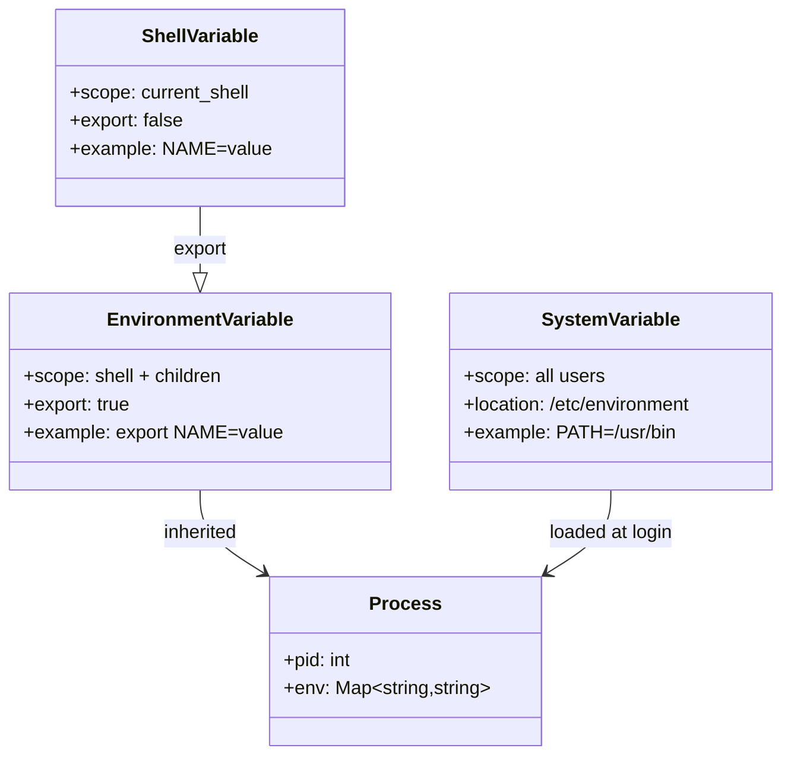
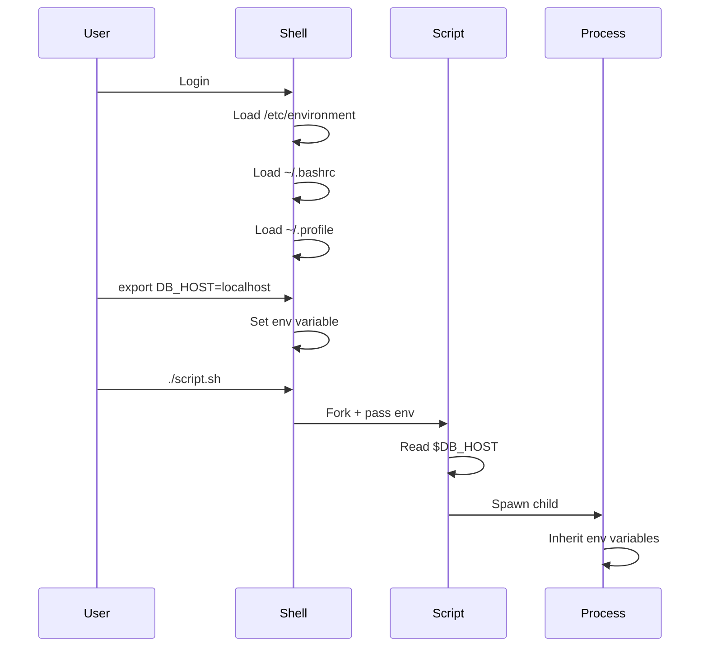

# Modul 03: Environment Variable Linux untuk Data Engineering

## 📚 Daftar Isi
- [Learning Outcome](#learning-outcome)
- [Prasyarat](#prasyarat)
- [Bab 0: Analisis Kebutuhan](#bab-0-analisis-kebutuhan)
- [Bab 1: Konsep Dasar Environment Variable](#bab-1-konsep-dasar-environment-variable)
- [Bab 2: Command Dasar](#bab-2-command-dasar)
- [Bab 3: Flow Latihan Environment Variable](#bab-3-flow-latihan-environment-variable)
- [Bab 4: Advanced Topics](#bab-4-advanced-topics)
- [Bab 5: Mini Challenge](#bab-5-mini-challenge)
- [Referensi](#referensi)

---

## Learning Outcome
Setelah menyelesaikan modul ini, peserta mampu:

1. ✅ Memahami konsep environment variable di Linux
2. ✅ Membuat, mengubah, dan menghapus environment variable
3. ✅ Membedakan session variable dan persistent variable
4. ✅ Menggunakan environment variable dalam script
5. ✅ Mengelola PATH dan konfigurasi aplikasi
6. ✅ Menyimpan credentials dengan aman menggunakan environment variable

---

## Prasyarat
- Menyelesaikan Modul 01: Filesystem
- Menyelesaikan Modul 02: Permission
- Pemahaman dasar shell (bash)

---

## Bab 0: Analisis Kebutuhan

### Mengapa Environment Variable Penting untuk Data Engineering?

| Aspek | Kebutuhan | Solusi |
|-------|-----------|--------|
| **Konfigurasi** | Database connection string | `DB_HOST`, `DB_USER`, `DB_PASS` |
| **Path Management** | Python, Java, tools lokasi | `PATH`, `PYTHONPATH`, `JAVA_HOME` |
| **Credentials** | API keys, passwords | Environment variable (bukan hardcode) |
| **Multi-Environment** | Dev, staging, production | `ENV=development`, `ENV=production` |
| **Automation** | Script portability | Variabel dinamis berdasarkan environment |

### Skenario Data Engineering
```bash
# Development
export DB_HOST=localhost
export DB_NAME=dev_db
export API_KEY=dev_key_123

# Production
export DB_HOST=prod.database.com
export DB_NAME=prod_db
export API_KEY=prod_key_456
```

---

## Bab 1: Konsep Dasar Environment Variable

### Apa itu Environment Variable?

Environment variable adalah pasangan **key-value** yang tersedia di shell session dan dapat diakses oleh proses yang berjalan.

```bash
KEY=value
DATABASE_URL=postgresql://localhost/mydb
```

### Jenis Variable

| Jenis | Scope | Contoh |
|-------|-------|--------|
| **Shell Variable** | Hanya shell saat ini | `name="John"` |
| **Environment Variable** | Shell + child processes | `export NAME="John"` |
| **System Variable** | Semua user/session | `/etc/environment` |

### Environment Variable Penting

| Variable | Fungsi | Contoh |
|----------|--------|--------|
| `PATH` | Lokasi executable | `/usr/local/bin:/usr/bin` |
| `HOME` | Home directory user | `/home/username` |
| `USER` | Username saat ini | `john` |
| `SHELL` | Default shell | `/bin/bash` |
| `PWD` | Working directory | `/home/john/project` |
| `LANG` | Locale/language | `en_US.UTF-8` |
| `EDITOR` | Default text editor | `vim` atau `nano` |

### Naming Convention

| ✅ Good | ❌ Bad |
|---------|--------|
| `DB_HOST` | `db host` (ada spasi) |
| `API_KEY` | `api-key` (ada dash) |
| `MY_VAR_1` | `1_MY_VAR` (mulai angka) |
| `DATABASE_URL` | `database.url` (ada titik) |

**Aturan:**
- Huruf besar (UPPERCASE) untuk environment variable
- Gunakan underscore `_` sebagai separator
- Tidak boleh dimulai dengan angka
- Tidak boleh mengandung spasi atau karakter khusus

---

## Bab 2: Command Dasar

### Melihat Environment Variable

| Command | Fungsi | Contoh |
|---------|--------|--------|
| `printenv` | Tampilkan semua env var | `printenv` |
| `printenv VAR` | Tampilkan satu var | `printenv PATH` |
| `env` | Tampilkan semua env var | `env` |
| `echo $VAR` | Tampilkan nilai var | `echo $HOME` |
| `set` | Semua variable (termasuk shell) | `set` |

### Membuat Variable

| Command | Scope | Contoh |
|---------|-------|--------|
| `VAR=value` | Shell only | `NAME="John"` |
| `export VAR=value` | Shell + child | `export NAME="John"` |
| `export VAR` | Export existing var | `export NAME` |

### Menghapus Variable

| Command | Fungsi | Contoh |
|---------|--------|--------|
| `unset VAR` | Hapus variable | `unset NAME` |
| `VAR=` | Set kosong (tidak sama dengan unset) | `NAME=` |

### Variable dalam Command

| Syntax | Fungsi | Contoh |
|--------|--------|--------|
| `$VAR` | Akses nilai | `echo $HOME` |
| `${VAR}` | Akses dengan delimiter | `echo ${HOME}/data` |
| `${VAR:-default}` | Default jika kosong | `${DB_HOST:-localhost}` |
| `${VAR:=default}` | Set default jika kosong | `${DB_HOST:=localhost}` |
| `${VAR:+alt}` | Alt value jika ada | `${DEBUG:+--verbose}` |
| `${#VAR}` | Length of value | `echo ${#PATH}` |

---

## Bab 3: Flow Latihan Environment Variable

### 🔧 Flow 0: Persiapan Lab
```bash
# Pindah ke direktori lab
cd ~/linux-practical/lab/03-env-variable/
mkdir -p scripts configs

# Buat file untuk latihan
touch scripts/app.sh
touch configs/.env

# Verifikasi
pwd
ls -la
```

---

### 👀 Flow 1: Melihat Environment Variable
```bash
# Lihat semua environment variable
printenv

# Lihat beberapa variable penting
echo "User: $USER"
echo "Home: $HOME"
echo "Shell: $SHELL"
echo "Path: $PATH"
echo "PWD: $PWD"

# Filter environment variable
printenv | grep -i path
env | grep HOME

# Lihat semua variable (termasuk shell variable)
set | head -20
```
**✅ Tujuan:** Familiar dengan environment variable yang ada

---

### ✏️ Flow 2: Membuat dan Mengubah Variable
```bash
# Shell variable (tidak diexport)
MY_NAME="Data Engineer"
echo $MY_NAME

# Environment variable (diexport)
export PROJECT_NAME="ETL Pipeline"
echo $PROJECT_NAME

# Verifikasi perbedaan dengan child process
echo $MY_NAME        # Ada
bash -c 'echo $MY_NAME'   # Kosong (tidak diexport)

echo $PROJECT_NAME   # Ada
bash -c 'echo $PROJECT_NAME'  # Ada (diexport)

# Export existing variable
TEMP_VAR="temporary"
export TEMP_VAR
bash -c 'echo $TEMP_VAR'  # Sekarang ada di child

# Inline variable untuk satu command
DB_HOST=localhost DB_PORT=5432 bash -c 'echo "$DB_HOST:$DB_PORT"'
```
**✅ Tujuan:** Memahami perbedaan shell variable dan environment variable

---

### 📝 Flow 3: Variable dalam Script
```bash
# Buat script yang menggunakan environment variable
cat > scripts/app.sh << 'EOF'
#!/bin/bash

# Default values
DB_HOST=${DB_HOST:-localhost}
DB_PORT=${DB_PORT:-5432}
DB_NAME=${DB_NAME:-mydb}
DEBUG=${DEBUG:-false}

echo "================================"
echo "Application Configuration"
echo "================================"
echo "Database Host: $DB_HOST"
echo "Database Port: $DB_PORT"
echo "Database Name: $DB_NAME"
echo "Debug Mode: $DEBUG"
echo "Environment: ${ENV:-development}"
echo "================================"

if [ "$DEBUG" = "true" ]; then
    echo "[DEBUG] Extra logging enabled"
fi
EOF

# Buat executable
chmod +x scripts/app.sh

# Run dengan default values
./scripts/app.sh

# Run dengan custom values
DB_HOST=prod.db.com DB_PORT=5433 ENV=production ./scripts/app.sh

# Export dan run
export DB_HOST=staging.db.com
export ENV=staging
./scripts/app.sh
```
**✅ Tujuan:** Menggunakan environment variable dalam script

---

### 📁 Flow 4: File .env dan Source
```bash
# Buat file .env
cat > configs/.env << 'EOF'
# Database Configuration
DB_HOST=localhost
DB_PORT=5432
DB_USER=admin
DB_PASS=secret123
DB_NAME=analytics

# API Configuration
API_URL=https://api.example.com
API_KEY=abcd1234efgh5678

# Application Settings
ENV=development
DEBUG=true
LOG_LEVEL=info
EOF

# Load environment variable dari file
source configs/.env
# atau
. configs/.env

# Verifikasi
echo "DB_HOST: $DB_HOST"
echo "API_URL: $API_URL"
echo "ENV: $ENV"

# Unload (hapus variable)
unset DB_HOST DB_PORT DB_USER DB_PASS DB_NAME
unset API_URL API_KEY
unset ENV DEBUG LOG_LEVEL
```
**✅ Tujuan:** Mengelola konfigurasi dengan file .env

---

### 🛤️ Flow 5: PATH Management
```bash
# Lihat PATH saat ini
echo $PATH
echo $PATH | tr ':' '\n'

# Tambah folder ke PATH (sementara)
export PATH="$HOME/bin:$PATH"
echo $PATH | tr ':' '\n' | head -5

# Buat custom script
mkdir -p ~/bin
cat > ~/bin/hello << 'EOF'
#!/bin/bash
echo "Hello from custom script!"
EOF
chmod +x ~/bin/hello

# Jalankan tanpa full path
hello

# Tambah PATH permanent (di ~/.bashrc)
echo 'export PATH="$HOME/bin:$PATH"' >> ~/.bashrc

# Reload bashrc
source ~/.bashrc
```
**✅ Tujuan:** Mengelola PATH untuk custom executables

---

## Bab 4: Advanced Topics

### Persistent Environment Variable

#### User Level (~/.bashrc atau ~/.profile)
```bash
# Edit ~/.bashrc
nano ~/.bashrc

# Tambahkan di akhir file
export DB_HOST=localhost
export DB_PORT=5432
export PYTHONPATH="$HOME/python_libs"
export PATH="$HOME/bin:$PATH"

# Reload
source ~/.bashrc
```

#### System Level (/etc/environment)
```bash
# Edit (perlu sudo)
sudo nano /etc/environment

# Format (tanpa export)
DB_HOST=localhost
JAVA_HOME=/usr/lib/jvm/java-11

# Berlaku setelah login ulang
```

### Variable Substitution

```bash
filename="data_2024.csv"

# Substring dari awal
echo ${filename#data_}     # 2024.csv

# Substring dari akhir
echo ${filename%.csv}      # data_2024

# Replace
echo ${filename/2024/2025}  # data_2025.csv

# Uppercase/Lowercase
name="John Doe"
echo ${name^^}    # JOHN DOE
echo ${name,,}    # john doe
```

### Secure Credentials Management

```bash
# JANGAN simpan password di script!
# ❌ Bad
# DB_PASS=mysecretpassword

# ✅ Good - Gunakan file terpisah dengan permission ketat
cat > ~/.secrets << 'EOF'
export DB_PASS=mysecretpassword
export API_SECRET=supersecret123
EOF
chmod 600 ~/.secrets

# Load saat diperlukan
source ~/.secrets

# Atau gunakan tools seperti:
# - direnv
# - vault
# - aws secrets manager
```

### direnv untuk Project-specific Variables
```bash
# Install direnv
# sudo apt install direnv

# Setup di bashrc
echo 'eval "$(direnv hook bash)"' >> ~/.bashrc
source ~/.bashrc

# Buat .envrc di project folder
cd ~/my_project
cat > .envrc << 'EOF'
export PROJECT_ENV=development
export DB_HOST=localhost
export PATH="$PWD/bin:$PATH"
EOF

# Allow direnv
direnv allow

# Variable otomatis load saat masuk folder
cd ~/my_project
echo $PROJECT_ENV  # development

cd ~
echo $PROJECT_ENV  # kosong (otomatis unload)
```

---

## Bab 5: Mini Challenge

### Challenge 1: Multi-Environment Configuration
```bash
# Buat config untuk different environments
mkdir -p ~/configs

# Development
cat > ~/configs/dev.env << 'EOF'
export ENV=development
export DB_HOST=localhost
export DB_PORT=5432
export DEBUG=true
export LOG_LEVEL=debug
EOF

# Production
cat > ~/configs/prod.env << 'EOF'
export ENV=production
export DB_HOST=prod.database.com
export DB_PORT=5432
export DEBUG=false
export LOG_LEVEL=error
EOF

# Script untuk switch environment
cat > ~/configs/switch_env.sh << 'EOF'
#!/bin/bash
if [ "$1" = "dev" ]; then
    source ~/configs/dev.env
    echo "Switched to development"
elif [ "$1" = "prod" ]; then
    source ~/configs/prod.env
    echo "Switched to production"
else
    echo "Usage: source switch_env.sh [dev|prod]"
fi
EOF

# Usage
source ~/configs/switch_env.sh dev
echo "ENV: $ENV, DEBUG: $DEBUG"
```

### Challenge 2: ETL Script dengan Environment Variable
```bash
cat > ~/etl_pipeline.sh << 'EOF'
#!/bin/bash

# Load configuration
CONFIG_FILE=${CONFIG_FILE:-~/.etl_config}
if [ -f "$CONFIG_FILE" ]; then
    source "$CONFIG_FILE"
fi

# Required variables check
required_vars=("DB_HOST" "DB_USER" "DB_NAME" "OUTPUT_DIR")
for var in "${required_vars[@]}"; do
    if [ -z "${!var}" ]; then
        echo "Error: $var is not set"
        exit 1
    fi
done

# Default values
DB_PORT=${DB_PORT:-5432}
LOG_FILE=${LOG_FILE:-/tmp/etl.log}

echo "Starting ETL Pipeline..."
echo "Database: $DB_USER@$DB_HOST:$DB_PORT/$DB_NAME"
echo "Output: $OUTPUT_DIR"
echo "Log: $LOG_FILE"

# Simulate ETL
mkdir -p "$OUTPUT_DIR"
echo "[$(date)] ETL started" >> "$LOG_FILE"
echo "[$(date)] ETL completed" >> "$LOG_FILE"

echo "ETL Pipeline completed!"
EOF

chmod +x ~/etl_pipeline.sh

# Create config
cat > ~/.etl_config << 'EOF'
export DB_HOST=localhost
export DB_USER=etl_user
export DB_NAME=warehouse
export OUTPUT_DIR=~/etl_output
export LOG_FILE=~/etl.log
EOF

# Run
~/etl_pipeline.sh
```

### Challenge 3: PATH dan Custom Commands
```bash
# Setup custom commands directory
mkdir -p ~/bin

# Create useful data engineering commands
cat > ~/bin/csv-preview << 'EOF'
#!/bin/bash
# Preview CSV file with column headers
head -n ${2:-10} "$1" | column -t -s,
EOF

cat > ~/bin/json-pretty << 'EOF'
#!/bin/bash
# Pretty print JSON
cat "$1" | python3 -m json.tool
EOF

cat > ~/bin/count-lines << 'EOF'
#!/bin/bash
# Count lines in files
for file in "$@"; do
    echo "$(wc -l < "$file") $file"
done
EOF

# Make executable
chmod +x ~/bin/*

# Add to PATH (permanent)
echo 'export PATH="$HOME/bin:$PATH"' >> ~/.bashrc
source ~/.bashrc

# Usage
echo "id,name,value" > test.csv
echo "1,Alice,100" >> test.csv
csv-preview test.csv

echo '{"name":"test","value":123}' > test.json
json-pretty test.json
```

---

## UML Diagram

### Environment Variable Scope


### Variable Loading Flow


---

## Referensi

- [Bash Environment Variables](https://www.gnu.org/software/bash/manual/html_node/Environment.html)
- [Linux Environment Variables](https://linuxize.com/post/how-to-set-and-list-environment-variables-in-linux/)
- [The Twelve-Factor App - Config](https://12factor.net/config)
- `man bash` (section: ENVIRONMENT)

---

## Tips & Best Practices

| ✅ Do | ❌ Don't |
|------|---------|
| Gunakan UPPERCASE untuk env var | Hardcode credentials di script |
| Gunakan file `.env` terpisah | Commit `.env` ke git |
| Set default values | Assume variable selalu ada |
| Validasi required variables | Ignore missing variables |
| Gunakan `chmod 600` untuk secrets | Permission terbuka untuk credentials |

### .gitignore untuk .env
```bash
# Selalu tambahkan ke .gitignore
echo ".env" >> .gitignore
echo "*.env" >> .gitignore
echo ".secrets" >> .gitignore
```

---

> 💡 **Pro Tip:** "Store configuration in the environment - Twelve-Factor App methodology. Ini memudahkan deployment ke berbagai environment tanpa mengubah code!"
