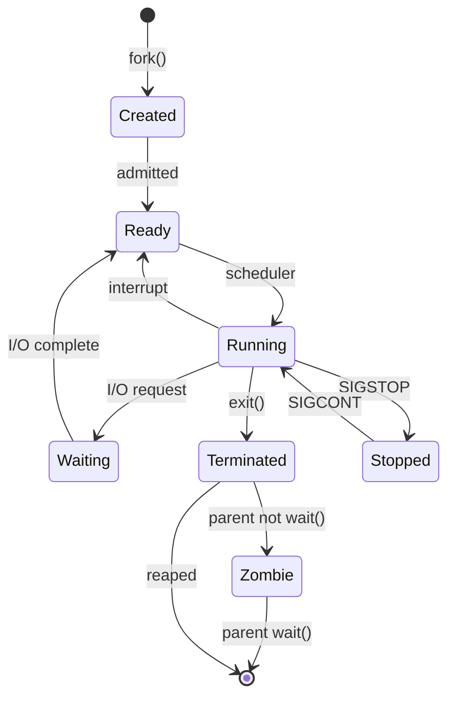
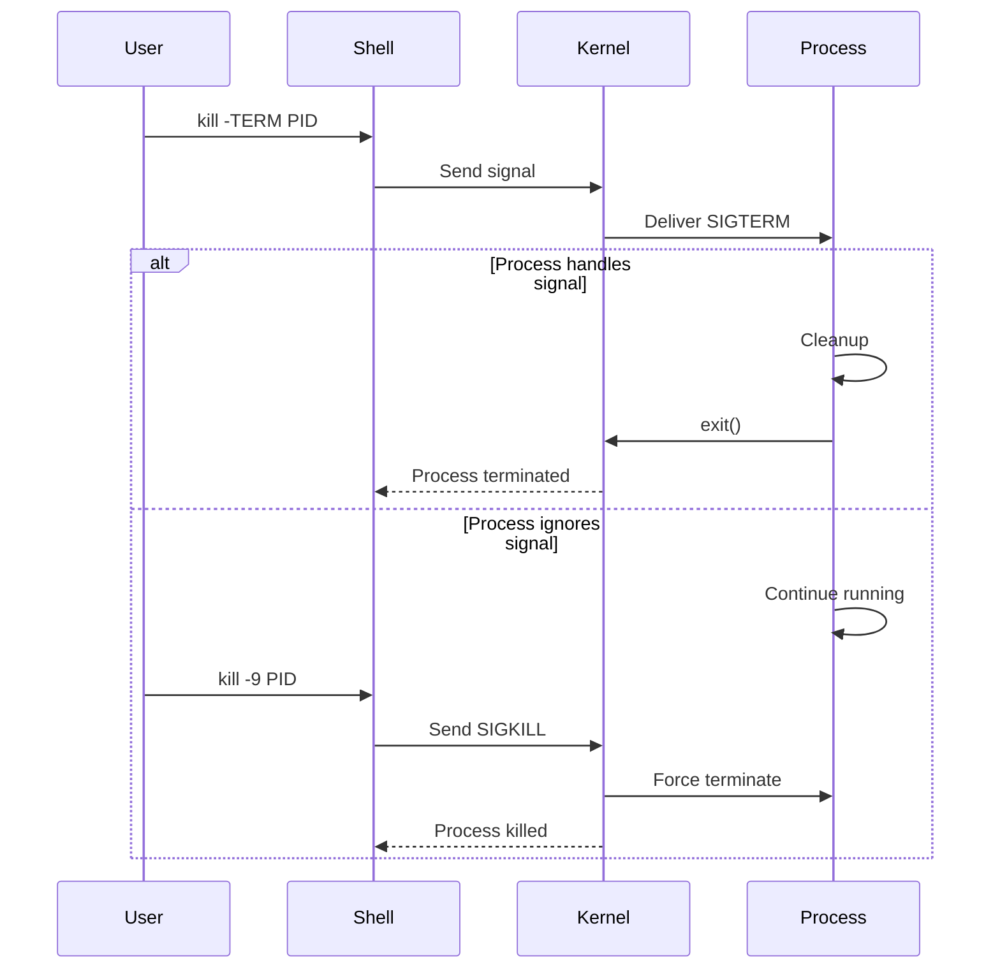

# Modul 04: Process Management Linux untuk Data Engineering

## 📚 Daftar Isi
- [Learning Outcome](#learning-outcome)
- [Prasyarat](#prasyarat)
- [Bab 0: Analisis Kebutuhan](#bab-0-analisis-kebutuhan)
- [Bab 1: Konsep Dasar Process](#bab-1-konsep-dasar-process)
- [Bab 2: Command Dasar](#bab-2-command-dasar)
- [Bab 3: Flow Latihan Process Management](#bab-3-flow-latihan-process-management)
- [Bab 4: Advanced Topics](#bab-4-advanced-topics)
- [Bab 5: Mini Challenge](#bab-5-mini-challenge)
- [Referensi](#referensi)

---

## Learning Outcome
Setelah menyelesaikan modul ini, peserta mampu:

1. ✅ Memahami konsep process di Linux (PID, states, hierarchy)
2. ✅ Memonitor process menggunakan `ps`, `top`, `htop`
3. ✅ Mengelola process foreground dan background
4. ✅ Mengirim signal ke process (`kill`, `pkill`)
5. ✅ Mengatur prioritas process (`nice`, `renice`)
6. ✅ Mengelola job control dalam ETL workflow

---

## Prasyarat
- Menyelesaikan Modul 01-03
- Pemahaman dasar shell dan scripting
- Akses ke terminal Linux

---

## Bab 0: Analisis Kebutuhan

### Mengapa Process Management Penting untuk Data Engineering?

| Aspek | Kebutuhan | Solusi |
|-------|-----------|--------|
| **Long-running Jobs** | ETL yang berjalan berjam-jam | Background process, nohup |
| **Resource Monitoring** | Cek memory/CPU usage | top, htop, ps |
| **Job Control** | Pause, resume, terminate jobs | Signals, job control |
| **Priority Management** | Prioritaskan critical jobs | nice, renice |
| **Multiple Tasks** | Run parallel processes | Background jobs, &, wait |
| **Troubleshooting** | Debug stuck processes | strace, lsof |

### Skenario Data Engineering
```bash
# Run ETL di background
./etl_job.sh &

# Monitor resource usage
top -p $(pgrep -f etl_job)

# Terminate jika stuck
kill -TERM $(pgrep -f etl_job)

# Run dengan priority rendah
nice -n 10 ./heavy_processing.sh
```

---

## Bab 1: Konsep Dasar Process

### Apa itu Process?

Process adalah instance dari program yang sedang berjalan. Setiap process memiliki:
- **PID** (Process ID) - identifier unik
- **PPID** (Parent PID) - PID dari parent process
- **State** - status saat ini
- **Resources** - CPU, memory, file descriptors

### Process States

| State | Symbol | Penjelasan |
|-------|--------|------------|
| Running | `R` | Sedang berjalan atau ready to run |
| Sleeping | `S` | Menunggu event (interruptible) |
| Disk Sleep | `D` | Menunggu I/O (uninterruptible) |
| Stopped | `T` | Dihentikan (Ctrl+Z atau signal) |
| Zombie | `Z` | Terminated tapi belum di-reap parent |

### Process Hierarchy

```
init/systemd (PID 1)
├── sshd
│   └── bash (login shell)
│       └── python script.py
│           └── subprocess
├── cron
│   └── bash (cron job)
│       └── etl_job.sh
└── ...
```

### Foreground vs Background

| Mode | Karakteristik | Control |
|------|---------------|---------|
| **Foreground** | Menempati terminal, blocking | Ctrl+C, Ctrl+Z |
| **Background** | Tidak blocking terminal | `&`, `bg`, `fg` |

---

## Bab 2: Command Dasar

### Melihat Process

| Command | Fungsi | Contoh |
|---------|--------|--------|
| `ps` | Snapshot process | `ps aux` |
| `ps -ef` | Full format | `ps -ef \| grep python` |
| `top` | Real-time monitor | `top` |
| `htop` | Interactive monitor | `htop` |
| `pgrep` | Find PID by name | `pgrep python` |
| `pidof` | Find PID by exact name | `pidof bash` |

### ps Output Columns

| Column | Meaning |
|--------|---------|
| `PID` | Process ID |
| `PPID` | Parent Process ID |
| `USER` | Owner |
| `%CPU` | CPU usage |
| `%MEM` | Memory usage |
| `VSZ` | Virtual memory size |
| `RSS` | Resident Set Size (actual memory) |
| `STAT` | Process state |
| `START` | Start time |
| `TIME` | CPU time used |
| `COMMAND` | Command line |

### Process Control

| Command | Fungsi | Contoh |
|---------|--------|--------|
| `command &` | Run in background | `./job.sh &` |
| `Ctrl+Z` | Suspend foreground | (in terminal) |
| `bg` | Resume in background | `bg %1` |
| `fg` | Bring to foreground | `fg %1` |
| `jobs` | List background jobs | `jobs -l` |
| `disown` | Detach from shell | `disown %1` |
| `nohup` | Immune to hangup | `nohup ./job.sh &` |

### Signal Management

| Command | Fungsi | Contoh |
|---------|--------|--------|
| `kill PID` | Send SIGTERM | `kill 1234` |
| `kill -9 PID` | Force kill (SIGKILL) | `kill -9 1234` |
| `kill -STOP PID` | Pause process | `kill -STOP 1234` |
| `kill -CONT PID` | Resume process | `kill -CONT 1234` |
| `pkill name` | Kill by name | `pkill python` |
| `killall name` | Kill all by exact name | `killall python3` |

### Common Signals

| Signal | Number | Meaning | Can Catch? |
|--------|--------|---------|------------|
| `SIGHUP` | 1 | Hangup | Yes |
| `SIGINT` | 2 | Interrupt (Ctrl+C) | Yes |
| `SIGQUIT` | 3 | Quit (Ctrl+\) | Yes |
| `SIGKILL` | 9 | Force kill | No |
| `SIGTERM` | 15 | Terminate (default) | Yes |
| `SIGSTOP` | 19 | Stop process | No |
| `SIGCONT` | 18 | Continue | Yes |

### Priority Management

| Command | Fungsi | Contoh |
|---------|--------|--------|
| `nice -n N cmd` | Run with priority | `nice -n 10 ./job.sh` |
| `renice N -p PID` | Change priority | `renice 5 -p 1234` |
| `ionice` | I/O priority | `ionice -c2 -n7 ./job.sh` |

**Nice values:** -20 (highest priority) to 19 (lowest priority)
- Default: 0
- Regular user: 0 to 19
- Root: -20 to 19

---

## Bab 3: Flow Latihan Process Management

### 🔧 Flow 0: Persiapan Lab
```bash
# Pindah ke direktori lab
cd ~/linux-practical/lab/04-prosess/
mkdir -p scripts logs

# Buat script untuk testing
cat > scripts/long_job.sh << 'EOF'
#!/bin/bash
echo "Job started at $(date)" > /tmp/job_$$.log
for i in {1..60}; do
    echo "Processing step $i..."
    sleep 1
done
echo "Job completed at $(date)" >> /tmp/job_$$.log
EOF
chmod +x scripts/long_job.sh

# Buat CPU-intensive script
cat > scripts/cpu_heavy.sh << 'EOF'
#!/bin/bash
echo "CPU heavy task starting..."
for i in {1..1000000}; do
    echo $((i * i)) > /dev/null
done
echo "CPU heavy task done"
EOF
chmod +x scripts/cpu_heavy.sh

echo "Lab ready!"
```

---

### 👀 Flow 1: Melihat Process
```bash
# Lihat process user saat ini
ps

# Lihat semua process dengan detail
ps aux

# Lihat process dalam format tree
ps auxf

# Lihat process tertentu
ps aux | grep bash

# Lihat process dengan custom columns
ps -eo pid,ppid,user,%cpu,%mem,stat,cmd --sort=-%cpu | head

# Cari PID by name
pgrep -a bash
pidof bash

# Real-time monitoring dengan top
top
# (tekan 'q' untuk keluar, 'h' untuk help)

# Jika tersedia, gunakan htop
htop
```
**✅ Tujuan:** Familiar dengan tools monitoring process

---

### ▶️ Flow 2: Foreground dan Background
```bash
# Run di foreground (blocking)
./scripts/long_job.sh
# (Ctrl+C untuk stop)

# Run di background
./scripts/long_job.sh &
echo "Job running in background"

# Lihat background jobs
jobs
jobs -l

# Run lagi di foreground
./scripts/long_job.sh
# (Ctrl+Z untuk suspend)

# Resume di background
bg %1
jobs

# Bring kembali ke foreground
fg %1
# (Ctrl+C untuk stop)
```
**✅ Tujuan:** Menguasai foreground dan background job control

---

### 🔔 Flow 3: Signal dan Kill
```bash
# Start long job di background
./scripts/long_job.sh &
JOB_PID=$!
echo "Job PID: $JOB_PID"

# Cek status
ps -p $JOB_PID

# Pause job
kill -STOP $JOB_PID
ps -p $JOB_PID  # Status: T (stopped)

# Resume job
kill -CONT $JOB_PID
ps -p $JOB_PID  # Status: S (sleeping)

# Graceful terminate (SIGTERM)
kill $JOB_PID
# atau
kill -15 $JOB_PID

# Start lagi untuk force kill
./scripts/long_job.sh &
JOB_PID=$!

# Force kill (SIGKILL) - last resort
kill -9 $JOB_PID

# Kill by name
./scripts/long_job.sh &
pkill -f long_job.sh

# Kill all bash processes (hati-hati!)
# killall bash
```
**✅ Tujuan:** Mengelola process dengan signals

---

### 🔒 Flow 4: Persistent Process (nohup & disown)
```bash
# Tanpa nohup - job akan mati saat terminal tutup
./scripts/long_job.sh &

# Dengan nohup - job tetap jalan
nohup ./scripts/long_job.sh &
# Output ke nohup.out

# Dengan redirect output
nohup ./scripts/long_job.sh > logs/job.log 2>&1 &
echo "Job PID: $!"

# Disown - detach existing background job
./scripts/long_job.sh &
disown %1  # Sekarang tidak terikat ke shell

# Verifikasi
jobs  # Tidak muncul
ps aux | grep long_job  # Masih running
```
**✅ Tujuan:** Menjalankan persistent background process

---

### ⚡ Flow 5: Priority dengan nice dan renice
```bash
# Run dengan priority rendah (nice)
nice -n 10 ./scripts/cpu_heavy.sh &
ps -p $! -o pid,ni,cmd

# Run dengan priority tinggi (perlu sudo)
sudo nice -n -10 ./scripts/cpu_heavy.sh &
ps -p $! -o pid,ni,cmd

# Ubah priority process yang sudah jalan
./scripts/cpu_heavy.sh &
PID=$!
echo "Original priority:"
ps -p $PID -o pid,ni,cmd

renice 15 -p $PID
echo "After renice:"
ps -p $PID -o pid,ni,cmd

# I/O priority (jika tersedia)
ionice -c2 -n7 ./scripts/long_job.sh &
```
**✅ Tujuan:** Mengatur prioritas process

---

## Bab 4: Advanced Topics

### Parallel Processing dengan wait
```bash
#!/bin/bash
# Run multiple jobs in parallel

echo "Starting parallel jobs..."

./job1.sh &
PID1=$!

./job2.sh &
PID2=$!

./job3.sh &
PID3=$!

# Wait for all to complete
echo "Waiting for all jobs..."
wait $PID1 $PID2 $PID3

# Or wait for any
# wait -n

echo "All jobs completed!"
```

### Process Monitoring Script
```bash
cat > scripts/monitor.sh << 'EOF'
#!/bin/bash
# Monitor specific process

PATTERN=${1:-"python"}
INTERVAL=${2:-5}

echo "Monitoring processes matching: $PATTERN"
echo "Interval: ${INTERVAL}s"
echo "Press Ctrl+C to stop"
echo ""

while true; do
    clear
    echo "=== $(date) ==="
    ps aux | head -1
    ps aux | grep "$PATTERN" | grep -v grep
    echo ""
    echo "Total: $(pgrep -f "$PATTERN" | wc -l) processes"
    sleep $INTERVAL
done
EOF
chmod +x scripts/monitor.sh
```

### Resource Limits dengan ulimit
```bash
# Lihat limits saat ini
ulimit -a

# Set max open files
ulimit -n 4096

# Set max memory (KB)
ulimit -v 1000000

# Set max CPU time (seconds)
ulimit -t 300

# Run script dengan limits
(ulimit -t 60; ./scripts/cpu_heavy.sh)
```

### Process Tracing dengan strace
```bash
# Trace system calls
strace ls

# Trace specific process
strace -p PID

# Trace with timing
strace -t ./script.sh

# Save trace to file
strace -o trace.log ./script.sh
```

### File Descriptors dengan lsof
```bash
# List open files by process
lsof -p PID

# Find process using file
lsof /path/to/file

# Find process using port
lsof -i :8080

# Find all network connections
lsof -i
```

---

## Bab 5: Mini Challenge

### Challenge 1: ETL Job Manager
```bash
cat > scripts/etl_manager.sh << 'EOF'
#!/bin/bash
# Simple ETL Job Manager

LOG_DIR="logs"
PID_FILE="$LOG_DIR/etl.pid"
mkdir -p "$LOG_DIR"

start_job() {
    if [ -f "$PID_FILE" ]; then
        PID=$(cat "$PID_FILE")
        if ps -p $PID > /dev/null 2>&1; then
            echo "Job already running with PID $PID"
            return 1
        fi
    fi
    
    nohup ./scripts/long_job.sh > "$LOG_DIR/etl.log" 2>&1 &
    echo $! > "$PID_FILE"
    echo "Job started with PID $!"
}

stop_job() {
    if [ -f "$PID_FILE" ]; then
        PID=$(cat "$PID_FILE")
        if kill -0 $PID 2>/dev/null; then
            kill $PID
            rm "$PID_FILE"
            echo "Job stopped"
        else
            echo "Job not running"
            rm "$PID_FILE"
        fi
    else
        echo "No job found"
    fi
}

status_job() {
    if [ -f "$PID_FILE" ]; then
        PID=$(cat "$PID_FILE")
        if ps -p $PID > /dev/null 2>&1; then
            echo "Job running with PID $PID"
            ps -p $PID -o pid,ppid,%cpu,%mem,etime,cmd
        else
            echo "Job not running (stale PID file)"
        fi
    else
        echo "No job found"
    fi
}

case "$1" in
    start)  start_job ;;
    stop)   stop_job ;;
    status) status_job ;;
    restart) stop_job; sleep 1; start_job ;;
    *)      echo "Usage: $0 {start|stop|status|restart}" ;;
esac
EOF
chmod +x scripts/etl_manager.sh

# Test
./scripts/etl_manager.sh start
./scripts/etl_manager.sh status
./scripts/etl_manager.sh stop
```

### Challenge 2: Parallel Data Processing
```bash
cat > scripts/parallel_process.sh << 'EOF'
#!/bin/bash
# Process files in parallel

INPUT_DIR="${1:-.}"
MAX_PARALLEL=${2:-4}
PIDS=()

process_file() {
    local file="$1"
    echo "Processing: $file"
    sleep 2  # Simulate processing
    echo "Completed: $file"
}

export -f process_file

# Find files and process in parallel
find "$INPUT_DIR" -name "*.csv" | while read file; do
    # Wait if max parallel reached
    while [ ${#PIDS[@]} -ge $MAX_PARALLEL ]; do
        for i in "${!PIDS[@]}"; do
            if ! kill -0 ${PIDS[$i]} 2>/dev/null; then
                unset PIDS[$i]
            fi
        done
        sleep 0.5
    done
    
    process_file "$file" &
    PIDS+=($!)
done

# Wait for all remaining
wait
echo "All files processed!"
EOF
chmod +x scripts/parallel_process.sh
```

### Challenge 3: Resource Monitor Dashboard
```bash
cat > scripts/dashboard.sh << 'EOF'
#!/bin/bash
# Simple Resource Monitor Dashboard

while true; do
    clear
    echo "╔════════════════════════════════════════════════════════╗"
    echo "║           SYSTEM RESOURCE DASHBOARD                    ║"
    echo "║                 $(date)              ║"
    echo "╠════════════════════════════════════════════════════════╣"
    
    # CPU
    CPU=$(top -bn1 | grep "Cpu(s)" | awk '{print $2}')
    echo "║ CPU Usage: ${CPU}%"
    
    # Memory
    MEM=$(free -m | awk 'NR==2{printf "%.1f%%", $3*100/$2}')
    echo "║ Memory Usage: $MEM"
    
    # Disk
    DISK=$(df -h / | awk 'NR==2{print $5}')
    echo "║ Disk Usage: $DISK"
    
    echo "╠════════════════════════════════════════════════════════╣"
    echo "║ TOP 5 CPU CONSUMERS:"
    ps aux --sort=-%cpu | head -6 | tail -5 | awk '{printf "║ %-10s %5s%% %s\n", $1, $3, $11}'
    
    echo "╠════════════════════════════════════════════════════════╣"
    echo "║ TOP 5 MEMORY CONSUMERS:"
    ps aux --sort=-%mem | head -6 | tail -5 | awk '{printf "║ %-10s %5s%% %s\n", $1, $4, $11}'
    
    echo "╚════════════════════════════════════════════════════════╝"
    echo "Press Ctrl+C to exit"
    
    sleep 5
done
EOF
chmod +x scripts/dashboard.sh
```

---

## UML Diagram

### Process Lifecycle


### Signal Flow


---

## Referensi

- [Linux Process Management](https://www.kernel.org/doc/html/latest/scheduler/)
- [Signals in Linux](https://man7.org/linux/man-pages/man7/signal.7.html)
- [Job Control](https://www.gnu.org/software/bash/manual/html_node/Job-Control.html)
- `man ps`, `man top`, `man kill`, `man nice`

---

## Tips & Best Practices

| ✅ Do | ❌ Don't |
|------|---------|
| Gunakan SIGTERM sebelum SIGKILL | Langsung `kill -9` |
| Gunakan nohup untuk long jobs | Biarkan job terikat terminal |
| Monitor resource usage | Jalankan heavy job tanpa monitoring |
| Set nice value untuk batch jobs | Run everything dengan priority tinggi |
| Log PID untuk job management | Hardcode PID |

### Quick Reference
```bash
# Start background job
nohup ./job.sh > job.log 2>&1 &
echo $! > job.pid

# Stop gracefully
kill $(cat job.pid) && rm job.pid

# Monitor
tail -f job.log
ps -p $(cat job.pid)
```

---

> 💡 **Pro Tip:** "Selalu gunakan nohup dan redirect output untuk long-running ETL jobs. Kombinasikan dengan PID file untuk management yang lebih baik!"
