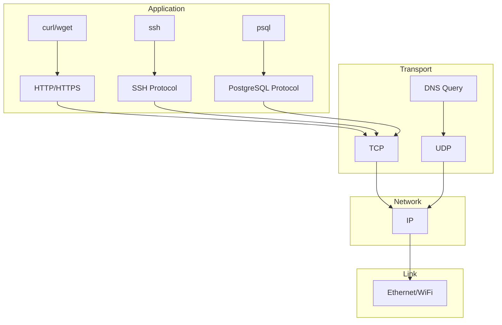
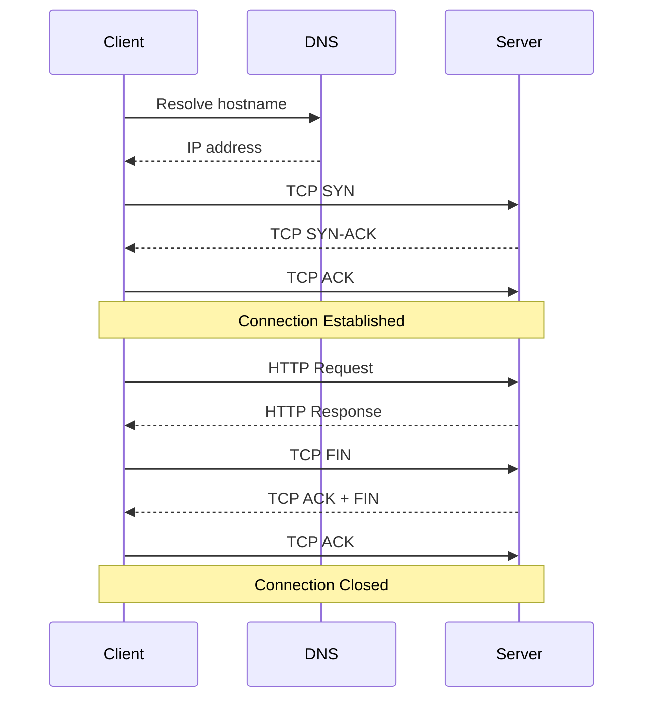

# Modul 06: Networking Linux untuk Data Engineering

## 📚 Daftar Isi
- [Learning Outcome](#learning-outcome)
- [Prasyarat](#prasyarat)
- [Bab 0: Analisis Kebutuhan](#bab-0-analisis-kebutuhan)
- [Bab 1: Konsep Dasar Networking](#bab-1-konsep-dasar-networking)
- [Bab 2: Command Dasar](#bab-2-command-dasar)
- [Bab 3: Flow Latihan Networking](#bab-3-flow-latihan-networking)
- [Bab 4: Advanced Topics](#bab-4-advanced-topics)
- [Bab 5: Mini Challenge](#bab-5-mini-challenge)
- [Referensi](#referensi)

---

## Learning Outcome
Setelah menyelesaikan modul ini, peserta mampu:

1. ✅ Memahami konsep dasar networking (IP, port, protocol)
2. ✅ Menggunakan tools network diagnostic (`ping`, `netstat`, `ss`, `curl`)
3. ✅ Troubleshooting koneksi database dan API
4. ✅ Memahami DNS dan hostname resolution
5. ✅ Monitoring network traffic dan connections
6. ✅ Network security basics (firewall, ports)

---

## Prasyarat
- Menyelesaikan Modul 01-05
- Pemahaman dasar command line
- Akses ke terminal Linux

---

## Bab 0: Analisis Kebutuhan

### Mengapa Networking Penting untuk Data Engineering?

| Aspek | Kebutuhan | Tools |
|-------|-----------|-------|
| **Database Connection** | Connect ke PostgreSQL, MySQL | netstat, telnet, nc |
| **API Integration** | Call REST APIs | curl, wget |
| **Service Monitoring** | Cek availability services | ping, curl, nc |
| **Troubleshooting** | Debug connection issues | ss, netstat, tcpdump |
| **DNS Resolution** | Resolve hostnames | nslookup, dig, host |
| **Firewall** | Security configuration | iptables, ufw |

### Skenario Data Engineering
```bash
# Cek koneksi database
nc -zv db.server.com 5432

# Test API endpoint
curl -I https://api.example.com/health

# Monitor active connections
ss -tuln | grep LISTEN

# Debug DNS
nslookup api.example.com
```

---

## Bab 1: Konsep Dasar Networking

### IP Address

| Type | Format | Example | Usage |
|------|--------|---------|-------|
| IPv4 | xxx.xxx.xxx.xxx | 192.168.1.100 | Most common |
| IPv6 | xxxx:xxxx:xxxx:... | 2001:db8::1 | Modern |
| Loopback | 127.0.0.1 | localhost | Local testing |
| Private | 10.x.x.x, 192.168.x.x | 192.168.1.1 | Internal network |

### Common Ports

| Port | Protocol | Service | Data Engineering Use |
|------|----------|---------|---------------------|
| 22 | TCP | SSH | Remote access |
| 80 | TCP | HTTP | Web APIs |
| 443 | TCP | HTTPS | Secure APIs |
| 3306 | TCP | MySQL | Database |
| 5432 | TCP | PostgreSQL | Database |
| 6379 | TCP | Redis | Cache |
| 27017 | TCP | MongoDB | Database |
| 9092 | TCP | Kafka | Message queue |
| 8080 | TCP | HTTP-alt | Web apps |

### Protocol Layers

```
┌──────────────────────────────────────┐
│         Application Layer            │
│    (HTTP, HTTPS, SSH, DNS, FTP)      │
├──────────────────────────────────────┤
│         Transport Layer              │
│           (TCP, UDP)                 │
├──────────────────────────────────────┤
│         Network Layer                │
│             (IP)                     │
├──────────────────────────────────────┤
│         Link Layer                   │
│       (Ethernet, WiFi)               │
└──────────────────────────────────────┘
```

### TCP vs UDP

| TCP | UDP |
|-----|-----|
| Connection-oriented | Connectionless |
| Reliable delivery | Best effort |
| Ordered packets | No ordering |
| Slower | Faster |
| HTTP, SSH, Database | DNS, Streaming |

---

## Bab 2: Command Dasar

### Network Configuration

| Command | Fungsi | Contoh |
|---------|--------|--------|
| `ip addr` | Show IP addresses | `ip addr show` |
| `ip route` | Show routing table | `ip route show` |
| `ifconfig` | Network interface (legacy) | `ifconfig eth0` |
| `hostname` | Show/set hostname | `hostname` |
| `hostnamectl` | System hostname info | `hostnamectl` |

### Connectivity Testing

| Command | Fungsi | Contoh |
|---------|--------|--------|
| `ping` | Test connectivity | `ping google.com` |
| `ping -c N` | Ping N times | `ping -c 3 google.com` |
| `traceroute` | Trace packet route | `traceroute google.com` |
| `mtr` | Combines ping + traceroute | `mtr google.com` |

### Port & Connection Testing

| Command | Fungsi | Contoh |
|---------|--------|--------|
| `nc -zv host port` | Test port | `nc -zv localhost 5432` |
| `telnet host port` | Connect to port | `telnet localhost 80` |
| `nmap host` | Port scan | `nmap localhost` |
| `curl telnet://host:port` | Test via curl | `curl telnet://localhost:22` |

### Connection Monitoring

| Command | Fungsi | Contoh |
|---------|--------|--------|
| `ss -tuln` | Show listening ports | `ss -tuln` |
| `ss -tunp` | Show connections with PID | `ss -tunp` |
| `netstat -tuln` | Legacy - listening ports | `netstat -tuln` |
| `lsof -i :port` | Process using port | `lsof -i :8080` |

**ss/netstat flags:**
- `-t` - TCP
- `-u` - UDP
- `-l` - Listening
- `-n` - Numeric (no DNS resolution)
- `-p` - Process info

### DNS Tools

| Command | Fungsi | Contoh |
|---------|--------|--------|
| `nslookup host` | Query DNS | `nslookup google.com` |
| `dig host` | Detailed DNS query | `dig google.com` |
| `host hostname` | Simple DNS lookup | `host google.com` |
| `cat /etc/resolv.conf` | DNS servers | `cat /etc/resolv.conf` |
| `cat /etc/hosts` | Local hostname mapping | `cat /etc/hosts` |

### HTTP Testing with curl

| Command | Fungsi | Contoh |
|---------|--------|--------|
| `curl URL` | GET request | `curl https://api.example.com` |
| `curl -I URL` | Headers only | `curl -I https://google.com` |
| `curl -X POST` | POST request | `curl -X POST -d "data" URL` |
| `curl -H "Header: value"` | Custom header | `curl -H "Auth: token" URL` |
| `curl -v URL` | Verbose output | `curl -v https://google.com` |
| `curl -w "%{time_total}"` | Response time | `curl -w "%{time_total}\n" URL` |

---

## Bab 3: Flow Latihan Networking

### 🔧 Flow 0: Persiapan Lab
```bash
# Pindah ke direktori lab
cd ~/linux-practical/lab/06-networking/
mkdir -p scripts logs

# Install tools jika belum ada
# sudo apt install -y net-tools dnsutils curl nmap netcat-openbsd

echo "Lab ready!"
```

---

### 🌐 Flow 1: Network Configuration
```bash
# Lihat IP address
ip addr show

# Lihat IP saja (filtered)
ip -4 addr show | grep inet

# Lihat routing table
ip route show

# Default gateway
ip route | grep default

# Hostname
hostname
hostnamectl

# DNS configuration
cat /etc/resolv.conf

# Hosts file
cat /etc/hosts
```
**✅ Tujuan:** Memahami konfigurasi network saat ini

---

### 📡 Flow 2: Connectivity Testing
```bash
# Ping test - basic
ping -c 3 google.com

# Ping test - local
ping -c 3 localhost
ping -c 3 127.0.0.1

# Ping dengan timeout
ping -c 3 -W 2 google.com

# Traceroute
traceroute google.com

# MTR (if available)
# mtr -c 10 google.com
```
**✅ Tujuan:** Test konektivitas jaringan

---

### 🔌 Flow 3: Port Testing
```bash
# Test port dengan netcat
nc -zv localhost 22      # SSH
nc -zv google.com 80     # HTTP
nc -zv google.com 443    # HTTPS

# Multiple ports
for port in 22 80 443 3306 5432; do
    nc -zv -w 2 localhost $port 2>&1 | grep -E "(succeeded|refused)"
done

# Test database port (example)
# nc -zv db.server.com 5432

# Lihat listening ports
ss -tuln

# Lihat dengan process info
ss -tulnp

# Filter by port
ss -tuln | grep :22
ss -tuln | grep :80

# Find process using port
# sudo lsof -i :22
```
**✅ Tujuan:** Mahir testing port dan koneksi

---

### 🔍 Flow 4: DNS Resolution
```bash
# nslookup
nslookup google.com
nslookup github.com

# dig - detailed
dig google.com

# dig - short answer
dig +short google.com

# Specific record types
dig google.com A        # IPv4
dig google.com AAAA     # IPv6
dig google.com MX       # Mail
dig google.com NS       # Name servers
dig google.com TXT      # Text records

# Reverse DNS
dig -x 8.8.8.8

# host command
host google.com
host -t MX google.com

# Check DNS resolution time
time dig google.com +short
```
**✅ Tujuan:** Troubleshoot DNS issues

---

### 🌍 Flow 5: HTTP Testing dengan curl
```bash
# Simple GET
curl https://httpbin.org/get

# Headers only
curl -I https://httpbin.org/get

# Verbose mode
curl -v https://httpbin.org/get 2>&1 | head -30

# Response time
curl -w "\nTime: %{time_total}s\n" -o /dev/null -s https://httpbin.org/get

# POST request
curl -X POST \
    -H "Content-Type: application/json" \
    -d '{"name":"test","value":123}' \
    https://httpbin.org/post

# With authentication
curl -u username:password https://httpbin.org/basic-auth/username/password

# Save response
curl -o response.json https://httpbin.org/json

# Follow redirects
curl -L https://httpbin.org/redirect/3

# Check HTTP status code
curl -s -o /dev/null -w "%{http_code}" https://httpbin.org/get
```
**✅ Tujuan:** Mahir testing API dengan curl

---

## Bab 4: Advanced Topics

### Network Debugging

```bash
# Capture packets (requires sudo)
# sudo tcpdump -i any port 80

# Monitor all connections
watch -n 1 'ss -tuln'

# Connection statistics
ss -s

# Network interface statistics
ip -s link show
```

### Firewall dengan UFW

```bash
# Status
sudo ufw status

# Enable/disable
sudo ufw enable
sudo ufw disable

# Allow port
sudo ufw allow 22/tcp
sudo ufw allow 80/tcp
sudo ufw allow 5432/tcp

# Deny port
sudo ufw deny 3306/tcp

# Allow from specific IP
sudo ufw allow from 192.168.1.100

# Delete rule
sudo ufw delete allow 80/tcp
```

### Port Forwarding dengan SSH

```bash
# Local port forwarding
# Access remote:5432 via local:15432
ssh -L 15432:localhost:5432 user@remote-server

# Remote port forwarding
# Expose local:8080 on remote:9090
ssh -R 9090:localhost:8080 user@remote-server

# Dynamic port forwarding (SOCKS proxy)
ssh -D 1080 user@remote-server
```

### Service Health Check Script

```bash
cat > scripts/health_check.sh << 'EOF'
#!/bin/bash

# Service Health Check
# Checks multiple endpoints

declare -A SERVICES=(
    ["Google"]="google.com:443"
    ["GitHub"]="github.com:443"
    ["HTTP Test"]="httpbin.org:80"
)

echo "================================"
echo "Service Health Check"
echo "Time: $(date)"
echo "================================"

for service in "${!SERVICES[@]}"; do
    endpoint="${SERVICES[$service]}"
    host="${endpoint%:*}"
    port="${endpoint#*:}"
    
    if nc -zv -w 3 "$host" "$port" 2>&1 | grep -q succeeded; then
        echo "✅ $service ($endpoint) - UP"
    else
        echo "❌ $service ($endpoint) - DOWN"
    fi
done

echo "================================"
EOF
chmod +x scripts/health_check.sh
```

### API Monitor Script

```bash
cat > scripts/api_monitor.sh << 'EOF'
#!/bin/bash

# API Monitor
# Monitors API endpoints and logs response times

ENDPOINTS=(
    "https://httpbin.org/get"
    "https://httpbin.org/json"
    "https://api.github.com"
)

LOG_FILE="logs/api_monitor.log"

echo "API Monitor started at $(date)" >> "$LOG_FILE"

for url in "${ENDPOINTS[@]}"; do
    response=$(curl -s -o /dev/null -w "%{http_code},%{time_total}" "$url")
    status="${response%,*}"
    time="${response#*,}"
    
    timestamp=$(date '+%Y-%m-%d %H:%M:%S')
    echo "$timestamp | $url | Status: $status | Time: ${time}s" >> "$LOG_FILE"
    
    if [ "$status" -eq 200 ]; then
        echo "✅ $url - ${time}s"
    else
        echo "❌ $url - Status $status"
    fi
done
EOF
chmod +x scripts/api_monitor.sh
```

---

## Bab 5: Mini Challenge

### Challenge 1: Database Connection Tester
```bash
cat > scripts/db_connection_test.sh << 'EOF'
#!/bin/bash

# Database Connection Tester
# Tests connectivity to various database ports

# Configuration
declare -A DATABASES=(
    ["PostgreSQL"]="localhost:5432"
    ["MySQL"]="localhost:3306"
    ["MongoDB"]="localhost:27017"
    ["Redis"]="localhost:6379"
)

TIMEOUT=3

echo "╔════════════════════════════════════════╗"
echo "║     Database Connection Tester         ║"
echo "╠════════════════════════════════════════╣"

for db in "${!DATABASES[@]}"; do
    endpoint="${DATABASES[$db]}"
    host="${endpoint%:*}"
    port="${endpoint#*:}"
    
    # Test connection
    if nc -zv -w $TIMEOUT "$host" "$port" 2>&1 | grep -q succeeded; then
        status="✅ Connected"
    elif nc -zv -w $TIMEOUT "$host" "$port" 2>&1 | grep -q refused; then
        status="⚠️  Port closed"
    else
        status="❌ Unreachable"
    fi
    
    printf "║ %-12s %-20s %-10s ║\n" "$db" "$endpoint" "$status"
done

echo "╚════════════════════════════════════════╝"
EOF
chmod +x scripts/db_connection_test.sh
```

### Challenge 2: Network Diagnostics Suite
```bash
cat > scripts/network_diagnostic.sh << 'EOF'
#!/bin/bash

# Network Diagnostics Suite
# Comprehensive network analysis

TARGET="${1:-google.com}"

echo "╔══════════════════════════════════════════════════════╗"
echo "║         Network Diagnostics Suite                    ║"
echo "║         Target: $TARGET"
echo "╠══════════════════════════════════════════════════════╣"

# DNS Resolution
echo "║ 1. DNS Resolution"
echo "║    $(dig +short $TARGET | head -1)"

# Ping Test
echo "║"
echo "║ 2. Ping Test"
ping_result=$(ping -c 3 $TARGET 2>&1)
if echo "$ping_result" | grep -q "0% packet loss"; then
    avg_time=$(echo "$ping_result" | grep "avg" | awk -F'/' '{print $5}')
    echo "║    ✅ Reachable (avg: ${avg_time}ms)"
else
    echo "║    ❌ Unreachable"
fi

# Port Check
echo "║"
echo "║ 3. Common Ports"
for port in 80 443; do
    if nc -zv -w 2 $TARGET $port 2>&1 | grep -q succeeded; then
        echo "║    Port $port: ✅ Open"
    else
        echo "║    Port $port: ❌ Closed"
    fi
done

# HTTP Response
echo "║"
echo "║ 4. HTTP Response"
http_status=$(curl -s -o /dev/null -w "%{http_code}" "https://$TARGET" 2>/dev/null)
echo "║    Status Code: $http_status"

# Response Time
response_time=$(curl -s -o /dev/null -w "%{time_total}" "https://$TARGET" 2>/dev/null)
echo "║    Response Time: ${response_time}s"

echo "╚══════════════════════════════════════════════════════╝"
EOF
chmod +x scripts/network_diagnostic.sh
```

### Challenge 3: Connection Monitor
```bash
cat > scripts/connection_monitor.sh << 'EOF'
#!/bin/bash

# Connection Monitor
# Monitors established connections

INTERVAL=${1:-5}

while true; do
    clear
    echo "╔════════════════════════════════════════════════════════╗"
    echo "║           Connection Monitor                           ║"
    echo "║           $(date)                    ║"
    echo "╠════════════════════════════════════════════════════════╣"
    
    echo "║ LISTENING PORTS:"
    ss -tuln | grep LISTEN | head -10 | while read line; do
        echo "║   $line"
    done
    
    echo "║"
    echo "║ ESTABLISHED CONNECTIONS:"
    ss -tun | grep ESTAB | head -10 | while read line; do
        echo "║   $line"
    done
    
    echo "║"
    echo "║ CONNECTION SUMMARY:"
    echo "║   LISTEN: $(ss -tuln | grep -c LISTEN)"
    echo "║   ESTABLISHED: $(ss -tun | grep -c ESTAB)"
    echo "║   TIME-WAIT: $(ss -tun | grep -c TIME-WAIT)"
    
    echo "╚════════════════════════════════════════════════════════╝"
    echo "Refreshing every ${INTERVAL}s... Press Ctrl+C to exit"
    
    sleep $INTERVAL
done
EOF
chmod +x scripts/connection_monitor.sh
```

---

## UML Diagram

### Network Stack


### Connection Flow


---

## Referensi

- [Linux Networking Commands](https://www.redhat.com/sysadmin/linux-networking-commands)
- [curl Manual](https://curl.se/docs/manpage.html)
- [ss Command](https://man7.org/linux/man-pages/man8/ss.8.html)
- `man ip`, `man ss`, `man curl`, `man dig`

---

## Tips & Best Practices

| ✅ Do | ❌ Don't |
|------|---------|
| Use `ss` instead of `netstat` | Rely on deprecated tools |
| Test ports before deployment | Assume ports are open |
| Use connection timeouts | Wait forever for response |
| Log network errors | Ignore connection failures |
| Use `curl -v` for debugging | Guess what's wrong |

### Quick Troubleshooting Guide
```bash
# Can't connect to service?
1. ping host              # Check basic connectivity
2. nc -zv host port       # Check port is open
3. dig host               # Check DNS resolution
4. curl -v URL            # Check HTTP layer
5. ss -tuln | grep port   # Check if service listening
```

---

> 💡 **Pro Tip:** "Selalu test connectivity dalam script ETL dengan timeout yang wajar. Gunakan health check endpoints sebelum menjalankan operasi data yang besar!"

---

**Sebelumnya:** [Modul 05: Archive & Transfer Linux untuk Data Engineering](../05-archive-transfer/README.md)  
**Selanjutnya:** [Modul 07: SSH (Secure Shell) untuk Data Engineering](../07-ssh/README.md)

---
