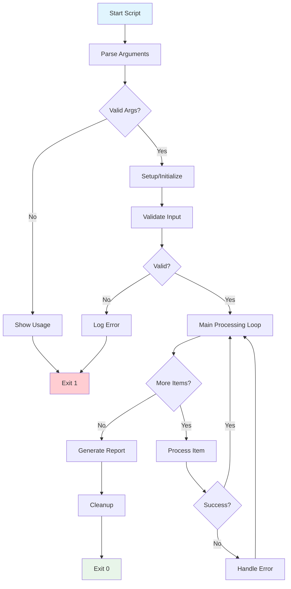
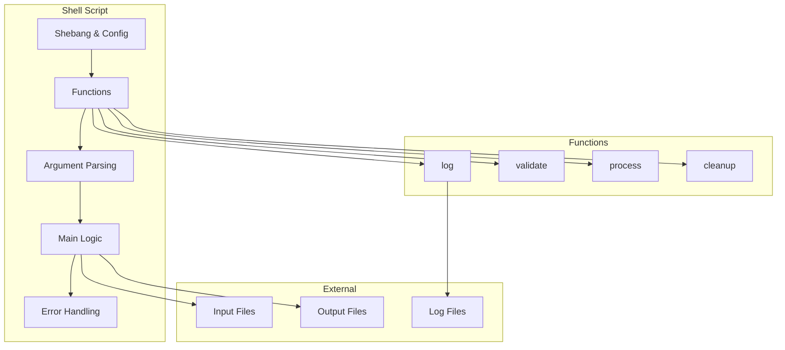
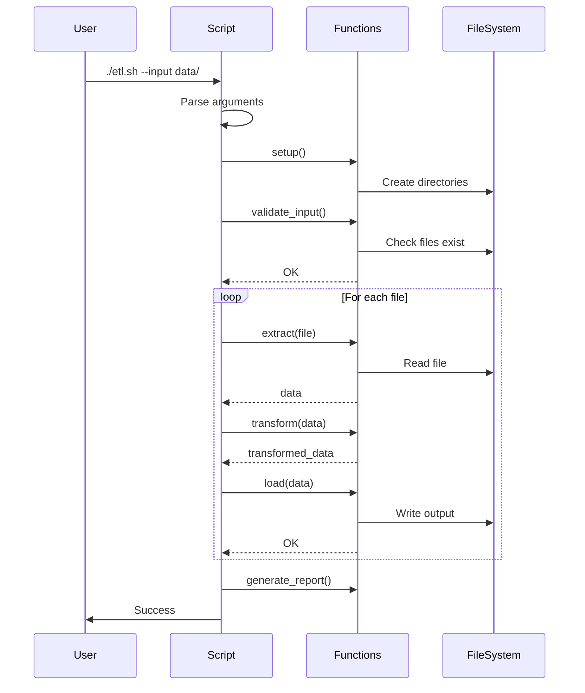

# Modul 10: Shell Scripting untuk Data Engineering

## 📚 Daftar Isi
- [Learning Outcome](#learning-outcome)
- [Prasyarat](#prasyarat)
- [Bab 0: Analisis Kebutuhan](#bab-0-analisis-kebutuhan)
- [Bab 1: Konsep Dasar](#bab-1-konsep-dasar)
- [Bab 2: Syntax Dasar](#bab-2-syntax-dasar)
- [Bab 3: Flow Latihan](#bab-3-flow-latihan)
- [Bab 4: Advanced Topics](#bab-4-advanced-topics)
- [Bab 5: Mini Challenge](#bab-5-mini-challenge)
- [UML Diagram](#uml-diagram)
- [Referensi](#referensi)

---

## Learning Outcome
Setelah menyelesaikan modul ini, peserta mampu:

1. ✅ Membuat dan menjalankan shell script
2. ✅ Menggunakan variabel, arguments, dan environment
3. ✅ Implementasi conditional statements (if/else/case)
4. ✅ Menggunakan loops (for/while/until)
5. ✅ Membuat functions yang reusable
6. ✅ Membuat production-ready automation scripts

---

## Prasyarat
- Menyelesaikan Modul 01-09
- Familiar dengan bash commands
- Memahami text processing tools (grep, sed, awk)

---

## Bab 0: Analisis Kebutuhan

### Mengapa Shell Scripting Penting untuk Data Engineering?

| Use Case | Contoh |
|----------|--------|
| **ETL Automation** | Script untuk extract, transform, load data |
| **Batch Processing** | Process multiple files secara otomatis |
| **System Monitoring** | Check disk, memory, database health |
| **Deployment** | Setup environment, install dependencies |
| **Backup & Maintenance** | Scheduled backups, log rotation |
| **CI/CD Integration** | Build, test, deploy scripts |

### Real-World Scripts di Data Engineering

```bash
# 1. Daily ETL Job
#!/bin/bash
./extract.py --date $(date +%Y-%m-%d)
./transform.py --input raw/ --output clean/
./load.py --source clean/ --dest postgres

# 2. Batch File Processor
#!/bin/bash
for file in data/*.csv; do
    python process.py "$file"
done

# 3. Health Check
#!/bin/bash
if ! pg_isready -h localhost; then
    echo "Database down!" | mail -s "Alert" admin@company.com
fi

# 4. Backup Script
#!/bin/bash
DATE=$(date +%Y%m%d)
pg_dump mydb | gzip > backup_${DATE}.sql.gz
```

### Shell Script vs Python

| Aspek | Shell Script | Python |
|-------|--------------|--------|
| **File operations** | ✅ Excellent | ✅ Good |
| **Running commands** | ✅ Native | ⚠️ subprocess |
| **Text processing** | ✅ Excellent | ✅ Good |
| **Data processing** | ⚠️ Limited | ✅ Excellent |
| **Complex logic** | ⚠️ Harder | ✅ Easier |
| **Portability** | ⚠️ Unix-based | ✅ Cross-platform |

**Aturan Praktis:**
- Gunakan Shell Script untuk: file operations, running commands, simple automation
- Gunakan Python untuk: complex logic, data processing, API integration

---

## Bab 1: Konsep Dasar

### Anatomy of a Shell Script

```bash
#!/bin/bash                    # Shebang - interpreter
# Script description           # Comments
# Author: Your Name

# Exit on error
set -e

# Variables
NAME="ETL Job"

# Functions
log() {
    echo "[$(date)] $1"
}

# Main logic
log "Starting $NAME"
# ... commands ...
log "Completed $NAME"
```

### Shebang Variants

```bash
#!/bin/bash           # Bash shell
#!/bin/sh             # POSIX shell (more portable)
#!/usr/bin/env bash   # Find bash in PATH (recommended)
#!/usr/bin/env python # Python script
```

### Script Execution

```bash
# Method 1: Make executable
chmod +x script.sh
./script.sh

# Method 2: Call interpreter directly
bash script.sh

# Method 3: Source (run in current shell)
source script.sh
. script.sh
```

### Exit Codes

| Code | Meaning |
|------|---------|
| 0 | Success |
| 1 | General error |
| 2 | Misuse of command |
| 126 | Permission denied |
| 127 | Command not found |
| 128+n | Fatal error signal n |

```bash
# Check exit code
command
if [ $? -eq 0 ]; then
    echo "Success"
fi

# Exit with code
exit 0    # Success
exit 1    # Error
```

---

## Bab 2: Syntax Dasar

### Variables

```bash
# Assignment (NO SPACES around =)
NAME="Alice"
AGE=30
FILE=/path/to/file.csv

# Use variables
echo $NAME
echo ${NAME}           # Safer, clearer
echo "Hello, ${NAME}!"

# Read-only
readonly DB_HOST="localhost"

# Unset
unset NAME
```

### Special Variables

| Variable | Description |
|----------|-------------|
| `$0` | Script name |
| `$1, $2...` | Positional arguments |
| `$#` | Number of arguments |
| `$@` | All arguments (as separate words) |
| `$*` | All arguments (as single word) |
| `$?` | Exit code of last command |
| `$$` | Current process ID |
| `$!` | Last background process ID |

### String Operations

```bash
NAME="Hello World"

# Length
echo ${#NAME}              # 11

# Substring
echo ${NAME:0:5}           # Hello
echo ${NAME:6}             # World

# Replace
echo ${NAME/World/Bash}    # Hello Bash
echo ${NAME//l/L}          # HeLLo WorLd (all)

# Default values
echo ${UNDEFINED:-default} # Use default if unset
echo ${UNDEFINED:=default} # Set and use default

# Check if set
echo ${NAME:?Error msg}    # Exit with error if unset
```

### Quoting

```bash
NAME="Alice"

# Double quotes - variables expanded
echo "Hello $NAME"         # Hello Alice
echo "Path: $HOME"         # Path: /home/user

# Single quotes - literal
echo 'Hello $NAME'         # Hello $NAME

# Backticks / $() - command substitution
echo "Date: $(date)"       # Date: Sun Dec 29 ...
echo "Files: `ls | wc -l`" # Files: 5
```

### Arithmetic

```bash
# (( )) for arithmetic
x=5
y=3
echo $((x + y))            # 8
echo $((x * y))            # 15
echo $((x / y))            # 1
echo $((x % y))            # 2
echo $((x ** y))           # 125

# Increment/decrement
((x++))
((y--))

# let command
let "result = x + y"

# expr (older)
expr $x + $y
```

### Arrays

```bash
# Indexed array
fruits=("apple" "banana" "cherry")
echo ${fruits[0]}          # apple
echo ${fruits[@]}          # all elements
echo ${#fruits[@]}         # length: 3

# Add element
fruits+=("date")

# Loop array
for fruit in "${fruits[@]}"; do
    echo $fruit
done

# Associative array (bash 4+)
declare -A person
person[name]="Alice"
person[age]=30
echo ${person[name]}
```

### Conditionals

```bash
# if-else
if [ condition ]; then
    # commands
elif [ condition ]; then
    # commands
else
    # commands
fi

# Test operators ([ ] or test)
# String
[ "$a" = "$b" ]    # Equal
[ "$a" != "$b" ]   # Not equal
[ -z "$a" ]        # Is empty
[ -n "$a" ]        # Not empty

# Numeric
[ $a -eq $b ]      # Equal
[ $a -ne $b ]      # Not equal
[ $a -lt $b ]      # Less than
[ $a -le $b ]      # Less or equal
[ $a -gt $b ]      # Greater than
[ $a -ge $b ]      # Greater or equal

# File tests
[ -e file ]        # Exists
[ -f file ]        # Is file
[ -d dir ]         # Is directory
[ -r file ]        # Is readable
[ -w file ]        # Is writable
[ -x file ]        # Is executable
[ -s file ]        # Size > 0

# Logical
[ cond1 ] && [ cond2 ]    # AND
[ cond1 ] || [ cond2 ]    # OR
[ ! condition ]            # NOT

# [[ ]] - Extended test (preferred)
[[ $a == $b ]]             # Pattern matching
[[ $a =~ ^[0-9]+$ ]]       # Regex
[[ -f file && -r file ]]   # Combined
```

### Loops

```bash
# For loop
for i in 1 2 3 4 5; do
    echo $i
done

# Range
for i in {1..10}; do
    echo $i
done

# C-style for
for ((i=0; i<10; i++)); do
    echo $i
done

# Loop files
for file in *.csv; do
    echo "Processing $file"
done

# While loop
count=0
while [ $count -lt 5 ]; do
    echo $count
    ((count++))
done

# Read file line by line
while IFS= read -r line; do
    echo "$line"
done < input.txt

# Until loop
until [ $count -ge 5 ]; do
    echo $count
    ((count++))
done

# Loop control
break      # Exit loop
continue   # Skip to next iteration
```

### Case Statement

```bash
case $value in
    pattern1)
        # commands
        ;;
    pattern2|pattern3)
        # commands
        ;;
    *)
        # default
        ;;
esac

# Example
case $1 in
    start)
        echo "Starting..."
        ;;
    stop)
        echo "Stopping..."
        ;;
    restart)
        echo "Restarting..."
        ;;
    *)
        echo "Usage: $0 {start|stop|restart}"
        exit 1
        ;;
esac
```

### Functions

```bash
# Define function
function greet() {
    echo "Hello, $1!"
}

# Or
greet() {
    echo "Hello, $1!"
}

# Call function
greet "Alice"

# Return value
add() {
    local result=$(($1 + $2))
    echo $result
}
sum=$(add 5 3)
echo $sum  # 8

# Local variables
myfunc() {
    local var="local"
    echo $var
}
```

---

## Bab 3: Flow Latihan

### 🔧 Flow 0: Persiapan Lab

```bash
# Buat folder lab
mkdir -p ~/linux-practical/lab/10-shell-scripting
cd ~/linux-practical/lab/10-shell-scripting

# Buat folder struktur
mkdir -p scripts data/{input,output} logs

# Buat sample data
cat > data/input/users.csv << 'EOF'
id,name,email,status
1,Alice,alice@example.com,active
2,Bob,bob@example.com,inactive
3,Charlie,charlie@test.com,active
4,Diana,diana@example.com,active
5,Eve,eve@test.com,inactive
EOF

cat > data/input/sales.csv << 'EOF'
date,product,quantity,price
2024-12-01,ProductA,10,100
2024-12-01,ProductB,5,200
2024-12-02,ProductA,15,100
2024-12-02,ProductC,8,150
2024-12-03,ProductB,12,200
EOF

# Verifikasi
tree .
```

**✅ Hasil:** Lab environment siap

---

### 📝 Flow 1: Basic Script

```bash
cd ~/linux-practical/lab/10-shell-scripting/scripts

# Buat script pertama
cat > 01_hello.sh << 'EOF'
#!/bin/bash
# Script: Hello World
# Description: Basic shell script example

echo "Hello, World!"
echo "Script name: $0"
echo "Current date: $(date)"
echo "Current user: $USER"
echo "Home directory: $HOME"
echo "Working directory: $(pwd)"
EOF

# Make executable
chmod +x 01_hello.sh

# Run
./01_hello.sh
```

**✅ Tujuan:** Memahami struktur dasar script

---

### 🔢 Flow 2: Variables dan Arguments

```bash
cd ~/linux-practical/lab/10-shell-scripting/scripts

cat > 02_variables.sh << 'EOF'
#!/bin/bash
# Script: Variables and Arguments Demo

# Script arguments
echo "=== ARGUMENTS ==="
echo "Script name: $0"
echo "Argument 1: $1"
echo "Argument 2: $2"
echo "All arguments: $@"
echo "Number of arguments: $#"

# Variables
echo ""
echo "=== VARIABLES ==="
NAME="ETL Pipeline"
VERSION="1.0.0"
DATE=$(date +%Y-%m-%d)

echo "Name: $NAME"
echo "Version: $VERSION"
echo "Date: $DATE"

# String operations
echo ""
echo "=== STRING OPERATIONS ==="
TEXT="Hello World"
echo "Text: $TEXT"
echo "Length: ${#TEXT}"
echo "Uppercase: ${TEXT^^}"      # Bash 4+
echo "Substring: ${TEXT:0:5}"

# Default values
echo ""
echo "=== DEFAULT VALUES ==="
echo "Defined: ${NAME:-undefined}"
echo "Undefined: ${MISSING:-default_value}"

# Array
echo ""
echo "=== ARRAY ==="
FILES=("file1.csv" "file2.csv" "file3.csv")
echo "First: ${FILES[0]}"
echo "All: ${FILES[@]}"
echo "Count: ${#FILES[@]}"
EOF

chmod +x 02_variables.sh

# Test dengan arguments
./02_variables.sh arg1 arg2 arg3
```

**✅ Tujuan:** Memahami variabel dan arguments

---

### ❓ Flow 3: Conditionals

```bash
cd ~/linux-practical/lab/10-shell-scripting/scripts

cat > 03_conditions.sh << 'EOF'
#!/bin/bash
# Script: Conditional Statements

# Check arguments
if [ $# -eq 0 ]; then
    echo "Error: No arguments provided"
    echo "Usage: $0 <filename>"
    exit 1
fi

FILE=$1

echo "Checking: $FILE"
echo ""

# File checks
if [ -e "$FILE" ]; then
    echo "✅ File exists"
    
    if [ -f "$FILE" ]; then
        echo "✅ Is a regular file"
        echo "   Size: $(stat -c%s "$FILE") bytes"
        echo "   Lines: $(wc -l < "$FILE")"
    elif [ -d "$FILE" ]; then
        echo "✅ Is a directory"
        echo "   Contents: $(ls "$FILE" | wc -l) items"
    fi
    
    if [ -r "$FILE" ]; then
        echo "✅ Is readable"
    else
        echo "❌ Not readable"
    fi
    
    if [ -w "$FILE" ]; then
        echo "✅ Is writable"
    else
        echo "❌ Not writable"
    fi
    
    if [ -x "$FILE" ]; then
        echo "✅ Is executable"
    else
        echo "❌ Not executable"
    fi
else
    echo "❌ File does not exist"
    exit 1
fi

# String comparison
echo ""
echo "=== Extension Check ==="
if [[ "$FILE" == *.csv ]]; then
    echo "This is a CSV file"
elif [[ "$FILE" == *.json ]]; then
    echo "This is a JSON file"
elif [[ "$FILE" == *.sh ]]; then
    echo "This is a Shell script"
else
    echo "Unknown file type"
fi
EOF

chmod +x 03_conditions.sh

# Test
./03_conditions.sh ../data/input/users.csv
./03_conditions.sh ../data/input/
./03_conditions.sh nonexistent.txt
```

**✅ Tujuan:** Memahami if/else dan file tests

---

### 🔄 Flow 4: Loops

```bash
cd ~/linux-practical/lab/10-shell-scripting/scripts

cat > 04_loops.sh << 'EOF'
#!/bin/bash
# Script: Loop Examples

echo "=== FOR LOOP: Numbers ==="
for i in {1..5}; do
    echo "Number: $i"
done

echo ""
echo "=== FOR LOOP: Files ==="
for file in ../data/input/*.csv; do
    echo "File: $file"
    echo "  Lines: $(wc -l < "$file")"
done

echo ""
echo "=== FOR LOOP: Array ==="
SERVERS=("web01" "web02" "db01" "db02")
for server in "${SERVERS[@]}"; do
    echo "Server: $server"
done

echo ""
echo "=== C-STYLE FOR ==="
for ((i=0; i<5; i++)); do
    echo "Index: $i"
done

echo ""
echo "=== WHILE LOOP: Count ==="
count=0
while [ $count -lt 3 ]; do
    echo "Count: $count"
    ((count++))
done

echo ""
echo "=== WHILE LOOP: Read File ==="
echo "Reading users.csv header..."
head -1 ../data/input/users.csv | tr ',' '\n' | while read -r field; do
    echo "  Column: $field"
done

echo ""
echo "=== WHILE LOOP: Process CSV ==="
line_num=0
while IFS=',' read -r id name email status; do
    ((line_num++))
    if [ $line_num -eq 1 ]; then
        continue  # Skip header
    fi
    echo "User $id: $name ($status)"
done < ../data/input/users.csv

echo ""
echo "=== UNTIL LOOP ==="
x=0
until [ $x -ge 3 ]; do
    echo "Until: $x"
    ((x++))
done
EOF

chmod +x 04_loops.sh
./04_loops.sh
```

**✅ Tujuan:** Memahami for, while, until loops

---

### 📦 Flow 5: Functions

```bash
cd ~/linux-practical/lab/10-shell-scripting/scripts

cat > 05_functions.sh << 'EOF'
#!/bin/bash
# Script: Functions Demo

# Simple function
say_hello() {
    echo "Hello, $1!"
}

# Function with return value (via echo)
add_numbers() {
    local a=$1
    local b=$2
    echo $((a + b))
}

# Function with exit status
file_exists() {
    if [ -f "$1" ]; then
        return 0  # Success (true)
    else
        return 1  # Failure (false)
    fi
}

# Logging function
log() {
    local level=$1
    local message=$2
    local timestamp=$(date "+%Y-%m-%d %H:%M:%S")
    echo "[$timestamp] [$level] $message"
}

# CSV processing function
count_csv_rows() {
    local file=$1
    if [ ! -f "$file" ]; then
        echo "0"
        return 1
    fi
    # Count rows excluding header
    tail -n +2 "$file" | wc -l
}

# Validation function
validate_csv() {
    local file=$1
    local expected_cols=$2
    
    if [ ! -f "$file" ]; then
        log "ERROR" "File not found: $file"
        return 1
    fi
    
    local actual_cols=$(head -1 "$file" | tr ',' '\n' | wc -l)
    
    if [ "$actual_cols" -ne "$expected_cols" ]; then
        log "ERROR" "Expected $expected_cols columns, found $actual_cols"
        return 1
    fi
    
    log "INFO" "Validation passed for $file"
    return 0
}

# === Main Script ===
echo "=== FUNCTION DEMOS ==="

echo ""
echo "--- Simple Function ---"
say_hello "Alice"
say_hello "Bob"

echo ""
echo "--- Return Value ---"
result=$(add_numbers 10 20)
echo "10 + 20 = $result"

echo ""
echo "--- Exit Status ---"
if file_exists "../data/input/users.csv"; then
    echo "users.csv exists"
else
    echo "users.csv not found"
fi

if file_exists "nonexistent.txt"; then
    echo "Found"
else
    echo "nonexistent.txt not found"
fi

echo ""
echo "--- Logging ---"
log "INFO" "Script started"
log "DEBUG" "Processing data"
log "WARNING" "Low memory"
log "ERROR" "Connection failed"

echo ""
echo "--- CSV Processing ---"
rows=$(count_csv_rows "../data/input/users.csv")
echo "Users CSV has $rows data rows"

echo ""
echo "--- Validation ---"
validate_csv "../data/input/users.csv" 4
validate_csv "../data/input/users.csv" 5
validate_csv "nonexistent.txt" 4
EOF

chmod +x 05_functions.sh
./05_functions.sh
```

**✅ Tujuan:** Membuat reusable functions

---

### 📊 Flow 6: Case Statement

```bash
cd ~/linux-practical/lab/10-shell-scripting/scripts

cat > 06_case.sh << 'EOF'
#!/bin/bash
# Script: Case Statement - Service Controller

COMMAND=$1
SERVICE=${2:-"app"}

usage() {
    echo "Usage: $0 {start|stop|restart|status|logs} [service_name]"
    echo ""
    echo "Commands:"
    echo "  start   - Start the service"
    echo "  stop    - Stop the service"
    echo "  restart - Restart the service"
    echo "  status  - Show service status"
    echo "  logs    - Show service logs"
    exit 1
}

log() {
    echo "[$(date '+%H:%M:%S')] $1"
}

case $COMMAND in
    start)
        log "Starting $SERVICE..."
        sleep 1
        log "$SERVICE started successfully"
        ;;
    
    stop)
        log "Stopping $SERVICE..."
        sleep 1
        log "$SERVICE stopped"
        ;;
    
    restart)
        log "Restarting $SERVICE..."
        $0 stop $SERVICE
        $0 start $SERVICE
        ;;
    
    status)
        log "Checking $SERVICE status..."
        echo "Service: $SERVICE"
        echo "Status: Running"
        echo "PID: $$"
        echo "Uptime: 1d 2h 30m"
        ;;
    
    logs)
        log "Showing logs for $SERVICE..."
        echo "2024-12-29 10:00:00 INFO Service started"
        echo "2024-12-29 10:00:01 INFO Connected to database"
        echo "2024-12-29 10:00:05 WARNING High memory usage"
        ;;
    
    help|--help|-h)
        usage
        ;;
    
    *)
        echo "Error: Unknown command '$COMMAND'"
        usage
        ;;
esac
EOF

chmod +x 06_case.sh

# Test
./06_case.sh start
./06_case.sh status myapp
./06_case.sh restart
./06_case.sh help
./06_case.sh invalid
```

**✅ Tujuan:** Memahami case untuk multiple options

---

### 🛠️ Flow 7: Complete ETL Script

```bash
cd ~/linux-practical/lab/10-shell-scripting/scripts

cat > 07_etl_script.sh << 'EOF'
#!/bin/bash
#
# ETL Pipeline Script
# Description: Extract, Transform, Load data pipeline
# Usage: ./07_etl_script.sh [options]
#

set -e  # Exit on error

# === Configuration ===
SCRIPT_DIR=$(dirname "$0")
BASE_DIR=$(dirname "$SCRIPT_DIR")
INPUT_DIR="${BASE_DIR}/data/input"
OUTPUT_DIR="${BASE_DIR}/data/output"
LOG_DIR="${BASE_DIR}/logs"
LOG_FILE="${LOG_DIR}/etl_$(date +%Y%m%d_%H%M%S).log"

# === Functions ===

log() {
    local level=$1
    local message=$2
    local timestamp=$(date "+%Y-%m-%d %H:%M:%S")
    echo "[$timestamp] [$level] $message" | tee -a "$LOG_FILE"
}

info()    { log "INFO" "$1"; }
warning() { log "WARN" "$1"; }
error()   { log "ERROR" "$1"; }
debug()   { [ "$VERBOSE" = true ] && log "DEBUG" "$1"; }

usage() {
    cat << EOF
Usage: $0 [OPTIONS]

ETL Pipeline Script for Data Processing

OPTIONS:
    -i, --input DIR     Input directory (default: $INPUT_DIR)
    -o, --output DIR    Output directory (default: $OUTPUT_DIR)
    -f, --filter PATTERN Filter files by pattern (default: *.csv)
    -v, --verbose       Enable verbose output
    -d, --dry-run       Show what would be done
    -h, --help          Show this help message

EXAMPLES:
    $0                              # Run with defaults
    $0 -i /data/raw -o /data/clean  # Custom directories
    $0 -f "sales*.csv" -v           # Filter and verbose
    $0 --dry-run                    # Preview only
EOF
    exit 0
}

setup() {
    info "Setting up directories..."
    mkdir -p "$OUTPUT_DIR" "$LOG_DIR"
    debug "Created output: $OUTPUT_DIR"
    debug "Created logs: $LOG_DIR"
}

validate_input() {
    if [ ! -d "$INPUT_DIR" ]; then
        error "Input directory not found: $INPUT_DIR"
        exit 1
    fi
    
    local file_count=$(find "$INPUT_DIR" -name "$PATTERN" 2>/dev/null | wc -l)
    if [ "$file_count" -eq 0 ]; then
        error "No files matching pattern '$PATTERN' in $INPUT_DIR"
        exit 1
    fi
    
    info "Found $file_count files to process"
}

extract() {
    local file=$1
    local filename=$(basename "$file")
    info "Extracting: $filename"
    
    # Count rows
    local rows=$(tail -n +2 "$file" | wc -l)
    debug "  Source rows: $rows"
    
    echo "$rows"
}

transform() {
    local file=$1
    local filename=$(basename "$file")
    info "Transforming: $filename"
    
    # Get header
    local header=$(head -1 "$file")
    
    # Transform: uppercase first column, remove empty lines
    local transformed_file="${OUTPUT_DIR}/transformed_${filename}"
    
    if [ "$DRY_RUN" = true ]; then
        debug "  Would create: $transformed_file"
        return 0
    fi
    
    # Write header
    echo "$header" > "$transformed_file"
    
    # Transform data
    tail -n +2 "$file" | \
        awk -F',' 'NF>0 {$1=toupper($1); print}' OFS=',' >> "$transformed_file"
    
    local rows=$(tail -n +2 "$transformed_file" | wc -l)
    debug "  Output rows: $rows"
    
    echo "$transformed_file"
}

load() {
    local file=$1
    info "Loading: $(basename "$file")"
    
    if [ "$DRY_RUN" = true ]; then
        debug "  Would load to destination"
        return 0
    fi
    
    # Simulate load (in real scenario: load to database)
    local rows=$(tail -n +2 "$file" | wc -l)
    debug "  Loaded $rows rows"
}

process_file() {
    local file=$1
    local filename=$(basename "$file")
    
    info "=========================================="
    info "Processing: $filename"
    info "=========================================="
    
    # Extract
    local source_rows=$(extract "$file")
    
    # Transform
    local output_file=$(transform "$file")
    
    # Load
    if [ -n "$output_file" ] && [ -f "$output_file" ]; then
        load "$output_file"
    fi
    
    info "Completed: $filename"
}

generate_report() {
    info ""
    info "=========================================="
    info "ETL SUMMARY REPORT"
    info "=========================================="
    info "Input Directory: $INPUT_DIR"
    info "Output Directory: $OUTPUT_DIR"
    info "Pattern: $PATTERN"
    
    if [ "$DRY_RUN" = true ]; then
        info "Mode: DRY RUN (no changes made)"
    else
        local processed=$(find "$OUTPUT_DIR" -name "transformed_*" 2>/dev/null | wc -l)
        info "Files Processed: $processed"
    fi
    
    info "Log File: $LOG_FILE"
    info "=========================================="
}

cleanup() {
    if [ $? -ne 0 ]; then
        error "Pipeline failed!"
    fi
    info "Cleanup completed"
}

# === Main ===

main() {
    # Defaults
    PATTERN="*.csv"
    VERBOSE=false
    DRY_RUN=false
    
    # Parse arguments
    while [[ $# -gt 0 ]]; do
        case $1 in
            -i|--input)
                INPUT_DIR="$2"
                shift 2
                ;;
            -o|--output)
                OUTPUT_DIR="$2"
                shift 2
                ;;
            -f|--filter)
                PATTERN="$2"
                shift 2
                ;;
            -v|--verbose)
                VERBOSE=true
                shift
                ;;
            -d|--dry-run)
                DRY_RUN=true
                shift
                ;;
            -h|--help)
                usage
                ;;
            *)
                error "Unknown option: $1"
                usage
                ;;
        esac
    done
    
    # Setup trap for cleanup
    trap cleanup EXIT
    
    # Start pipeline
    info "=========================================="
    info "ETL PIPELINE STARTED"
    info "=========================================="
    
    setup
    validate_input
    
    # Process each file
    for file in "$INPUT_DIR"/$PATTERN; do
        if [ -f "$file" ]; then
            process_file "$file"
        fi
    done
    
    generate_report
    
    info ""
    info "ETL PIPELINE COMPLETED SUCCESSFULLY"
}

# Run main
main "$@"
EOF

chmod +x 07_etl_script.sh

# Test
./07_etl_script.sh --help
./07_etl_script.sh --dry-run -v
./07_etl_script.sh -v

# Check output
ls -la ../data/output/
cat ../logs/*.log
```

**✅ Tujuan:** Production-ready ETL script dengan argument parsing

---

## Bab 4: Advanced Topics

### 4.1 Error Handling Best Practices

```bash
#!/bin/bash

# Exit immediately on error
set -e

# Exit on undefined variable
set -u

# Fail on pipe errors
set -o pipefail

# Combined
set -euo pipefail

# Trap errors
trap 'echo "Error on line $LINENO"; exit 1' ERR

# Trap cleanup on exit
cleanup() {
    rm -f "$TEMP_FILE"
}
trap cleanup EXIT
```

### 4.2 Argument Parsing with getopts

```bash
#!/bin/bash

usage() {
    echo "Usage: $0 [-v] [-o output] [-n number] file"
}

VERBOSE=false
OUTPUT=""
NUMBER=10

while getopts ":vo:n:h" opt; do
    case $opt in
        v) VERBOSE=true ;;
        o) OUTPUT="$OPTARG" ;;
        n) NUMBER="$OPTARG" ;;
        h) usage; exit 0 ;;
        \?) echo "Invalid option: -$OPTARG"; exit 1 ;;
        :) echo "Option -$OPTARG requires argument"; exit 1 ;;
    esac
done
shift $((OPTIND-1))

FILE=${1:-""}
```

### 4.3 Parallel Execution

```bash
#!/bin/bash

# Background jobs
for file in *.csv; do
    process_file "$file" &
done
wait  # Wait for all background jobs

# Using xargs for parallel
find . -name "*.csv" | xargs -P 4 -I {} bash -c 'process_file "$@"' _ {}

# GNU Parallel (if installed)
parallel process_file ::: *.csv
```

### 4.4 Debugging

```bash
# Enable debug mode
bash -x script.sh       # Print commands
bash -v script.sh       # Print input lines

# In script
set -x                  # Enable debug
set +x                  # Disable debug

# Debug specific section
set -x
# commands to debug
set +x

# Custom debug function
DEBUG=${DEBUG:-false}
debug() {
    [ "$DEBUG" = true ] && echo "DEBUG: $*" >&2
}
```

### 4.5 Troubleshooting

| Problem | Cause | Solution |
|---------|-------|----------|
| Permission denied | Not executable | `chmod +x script.sh` |
| Command not found | Wrong shebang | Use `#!/bin/bash` |
| Syntax error | Spaces in assignment | No spaces: `VAR=value` |
| Unexpected token | Wrong line endings | `dos2unix script.sh` |
| Variable empty | Not quoted | Use `"$VAR"` |

---

## Bab 5: Mini Challenge

### Challenge 1: Backup Script ⭐

Buat script yang:
1. Backup semua .csv files ke folder backup/
2. Compress dengan tar.gz
3. Add timestamp ke filename
4. Keep only last 5 backups

### Challenge 2: Log Rotator ⭐⭐

Buat script yang:
1. Check log files di folder
2. Rotate jika size > 10MB
3. Compress old logs
4. Delete logs older than 7 days

### Challenge 3: Database Health Check ⭐⭐⭐

Buat monitoring script yang:
1. Check PostgreSQL connection
2. Check disk space
3. Check memory usage
4. Send alert if threshold exceeded
5. Log all checks

---

## UML Diagram

### Flowchart: Script Execution


### Component Diagram: Script Structure


### Sequence Diagram: ETL Script


---

## Referensi

### Man Pages
```bash
man bash
man test
man getopts
```

### Online Resources
- [Bash Guide](https://mywiki.wooledge.org/BashGuide)
- [Bash Scripting Tutorial](https://linuxconfig.org/bash-scripting-tutorial)
- [ShellCheck](https://www.shellcheck.net/) - Linter online
- [explainshell](https://explainshell.com/) - Command explainer

### Cheat Sheet

```bash
# ===== STRUCTURE =====
#!/bin/bash
set -euo pipefail

# ===== VARIABLES =====
VAR="value"                    # Assign
echo "$VAR"                    # Use (quoted!)
readonly CONST="constant"      # Read-only
unset VAR                      # Delete

# ===== SPECIAL VARS =====
$0        # Script name
$1-$9     # Arguments
$#        # Argument count
$@        # All arguments
$?        # Exit code
$$        # Process ID

# ===== CONDITIONALS =====
if [ condition ]; then
    commands
elif [ condition ]; then
    commands
else
    commands
fi

# ===== TESTS =====
[ -f file ]      # Is file
[ -d dir ]       # Is directory
[ -e path ]      # Exists
[ -z "$str" ]    # Is empty
[ -n "$str" ]    # Not empty
[ $a -eq $b ]    # Numbers equal
[ "$a" = "$b" ]  # Strings equal

# ===== LOOPS =====
for i in {1..10}; do commands; done
for file in *.csv; do commands; done
while [ condition ]; do commands; done
while read -r line; do commands; done < file

# ===== FUNCTIONS =====
myfunc() {
    local var=$1
    echo "result"
}
result=$(myfunc "arg")

# ===== CASE =====
case $var in
    pattern1) commands ;;
    pattern2) commands ;;
    *) default ;;
esac

# ===== ERROR HANDLING =====
set -e                         # Exit on error
set -u                         # Error on undefined
trap 'cleanup' EXIT            # Run on exit
command || { echo "failed"; exit 1; }

# ===== COMMON PATTERNS =====
# Check argument
[ $# -lt 1 ] && { echo "Usage: $0 file"; exit 1; }

# Default value
VAR=${1:-"default"}

# Check file exists
[ -f "$file" ] || { echo "Not found"; exit 1; }

# Process each line
while IFS=',' read -r col1 col2; do
    echo "$col1: $col2"
done < file.csv
```

---

## ✅ Checklist Sebelum Menyelesaikan Modul

- [ ] Bisa membuat dan menjalankan shell script
- [ ] Memahami variabel dan argument handling
- [ ] Bisa menggunakan conditionals (if/else/case)
- [ ] Bisa menggunakan loops (for/while)
- [ ] Bisa membuat reusable functions
- [ ] Memahami error handling dan exit codes
- [ ] Sudah menyelesaikan semua Flow latihan
- [ ] Sudah mencoba Mini Challenges

---

**Sebelumnya:** [Modul 09: Text Processing](../09-text-processing/README.md)

---

## 🎉 Selamat!

Anda telah menyelesaikan semua modul **Linux Practical untuk Data Engineering**!

### Skill yang Telah Dipelajari:
1. ✅ Filesystem & Navigation
2. ✅ Permission Management
3. ✅ Environment Variables
4. ✅ Process Management
5. ✅ Archive & Transfer
6. ✅ Networking Basics
7. ✅ SSH & Remote Access
8. ✅ Cron & Scheduling
9. ✅ Text Processing (grep, sed, awk)
10. ✅ Shell Scripting

### Langkah Selanjutnya:
- Praktikkan dengan automating real tasks
- Combine dengan Python untuk ETL
- Explore advanced bash features
- Build portfolio automation projects
